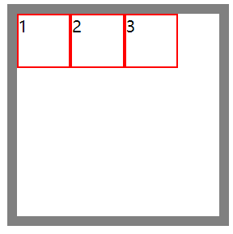

# FlexBox

## 容器属性

### 1. display 触发弹性盒子布局

将元素的 display 属性设置为 flex，可以使其**子元素**按照弹性盒进行布局。

注意：

* display 设置为 flex，影响的是**子元素**，但是不会影响到子元素的子元素。
* 触发弹性盒子布局之后，子元素将默认按照**块盒子**显示，也就是 display 属性会变成 block。
* 触发弹性盒子布局之后，子元素将默认按照**水平方向**进行排列，如果在侧轴没有尺寸会被拉伸。

几个基本概念：

* 主轴与侧轴：主轴就是子元素排列方向的轴。子元素按水平排列，主轴就是横向（水平方向），侧轴就是纵向（垂直方向）；子元素按垂直排列，主轴就是纵向，侧轴就是横向。默认主轴在水平方向。侧轴也叫交叉轴。
* 容器和项目：容器指的就是设置 display 为 flex 的父元素；项目指的就是这个父元素的所有子元素。

案例：

```html
<div class="bigbox">
    <div>1</div>
    <div>2</div>
    <div>3</div>
</div>
```

```css
.bigbox {
    width: 200px;
    height: 200px;
    border: 10px solid gray;
    margin: 100px auto;
    /* flexbox */
    display: flex
}

.bigbox>div {
    width: 50px;
    height: 50px;
    border: 2px solid red;
}
```



### 2. flex-direction 主轴方向

flexbox 默认主轴方向为水平方向。通过 flex-direction 属性可以设置主轴方向，也就是元素按什么方向排列。

可选值：

* row：水平排列（默认值）

  

* row-reverse：水平排列，但置换主轴的起点和终点

  ```
  .bigbox {
      flex-direction: row-reverse;
  }
  ```

  

* column：垂直排列

  

* column-reverse：垂直排列，但置换主轴的起点和终点

  

### 3. justify-content 主轴对齐方式

flexbox 默认从主轴的起始位置开始排列。通过 justify-content 属性可以设置元素如何沿着主轴排列，并分配空间。

可选值：

* normal：初始值（相当于flex-start）

* flex-start：起始位置开始排列，项目无间距

  

* flex-end：结束位置开始排列，项目无间距

  

* center：从居中位置开始排列，项目无间距

  

  

* space-between：均匀排列，首尾不留空

  

* space-around：均匀排列，首尾留空，每个元素周围分配相同的空间

  

* space-evenly：均匀排列，首尾留空，每个元素之间间隔相同

  

* stretch：自适应拉伸（前提是项目在该方向下没有尺寸）

### 4. align-items 侧轴对齐方式

flex-box 默认从侧轴的起始位置沿着主轴方向开始排列，通过 align-items 属性可以设置从侧轴何处开始排列。

可选值：

* normal：初始值（相当于 flex-start）

* flex-start：从侧轴的开始位置进行排列

  

* flex-end：从侧轴的结束位置进行排列

  

* center：居中开始排列

  

* stretch：自适应拉伸。前提是，子元素是没有侧轴方向的尺寸。比如，主轴在水平方向时，子元素想要侧轴自适应拉伸，那就不能设置高度值。

  ```css
  .bigbox {
      display: flex;
      align-items: stretch;
  }
  
  .bigbox>div {
      width: 50px;
      /* height: 50px; */
  }
  ```

  

### 5. flex-wrap 换行显示

在没有触发弹性盒子之前，当子元素过多时，由于元素保持自己的宽度和高度，会显示出**溢出**效果：


当触发弹性盒子之后，子元素会沿着主轴排列，当子元素过多时，元素会丢掉自己的主轴方向尺寸，显示出**压缩**效果：


也就是说，默认情况下项目是不会换行显示的。通过 flex-wrap 属性可以设置是否换行显示。

可选值：

* nowrap：不换行显示（默认值）

* wrap：换行显示。设置后项目保持自己的尺寸，并且在超出容器时自动**换行**显示。

  ```
  .bigbox{
  	flex-wrap: wrap;
  }
  ```

  

不过这种方式也会存在一些问题：

1. 如果一行中剩余的宽度不够排列下一个元素，会默认留白并换行排列。

2. 当子元素设置了固定的高度之后，行与行之间会留出间距。此时，如果不设置子元素的高度，那么子元素会沿着侧轴进行拉伸，高度均匀地分布在每一行之间。

   

### 6. align-content 行间距

当设置换行显示之后，如果子元素设置了固定的高度，行与行之间会留出间距。通过 align-content 属性可以控制这个行间距。

可选值：

* normal：初始值（相当于 flex-start）

* flex-start：每行元素在侧轴的起始位置排列，并且没有行间距。

  

* flex-end：每行元素在侧轴的结束位置开始排列（正向），并且没有行间距。

  

* space-between：均匀排列，首尾不留空

  

  如果有3排：

  

* space-around：均匀排列，首尾留空，每个元素周围分配相同的空间

  


* space-evenly：均匀排列，首尾留空，每个元素之间间隔相同

  

## 项目属性

### 1. align-self 项目侧轴对齐方式

默认情况下，项目按照容器设置的 align-items 属性进行侧轴对齐。通过 align-self 属性，可以给项目设置自己的侧轴对齐方式。

可选值：

* auto：设置为容器（父元素）的 align-items 值

* flex-start：从侧轴开始位置进行排列

* flex-end：从侧轴结束位置开始排列

  

* center：从侧轴居中位置开始排列

  

* stretch：自适应拉伸（在该项目的侧轴方向没有尺寸的情况下）

  

### 2. order 项目调整显示顺序

触发弹性盒子之后，项目默认按主轴横向显示，并且从左到右依次排列。使用 order 属性可以对项目的显示顺序进行调整。

可选值：

* auto：默认值（可以理解为0）
* 数值（可以正数负数0）：值越小越靠前，值越大越靠后

```html
<div class="bigbox">
    <div id="div1">1</div>
    <div id="div2">2</div>
    <div id="div3">3</div>
    <div id="div4">4</div>
</div>
```

```css
.bigbox {
    width: 200px;
    height: 200px;
    border: 10px solid gray;
    margin: 100px auto;

    display: flex;
}

.bigbox>div {
    width: 50px;
    height: 50px;
    border: 2px solid red;
}

#div2 {
    /* 可以是正数、负数、0 或者 auto,auto可以看作是0*/
    order: -1;
}
```


### 3. flex: 1 项目自适应剩余空间

当主轴在横向的时候，设置 flex: 1，项目会占据剩余所有宽度。


当主轴在纵向的时候，设置 flex: 1，项目会占据剩余所有高度。


当多个项目都设置了flex: 1，项目会平分剩余空间：

```css
#div1,
#div2 {
    flex: 1;
}
```


> flex 是一个复合属性，是由flex-grow、flex-shrink、flex-basis 三个属性复合得来的。
>
> 设置 flex: 1，相当于 flex:1 1 0，也就是flex-grow: 1 、flex-shrink: 1、flex-basis: 0

### 4.  flex-grow / flex-shrink / flex-basis

flex-basis 属性可以设置在分配多余空间之前，项目占据的主轴空间。浏览器会根据这个属性来计算主轴是否存在多余空间。初始值为 auto，省略时默认值为0。

flex-grow 属性可以设置项目的放大比例。初始值为0， 也就是即使存在剩余空间也不会放大；flex-grow 属性如果是一个数值 n，表示放大为 flex-grow 等于 1 的元素 n 倍。省略时默认值为1。

flex-shrink 属性可以设置项目的收缩比例。最常用的有两个可选值：初始值为0，表示不压缩；省略时默认值为1，表示项目进行压缩。

举例：

默认情况下，flexbox 中项目会失去原有的宽度，产生一个宽度压缩的效果：

```html
<div class="bigbox">
    <div>1</div>
    <div>2</div>
    <div>3</div>
    <div>4</div>
    <div>5</div>
    <div>6</div>
</div>
```

```css
.bigbox {
    width: 200px;
    height: 200px;
    border: 10px solid gray;
    margin: 100px auto;

    display: flex;
}

.bigbox>div {
    width: 50px;
    height: 50px;
    border: 2px solid red;
}
```


如果将 flex-shrink 设置为0，则项目宽度不会发生压缩：

```css
.bigbox>div {
    flex-shrink: 0;
}
```


如果想横向滚动，可以再给容器添加一个 overflow: auto。

```css
.bigbox {
    overflow: auto;
}
```


## 案例

### 水平垂直居中对齐

想让一个元素水平垂直居中对齐，可以将其父元素设置为弹性盒子（display: flex）,并且设置项目 margin: auto。

```html
<div class="bigbox">
    <div></div>
</div>
```

```css
.bigbox {
    width: 200px;
    height: 200px;
    border: 10px solid gray;
    margin: 100px auto;

    display: flex;
}

.bigbox>div {
    width: 50px;
    height: 50px;
    border: 2px solid red;
    margin: auto;
}
```


或者在容器上使用 justify-content 和 align-items 设置主轴和侧轴居中对齐：

```css
.bigbox {
    width: 200px;
    height: 200px;
    border: 10px solid gray;
    margin: 100px auto;

    display: flex;
    justify-content: center;
    align-items: center;
}
```

