# Grid 布局

grid 布局，也被称之为网格布局，是将页面中的父元素划分成一个个的格子，然后通过这些格子的合并来进行布局。

给父元素的 display 属性设置为 grid 或者 inline-grid，可以触发网格布局。grid 代表的是块状网格，默认独占一行，类似于块级元素；inline-grid 代表的是行内块网络，与行内块元素类似。

划分行列之后，才能将里面的区域进行划分，才能显示出网格。

几个基本概念：

* 容器：指的是采用 grid 布局的父元素
* 内容：指的是显示项目的区域
* 项目：每个格子内部放置的元素

* 行 / 列：横向 / 纵向
* 网格线：横向纵向的线条。一个 m 行 n 列的网格需要 m+1 条横向和 n+1 条纵向网格线组成
* 单元格：横纵线条交汇的区域称之为单元格
* 间距：网格与网格之间的距离被称为间距

案例：

```html
<div></div>
```

```css
div {
    width: 200px;
    height: 200px;
    border: 10px solid gray;
}
```

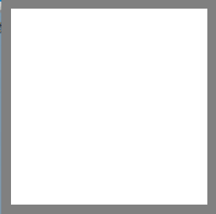

## 容器属性

### 1. display 触发网格布局

将元素的 display 属性设置为 grid 或者 inline-grid，可以触发网格布局。当属性设置为 grid 时，元素此时表现类似块元素；当属性设置为 inline-grid 时，元素此时表现类似于行内块元素。

### 2. grid-template-rows / grid-template-columns 划分行列

使用 grid-template-rows 和 grid-template-columns 可以对网格进行行列的划分。这两个元素有不同的取值方式。

#### 数值

举例：

```css
div{
    display: grid;
    grid-template-rows: 50px 50px 50px;
    grid-template-columns: 50px 50px 50px;
}
```

浏览器中打开控制台，选择元素可以看到网格布局：

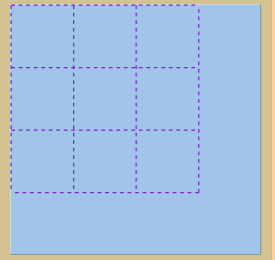

#### 百分比

举例：

```css
div{
    display: grid;
    grid-template-rows: 20% 30% 50%;
    grid-template-columns: 50px 50px 50px;
}
```

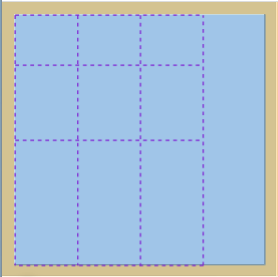

#### repeat() 参数

repeat(num1，num2) 函数有两个参数，第一个参数代表的是重复的次数，第二个参数代表的是需要重复的数值。

举例：

```css
div{
    grid-template-rows: repeat(3, 50px);
    grid-template-columns: repeat(3, 20%);
}
```

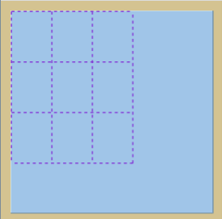

可以使用 auto-fill 根据需要重复的数值，自动填充数量。

举例：

```css
div{
    grid-template-rows: repeat(3, 50px);
    grid-template-columns: repeat(auto-fill, 20%);
}
```

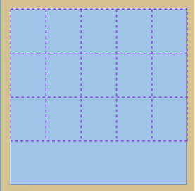

#### auto 自动

取值为 auto，可以自适应剩下的空间

举例：

```css
div{
    grid-template-rows: 30px auto 20px;
    grid-template-columns: repeat(auto-fill, 20%);
}
```

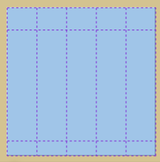

#### fr 片段划分

根据 fr 的数值可以自动计算出比例。

举例：

```css
div{
    grid-template-rows: 20px 1fr 2fr 3fr;
    grid-template-columns: repeat(auto-fill, 20%);
}
```

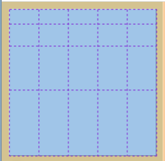

#### minmax() 函数

minmax(min, max) 函数指定了尺寸最大最小值的闭区间。有两个参数，第一个参数指的是尺寸的最小值，第二个参数指的是尺寸的最大值。

举例：

```css
div{
    grid-template-rows: 50px 50px minmax(50px, 80px);
    grid-template-columns: repeat(auto-fill, 20%);
}
```

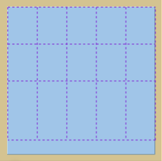

### 3. row-gap / column-gap 调整间距

默认情况下，网格之间的行间距和列间距都是0。通过 row-gap / column-gap 可以调整行列间距。

这两个属性合并在一起有一个简写形式 gap，这个属性值的第一个数值代表 row-gap，第二个数值代表 column-gap。

举例：

```css
div{
    display: grid;
    grid-template-rows: repeat(3, 50px);
    grid-template-columns: repeat(3, 50px);

    row-gap: 20px;
    column-gap: 10px;
}
```

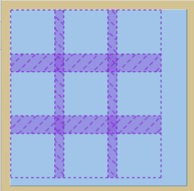

### 4. grid-auto-flow 排列方式

默认情况下，grid 布局中的项目按照从左到右，从上到下进行布局：

```html
<div class="box">
    <div>1</div>
    <div>2</div>
    <div>3</div>
    <div>4</div>
    <div>5</div>
    <div>6</div>
    <div>7</div>
    <div>8</div>
    <div>9</div>
</div>
```

```css
.box {
    width: 200px;
    height: 200px;
    border: 10px solid gray;
    display: grid;
    grid-template-rows: repeat(3, 60px);
    grid-template-columns: repeat(3, 60px);
}
```

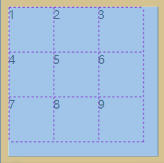

通过设置 grid-auto-flow 属性可以控制布局方式。

可选值：

* row，逐行进行排列（默认值）

* column，逐列进行排列

  ```css
  .box{
  	grid-auto-flow: column
  }
  ```

  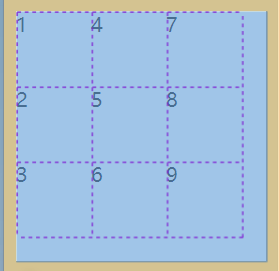

### 5. justify-items / align-items 项目对齐方式

通过 justify-items / align-items 可以设置项目的行 / 列对齐方式。

这两个属性合并到一起有一个简写属性：place-items，这个属性的第一个数值是 justify-items 的值，第二个属性是 align-items 的值。

 可选值：

* start：从起始位置开始排列
* end：从结束位置开始排列
* center：居中对齐
* stretch：自适应拉伸（前提是项目在该方向上没有尺寸）

举例：

```html
<div class="box">
    <div>1</div>
    <div>2</div>
    <div>3</div>
    <div>4</div>
    <div>5</div>
    <div>6</div>
    <div>7</div>
    <div>8</div>
    <div>9</div>
</div>
```

```css
.box {
    width: 200px;
    height: 200px;
    border: 10px solid gray;
    display: grid;
    grid-template-rows: repeat(3, 60px);
    grid-template-columns: repeat(3, 60px);
}

.box>div{
    width: 30px;
    height: 30px;
    border: 2px solid red;
}
```

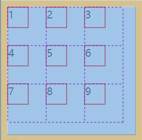

添加项目对齐方式：

```css
.box{
    place-items: center center;
}
```

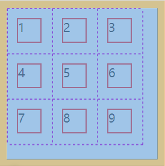

```css
.box{
    justify-items: stretch;
}

.box>div{
    /* width: 30px; */
}
```

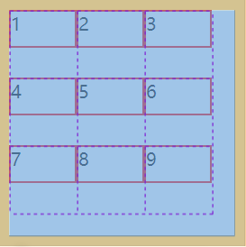

### 6. justify-content / align-content 内容对齐方式

默认情况下，网格位于容器的左上角显示。

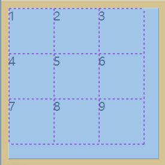

通过 justify-content / align-content 可以设置网格在容器中的行 / 列对齐方式。

这两个属性合并到一起有一个简写属性：place-content，这个属性的第一个数值是 justify-content 的值，第二个属性是 align-content 的值。

可选值：

* start：网格从容器的起始位置排列

* end：网格从容器的结束位置开始排列

* center：网格居中排列

  ```css
  .box{
  	place-content:center center
  }
  ```

  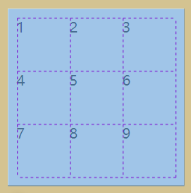

* space-between：均匀排列，首尾不留空

* space-around：均匀排列，首尾留空，每个网格周围分配相同的空间

* space-evenly：均匀排列，首尾留空，每个网格之间间隔相同

* stretch：自适应拉伸（前提是在该方向下没有尺寸）

## 项目属性

#### grid-column / grid-row 合并网格

可以使用 grid-column / grid-row 两个属性来合并网格。属性值的格式是 `start/end`，其中 start 代表的是合并后网格的起始编号，end 代表合并后网格的结束编号。

```html
<div class="box">
    <div>1</div>
    <div id="div2">2</div>
    <div>3</div>
    <div>4</div>
    <div>5</div>
    <div>6</div>
</div>
```

```css
.box {
    width: 200px;
    height: 200px;
    border: 10px solid gray;
    display: grid;
    grid-template-rows: repeat(3, 60px);
    grid-template-columns: repeat(3, 60px);
    justify-content: center;
    align-content: center;
}

.box>div {
    border: 1px solid red;
}

#div2 {
    grid-column: 2/4;
    grid-row: 1/3;
}
```

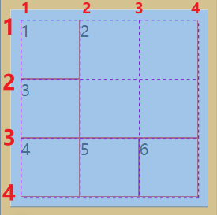

