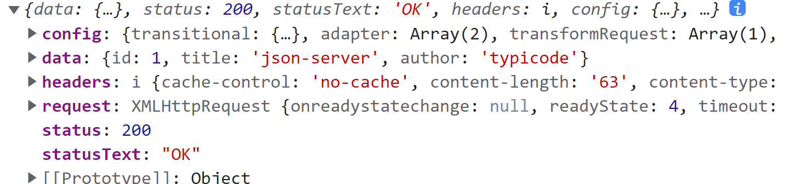

# 1 Axios 简介

## 1.1 特点

Axios 是一个基于 Promise 的网络请求库。一套代码可以同时运行在浏览器和 Node.js 中。浏览器中使用的是 XHR 对象，Node.js 中使用的是 http 模块。

支持拦截请求和响应、转换请求和响应数据、取消请求，并且可以自动转换 JSON 数据。

## 1.2 安装

NPM 安装：

```shell
npm install axios
```

使用 CDN：

```html
<script src="https://cdn.bootcdn.net/ajax/libs/axios/1.2.2/axios.min.js"></script>
```

# 2 Axios 发送请求

## 2.1 GET 请求

传给 axios() 一个配置对象，在配置对象中设置请求方法和 URL。

```javascript
// 发送一个 GET 请求
axios({	
    // 传入请求配置对象（该对象所有属性见第3节）
    method: 'get',
    url: 'http://localhost:3000/posts'
}).then((response) => {
    // 成功时执行
    console.log(response)
}).catch((error) => {
    // 失败时执行
    console.log(error)
}).finally(() => {
    // 无论成功还是失败都会执行
    console.log('finally code')
})
```

## 2.2 POST 请求

```javascript
axios({
    method: 'post',
    url: 'http://localhost:3000/posts',
    // 请求体
    data: {
        title: 'title',
        author: 'author'
    }
}).then((response) => {
    console.log(response)
}).catch((error) => {
    console.log(error)
}).finally(() => {
    console.log('finally code')
})
```

## 2.3 其他请求方法

Axios 支持 HTTP 中所有的请求方法。只需要在配置对象中正确设置 method 属性即可。

## 2.4 请求方法别名

为了方便起见，Axios 为所有支持的请求方法提供了别名。

发送 GET 请求可以：

```javascript
axios.get('http://localhost:3000/posts/1')
```

发送 POST 请求可以：

```javascript
axios.post('http://localhost:3000/posts', { title: 'title', author: 'author' })
```

所有请求方法别名如下：

```
axios.request(config)

axios.get(url[, config])

axios.delete(url[, config])

axios.head(url[, config])

axios.options(url[, config])

axios.post(url[, data[, config]])

axios.put(url[, data[, config]])

axios.patch(url[, data[, config]])
```

# 3 Axios 请求配置

创建请求时传入的配置对象，除 URL 外都是可选的：

```javascript
{
  // `url` 是用于请求的服务器 URL
  url: '/user',

  // `method` 是创建请求时使用的方法
  method: 'get', // 默认值

  // `baseURL` 将自动加在 `url` 前面，除非 `url` 是一个绝对 URL。
  // 它可以通过设置一个 `baseURL` 便于为 axios 实例的方法传递相对 URL
  baseURL: 'https://some-domain.com/api/',

  // `transformRequest` 允许在向服务器发送前，修改请求数据
  // 它只能用于 'PUT', 'POST' 和 'PATCH' 这几个请求方法
  // 数组中最后一个函数必须返回一个字符串， 一个Buffer实例，ArrayBuffer，FormData，或 Stream
  // 你可以修改请求头。
  transformRequest: [function (data, headers) {
    // 对发送的 data 进行任意转换处理

    return data;
  }],

  // `transformResponse` 在传递给 then/catch 前，允许修改响应数据
  transformResponse: [function (data) {
    // 对接收的 data 进行任意转换处理

    return data;
  }],

  // 自定义请求头
  headers: {'X-Requested-With': 'XMLHttpRequest'},

  // `params` 是与请求一起发送的 URL 参数
  // 必须是一个简单对象或 URLSearchParams 对象
  params: {
    ID: 12345
  },

  // `paramsSerializer`是可选方法，主要用于序列化`params`
  // (e.g. https://www.npmjs.com/package/qs, http://api.jquery.com/jquery.param/)
  paramsSerializer: function (params) {
    return Qs.stringify(params, {arrayFormat: 'brackets'})
  },

  // `data` 是作为请求体被发送的数据
  // 仅适用 'PUT', 'POST', 'DELETE 和 'PATCH' 请求方法
  // 在没有设置 `transformRequest` 时，则必须是以下类型之一:
  // - string, plain object, ArrayBuffer, ArrayBufferView, URLSearchParams
  // - 浏览器专属: FormData, File, Blob
  // - Node 专属: Stream, Buffer
  data: {
    firstName: 'Fred'
  },
  
  // 发送请求体数据的可选语法
  // 请求方式 post
  // 只有 value 会被发送，key 则不会
  data: 'Country=Brasil&City=Belo Horizonte',

  // `timeout` 指定请求超时的毫秒数。
  // 如果请求时间超过 `timeout` 的值，则请求会被中断
  timeout: 1000, // 默认值是 `0` (永不超时)

  // `withCredentials` 表示跨域请求时是否需要使用凭证
  withCredentials: false, // default

  // `adapter` 允许自定义处理请求，这使测试更加容易。
  // 返回一个 promise 并提供一个有效的响应 （参见 lib/adapters/README.md）。
  adapter: function (config) {
    /* ... */
  },

  // `auth` HTTP Basic Auth
  auth: {
    username: 'janedoe',
    password: 's00pers3cret'
  },

  // `responseType` 表示浏览器将要响应的数据类型
  // 选项包括: 'arraybuffer', 'document', 'json', 'text', 'stream'
  // 浏览器专属：'blob'
  responseType: 'json', // 默认值

  // `responseEncoding` 表示用于解码响应的编码 (Node.js 专属)
  // 注意：忽略 `responseType` 的值为 'stream'，或者是客户端请求
  // Note: Ignored for `responseType` of 'stream' or client-side requests
  responseEncoding: 'utf8', // 默认值

  // `xsrfCookieName` 是 xsrf token 的值，被用作 cookie 的名称
  xsrfCookieName: 'XSRF-TOKEN', // 默认值

  // `xsrfHeaderName` 是带有 xsrf token 值的http 请求头名称
  xsrfHeaderName: 'X-XSRF-TOKEN', // 默认值

  // `onUploadProgress` 允许为上传处理进度事件
  // 浏览器专属
  onUploadProgress: function (progressEvent) {
    // 处理原生进度事件
  },

  // `onDownloadProgress` 允许为下载处理进度事件
  // 浏览器专属
  onDownloadProgress: function (progressEvent) {
    // 处理原生进度事件
  },

  // `maxContentLength` 定义了node.js中允许的HTTP响应内容的最大字节数
  maxContentLength: 2000,

  // `maxBodyLength`（仅Node）定义允许的http请求内容的最大字节数
  maxBodyLength: 2000,

  // `validateStatus` 定义了对于给定的 HTTP状态码是 resolve 还是 reject promise。
  // 如果 `validateStatus` 返回 `true` (或者设置为 `null` 或 `undefined`)，
  // 则promise 将会 resolved，否则是 rejected。
  validateStatus: function (status) {
    return status >= 200 && status < 300; // 默认值
  },

  // `maxRedirects` 定义了在node.js中要遵循的最大重定向数。
  // 如果设置为0，则不会进行重定向
  maxRedirects: 5, // 默认值

  // `socketPath` 定义了在node.js中使用的UNIX套接字。
  // e.g. '/var/run/docker.sock' 发送请求到 docker 守护进程。
  // 只能指定 `socketPath` 或 `proxy` 。
  // 若都指定，这使用 `socketPath` 。
  socketPath: null, // default

  // `httpAgent` and `httpsAgent` define a custom agent to be used when performing http
  // and https requests, respectively, in node.js. This allows options to be added like
  // `keepAlive` that are not enabled by default.
  httpAgent: new http.Agent({ keepAlive: true }),
  httpsAgent: new https.Agent({ keepAlive: true }),

  // `proxy` 定义了代理服务器的主机名，端口和协议。
  // 您可以使用常规的`http_proxy` 和 `https_proxy` 环境变量。
  // 使用 `false` 可以禁用代理功能，同时环境变量也会被忽略。
  // `auth`表示应使用HTTP Basic auth连接到代理，并且提供凭据。
  // 这将设置一个 `Proxy-Authorization` 请求头，它会覆盖 `headers` 中已存在的自定义 `Proxy-Authorization` 请求头。
  // 如果代理服务器使用 HTTPS，则必须设置 protocol 为`https`
  proxy: {
    protocol: 'https',
    host: '127.0.0.1',
    port: 9000,
    auth: {
      username: 'mikeymike',
      password: 'rapunz3l'
    }
  },

  // see https://axios-http.com/zh/docs/cancellation
  cancelToken: new CancelToken(function (cancel) {
  }),

  // `decompress` indicates whether or not the response body should be decompressed 
  // automatically. If set to `true` will also remove the 'content-encoding' header 
  // from the responses objects of all decompressed responses
  // - Node only (XHR cannot turn off decompression)
  decompress: true // 默认值

}
```

# 4 Axios 响应内容

一个请求的响应内容包括：

```javascript
{
  // `data` 由服务器提供的响应
  data: {},

  // `status` 来自服务器响应的 HTTP 状态码
  status: 200,

  // `statusText` 来自服务器响应的 HTTP 状态信息
  statusText: 'OK',

  // `headers` 是服务器响应头
  // 所有的 header 名称都是小写，而且可以使用方括号语法访问
  // 例如: `response.headers['content-type']`
  headers: {},

  // `config` 是 `axios` 请求的配置信息
  config: {},

  // `request` 是生成此响应的请求
  // 在node.js中它是最后一个ClientRequest实例 (in redirects)，
  // 在浏览器中则是 XMLHttpRequest 实例
  request: {}
}
```

例如：

```javascript
axios.get('http://localhost:3000/posts/1').then(response => {
    console.log(response)
})
```



# 5 Axios 创建实例

可以使用 axios.create() 方法并传入一个**实例配置**（同样是配置对象，但优先级不同于前述的**请求配置**）来创建一个实例。使用实例身上的方法来发送请求。

```javascript
// 创建实例
const instance = axios.create({
    // 实例配置
    timeout: 1000,
    headers: { 'X-Custom-Header': 'foobar' }
});

// 使用实例的方法发送请求
instance.get('http://localhost:3000/posts/1')
```

这个实例配置也可以进行添加和修改：

```javascript
const instance = axios.create({
    timeout: 1000,
    headers: { 'X-Custom-Header': 'foobar' }
});

// 添加实例配置
instance.defaults.headers['Y-Custom-Header'] = 'bazqux'

// 使用实例的方法发送请求
instance.get('http://localhost:3000/posts/1').then(response=>{
    console.log(response.config.headers)
    // X-Custom-Header : 'foobar'
    // Y-Custom-Header : 'bazqux'
})
```

实例身上所有的方法如下，给实例方法传入的请求配置会和实例配置合并（实例配置优先级更高）：

```
axios#request(config)

axios#get(url[, config])

axios#delete(url[, config])

axios#head(url[, config])

axios#options(url[, config])

axios#post(url[, data[, config]])

axios#put(url[, data[, config]])

axios#patch(url[, data[, config]])

axios#getUri([config])
```

# 6 Axios 默认配置

Axios 共有 3 个不同优先级的配置。分别是**全局配置**、**自定义实例配置**和传入每个方法的**请求配置**（config 参数）。其中，前两个配置可以设置**默认值**。

## 6.1 全局默认配置

Axios 的全局默认配置位于 [lib/defaults.js](https://github.com/axios/axios/blob/master/lib/defaults.js#L28)，可修改 axios.defaults 属性对全局默认配置进行修改。全局的 Axios 配置将作用于每个请求：

```javascript
axios.defaults.baseURL = 'https://api.example.com';
axios.defaults.headers.common['Authorization'] = AUTH_TOKEN;
axios.defaults.headers.post['Content-Type'] = 'application/x-www-form-urlencoded';
```

## 6.2 自定义实例默认配置

Axios 的自定义实例默认配置在创建实例时进行设置，可修改实例的 instance 属性对其默认属性进行修改。自定义实例默认配置将作用于该实例的每个请求：

```javascript
// 创建实例时配置默认值
const instance = axios.create({
  baseURL: 'https://api.example.com'
});

// 创建实例后修改默认值
instance.defaults.headers.common['Authorization'] = 'AUTH_TOKEN'
```

## 6.3 配置优先级

优先级最高：请求配置（config 参数）；其次：自定义实例配置；最低：全局配置。

# 7 Axios 拦截器

可以给全局 axios 或者自定义实例添加请求或响应拦截器，以便在 then() 和 catch() 之前处理请求或响应。

## 7.1 添加拦截器

请求拦截器可以对请求配置（config）进行处理，响应拦截器可以对响应内容（response）进行处理。

```javascript
// 添加请求拦截器
axios.interceptors.request.use(function (config) {
    // 在发送请求之前做些什么
    return config;
  }, function (error) {
    // 对请求错误做些什么
    return Promise.reject(error);
  });

// 添加响应拦截器
axios.interceptors.response.use(function (response) {
    // 2xx 范围内的状态码都会触发该函数。
    // 对响应数据做点什么
    return response;
  }, function (error) {
    // 超出 2xx 范围的状态码都会触发该函数。
    // 对响应错误做点什么
    return Promise.reject(error);
  });
```

##  7.2 移除拦截器

```javascript
const myInterceptor = axios.interceptors.request.use(function () {/*...*/});
axios.interceptors.request.eject(myInterceptor);
```

## 7.3 多个拦截器的执行顺序

多个请求拦截器时，拦截顺序和定义请求拦截器时的顺序相反。

多个响应拦截器时，拦截顺序和定义响应拦截器时的顺序相同。

```javascript
// 定义2个请求拦截器和2个响应拦截器

axios.interceptors.request.use(function (config) {
    console.log('请求拦截器1')
    return config;
}, function (error) {
    return Promise.reject(error);
});

axios.interceptors.request.use(function (config) {
    console.log('请求拦截器2')
    return config;
}, function (error) {
    // 对请求错误做些什么
    return Promise.reject(error);
});


axios.interceptors.response.use(function (response) {
    console.log('响应拦截器1')
    return response;
}, function (error) {
    return Promise.reject(error);
});

axios.interceptors.response.use(function (response) {
    console.log('响应拦截器2')
    return response;
}, function (error) {
    return Promise.reject(error);
});


axios.get('http://localhost:3000/posts/1')

// 请求拦截器2
// 请求拦截器1
// 响应拦截器1
// 响应拦截器2
```

# 8 Axios 取消请求

## 8.1 AbortController 方式（0.22.0 开始支持）

从 `v0.22.0` 开始，Axios 支持以 fetch API 方式—— [`AbortController`](https://developer.mozilla.org/en-US/docs/Web/API/AbortController) 取消请求：

```javascript
const controller = new AbortController();

axios.get('http://localhost:3000/posts/1', {
    signal: controller.signal
}).then(function (response) {
    console.log(response.data)
});

// 取消请求
controller.abort()
```

## 8.2 CancelToken 方式（0.22.0 开始弃用）

可以使用 `CancelToken.source` 工厂方法创建一个 cancel token：

```javascript
const CancelToken = axios.CancelToken;
const source = CancelToken.source();

axios.get('/user/12345', {
  cancelToken: source.token
}).catch(function (thrown) {
  if (axios.isCancel(thrown)) {
    console.log('Request canceled', thrown.message);
  } else {
    // 处理错误
  }
});

axios.post('/user/12345', {
  name: 'new name'
}, {
  cancelToken: source.token
})

// 取消请求（message 参数是可选的）
source.cancel('Operation canceled by the user.');
```

也可以通过传递一个 executor 函数到 `CancelToken` 的构造函数来创建一个 cancel token：

```javascript
const CancelToken = axios.CancelToken;
let cancel;

axios.get('/user/12345', {
  cancelToken: new CancelToken(function executor(c) {
    // executor 函数接收一个 cancel 函数作为参数
    cancel = c;
  })
});

// 取消请求
cancel();
```


