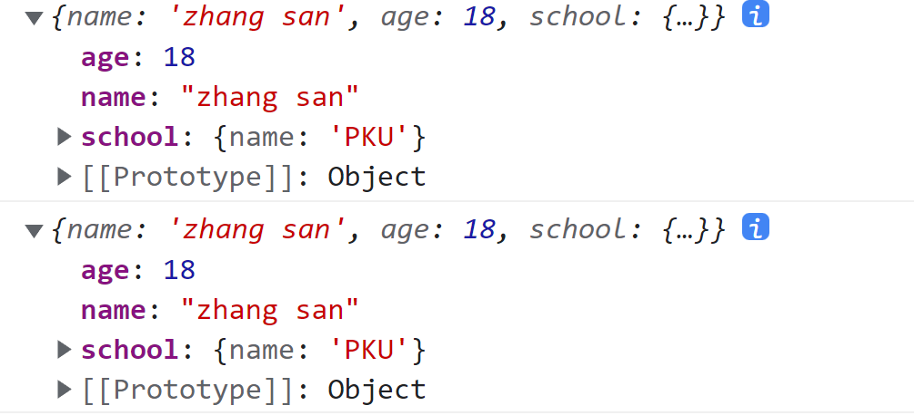
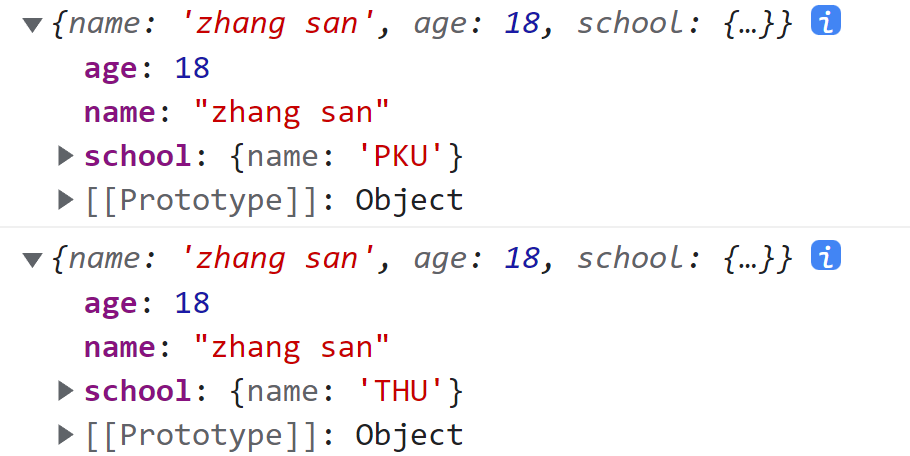
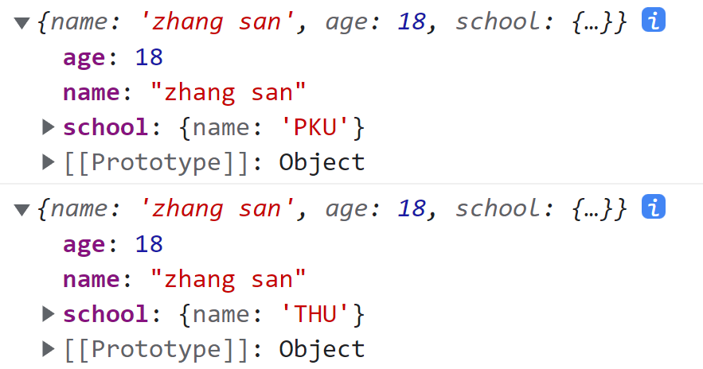

## 浅拷贝

浅拷贝：对于基本数据类型，拷贝的是值；对于引用数据类型，拷贝的是对象的地址。

### 1 for-in

使用 for-in 遍历原对象中的属性，并将属性名和属性值拷贝到新对象中。

```javascript
function copy(obj) {
    let newObj = {}
    for (let prop in obj) {
        newObj[prop] = obj[prop]
    }
    return newObj
}

let obj = {
    name: 'zhang san',
    age: 18,
    school: {
        name: 'THU',
    }
}

let newObj = copy(obj)

obj.school.name = 'PKU'

console.log(obj)
console.log(newObj)
```



## 深拷贝

### 1 for-in + 递归

判断原对象的每个属性值是否是对象，如果是则递归调用拷贝函数。

```javascript
function copy(obj) {
    let newObj = {}
    for (let prop in obj) {
        if (obj[prop] instanceof Object) {
            newObj[prop] = copy(obj[prop])
        } else {
            newObj[prop] = obj[prop]
        }
    }
    return newObj
}

let obj = {
    name: 'zhang san',
    age: 18,
    school: {
        name: 'THU',
    }
}

let newObj = copy(obj)

obj.school.name = 'PKU'

console.log(obj)
console.log(newObj)
```



### 2 JSON 

使用 JSON.stringify() 将原对象转为字符串，再使用 JSON.parse() 将该字符串转为一个新的对象。

```javascript
function copy(obj) {
    let objString = JSON.stringify(obj)
    let newObj = JSON.parse(objString)
    return newObj
}

let obj = {
    name: 'zhang san',
    age: 18,
    school: {
        name: 'THU',
    }
}

let newObj = copy(obj)

obj.school.name = 'PKU'

console.log(obj)
console.log(newObj)
```


