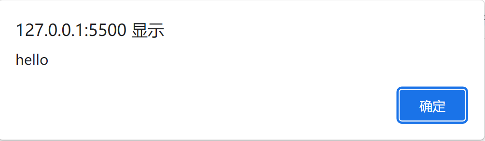
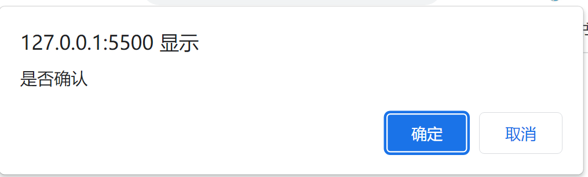
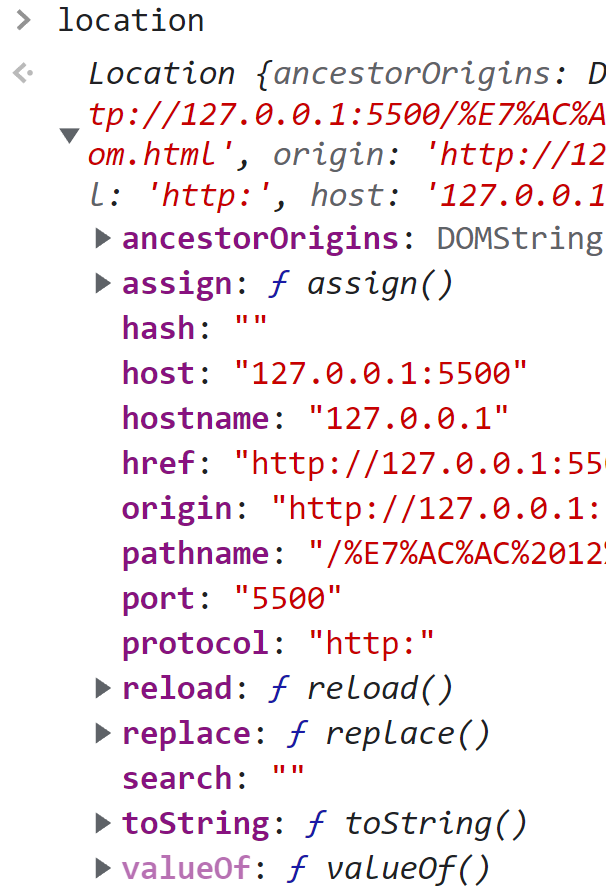
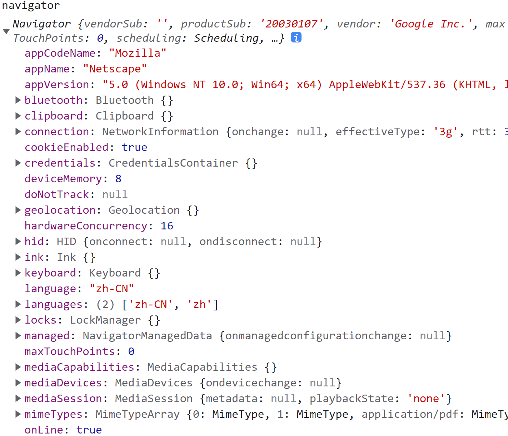
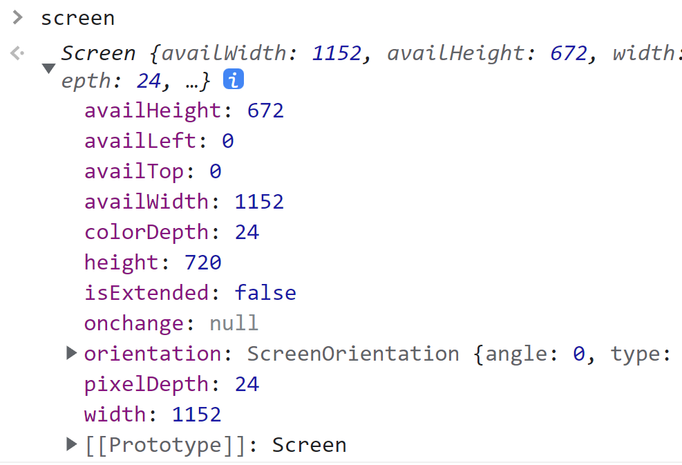
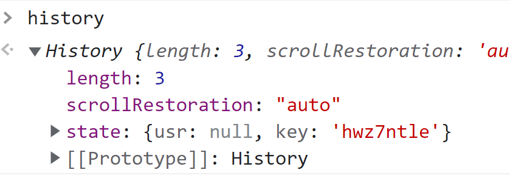

## 1 window 对象

window 对象是 ECMAScript 中的 Global 对象。

### 1.1 Global 作用域

在全局作用域中定义的全局变量和全局函数都会变成 window 对象的属性和方法。

```javascript
var foo = "foo";			// 全局变量
bar = "bar";				// 全局变量
console.log(window.foo);	// foo
console.log(window.bar);	// bar

function fn() {
  baz = "baz";				// 局部变量
  var qux = "qux";			// 局部变量
}
console.log(window.baz);	// undefined
console.log(window.qux);	// undefined
```

> **注意**：JavaScript 中很多对象暴露在全局作用域中，比如：location 和 navigator。因此它们都是 window 对象上的属性。

### 1.2 top、parent、self 窗口关系

top 对象始终指向最上层窗口，即浏览器窗口本身。parent 对象则始终指向当前窗口的父窗口。如果当前窗口是最上层窗口，则 parent 等于 top。还有一个 self 对象始终指向 window 对象。

上面的 top、self、parent 对象都是 window 身上的属性，因此可以把多个窗口的 window 对象串联起来，比如说 ` window.parent.parent`。

```javascript
console.log(window === window.self); // true
```

### 1.3 open() 打开新窗口

window.open() 用于导航到指定 URL 或者打开新窗口。这个方法接收4个参数：要加载的 URL、目标窗口、特性字符串和一个布尔值（代表新窗口在历史记录中是否代替当前窗口）。

如果第二个参数是已经存在的窗口的名字，则会在对应窗口打开 URL。否则会打开一个新窗口并将其命名为该参数。第二个参数也可以是特殊的窗口名，比如：`_self`、`_parent`、`_top`或者 `_blank`。

```javascript
window.open('http://www.baidu.com', 'win-2');
// 执行上述代码会新打开一个窗口并将其命名为 `win-2`。在该新窗口的控制台中查看`window.name`显示为`win-2`。
```

如果第二个参数是打开新窗口，可以使用第三个参数（特性字符串）指定新窗口的配置。详见 [MDN](https://developer.mozilla.org/zh-CN/docs/Web/API/Window/open) 文档。

```javascript
window.open('http://www.baidu.com', 'win-3', 'width=300,height=300,top=100,left=100');
// 执行上述代码会新打开一个窗口并将其命名为 win-3 。该新窗口大小 300 * 300，距离屏幕左上各 100 像素。
```

window.open() 方法返回新窗口的引用。该引用和 window 对象没有区别，可以控制新窗口。

```javascript
const win3 = window.open('http://www.baidu.com', 'win-3', 'width=300,height=300,top=100,left=100');
setTimeout(()=>{
    win3.close();	// 2s后关闭该新窗口
},2000)
```

> 如果弹窗被屏蔽，windows.open() 会返回 null。

### 1.4 定时器

setTimeout() 方法用于指定一段时间后执行某些代码，setInterval() 方法用于指定每隔一段时间执行某些代码。

#### 1.4.1 setTimeout()

setTimeout() 方法通常接受两个参数，第一个是要执行的代码，第二个是执行回调函数前等待的时间（毫秒）。第一个参数可以是代码的字符串，也可以是一个函数。

```javascript
// 第一种写法
setTimeout('console.log("hello")', 1000);

// 第二种写法
setTimeout(() => {
  console.log("hello");
}, 1000);
```

> 第二个参数是要等待的毫秒数，而不是执行代码的确切时间。JavaScript 是**单线程**的，每次只能执行一段代码。JavaScript 维护了一个**任务队列**，并按照加入队列的先后顺序依次执行任务。setTimeout() 的第二个参数只是告诉 JavaScript 引擎在固定毫秒后**将任务添加到队列**中。具体什么时候执行该任务，取决于队列中的情况。如果队列中没有任务，则立即执行。如果有其它任务未执行，需要等待前面的任务全部执行完毕。

调用 setTimeout() 会返回一个用于标识的 id。可以通过该 id 来取消尚未执行的任务。

```javascript
const id = setTimeout(() => {
  console.log("hello");
}, 1000);

clearTimeout(id);	// 取消任务
```

> setTimeout() 所要执行的函数会在全局作用域下的一个匿名函数中运行。因此，函数的 this 指向 window（非严格模式），想要保留函数定义时的 this 值，需要使用箭头函数。

#### 1.4.2 setInterval()

setInterval() 和 setTimeout() 类似，只不过，setInterval() 会每隔一段时间执行一次任务，直到取消循环或者页面卸载。

> setInterval() 会每隔固定时间将任务添加到任务队列，并不关心这些任务什么时候会被执行。因此无法保证两个任务执行的间隔时间。

### 1.5 系统对话框

alert()、confirm()、promt() 方法可以调用对话框向用户显示消息。这些对话框和浏览器中现实的网页无关。它们的外观由系统和浏览器决定。这些对话框都是同步的模态框，也就是说当它们在显示的时候，代码会停止运行，在它们消失的时候，代码才会恢复执行。

#### 1.5.1 alert() 警告框

alert() 警告框用来显示消息，只有一个确认按钮。alert() 接收一个参数，即显示的字符串。若传入的该参数不是字符串，则会调用 toString() 方法将其转成字符串。

```javascript
alert('hello');
```

 

#### 1.5.2 confirm() 确认框

confirm() 确定框也是用来显示消息，但是有取消和确认两个按钮。confirm() 接收一个参数，即显示的字符串。confirm() 返回一个布尔值，该值取决于用户的操作。用户点击确认，confirm() 返回 true；点击取消，confirm() 返回 false。

```javascript
if (confirm("是否确认")) {
  console.log("确认");
} else {
  console.log("取消");
}
```



#### 1.5.3 promt() 提示框

promt() 提示框的用于提示用户输入信息，可以显示文本并提供取消和确认两个按钮。promt() 接收两个参数，第一个参数时显示的字符串，第二个是文本框默认值。promt() 返回值取决于用户的操作。用户点击确认，返回文本框中的内容；点击取消，返回 null。

```javascript
const res = prompt("what is your name?");
if (res !== null) {
  console.log("hello " + res);
}
```

#### 1.5.4 find() 搜索和 print() 打印

find() 和 print() 对话框都是异步显示的，即控制权立即返回给脚本。find() 打开查找对话框，print() 打开打印对话框。

## 2 location 对象

location 既是 window 的属性也是 document 的属性。location 保存着 hash、hostname、port 等属性。



### 2.1 查询字符串

URLSearchParams 提供了一组标准的 API，通过它可以检查和修改查询字符串。给 URLSearchParams 构造函数传入一个查询字符串，即可创建一个实例。实例上有 has()、get()、delete() 等方法。 该实例也是一个可迭代对象。

```javascript
let qs = '?count=10&page=2';
let search = new URLSearchParams(qs);

console.log(search.has('count'));	// true
console.log(search.get('page'));	// 2

for(let item of search){
    console.log(item);
}
// ['count', '10']
// ['page', '2']
```

### 2.2 操作地址

可以通过 location 对象修改当前浏览器的地址。

#### 2.2.1 assign() 跳转到新地址

location.assign('xxx') 会立即导航到新的 URL，同时在浏览器历史记录中新增一条记录。下面两种操作会调用 assign() 因此有同样效果：

```javascript
location = 'xxx'
location.href = 'xxx'
```

修改 location 对象的属性值也会修改当前加载的页面。其中，hash、search、hostname、pathname 和 port 属性被设置为新值后都会修改当前页面的 URL。

#### 2.2.2 replace() 替换到新地址

如果不想增加历史记录，可以使用 location.replace() 方法。

#### 2.2.3 reload() 重新加载

location.reload() 可以重新加载当前页面。不传参数，页面可能会从缓存中加载；传递参数 `true`，页面会强制加载。

> 脚本中 reload() 后的代码可能执行也可能不执行。因此，最好把 reload() 当作最后一行代码。

## 3 navigator 对象

只读属性 **`Window.navigator`** 会返回一个 [`Navigator`](https://developer.mozilla.org/zh-CN/docs/Web/API/Navigator) 对象的引用，可以用于请求运行当前代码的应用程序的相关信息。



## 4 screen 对象

返回当前 window 的 screen 对象。screen 对象实现了[`Screen`](https://developer.mozilla.org/zh-CN/docs/Web/API/Screen)接口，它是个特殊的对象，返回当前渲染窗口中和屏幕有关的属性。



## 5 history 对象 



go() 方法可以在用户的历史记录中前进或者后退。

go() 可以接收一个整数。正数代表前进的步数，负数代表后退的步数。

```javascript
history.go(1)	// 历史记录中前进1步
history.go(-3)	// 历史记录中后退3步
```

go() 也可以接受一个地址字符串。浏览器会导航到最近的该地址的历史记录，可能是前进也可能是后退。如果历史记录中没有匹配项，那么就什么都不做。

```javascript
history.go('www.baidu.com')  // 导航到最近的该地址的历史记录
```

