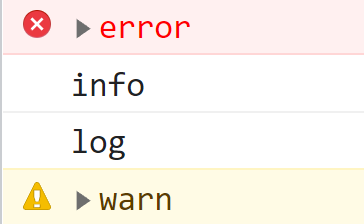

## 1 错误处理

### 1.1 try/catch 语句

任何可能出错的代码都放在 try 块中，而错误处理的代码放在 catch 块中。

```javascript
try{
	// 可能出错的代码
}catch(error){
	// 出错时的错误处理
}
```

如果 try 块中有代码发生错误，代码会立即推出执行，并跳到 catch 块中。catch 块此时接受到一个对象，该对象包含发生错误的信息。该对象至少包含两个属性：message（错误消息）和 name（错误类型）。

```javascript
try {
	// 可能出错的代码
} catch (error) {
  console.log(error.message);
  console.log(error.name);
}
```

>**注意**：当 try 块中发生错误时，浏览器会认为错误已 catch 块被处理，不会再报错。

#### 1.1.1 finally 子句

try/catch 语句中可选的 finally 子句会始终执行。如果 try 块或 catch 块中的代码执行完，则会接着执行 finally 块中的代码。

> **注意**：只要代码中包含了 finally 子句，那么 try 块和 catch 块中的 return 语句会被忽略。

```javascript
function fn() {
  try {
    return 0;			// 因为有 finally 子句，所以 try 块中 return 语句被忽略
  } catch (error) {
    return 1;			// return 语句会被忽略
  } finally {			
    return 2;
  }
}
console.log(fn());  // 2
```

#### 1.1.2 错误类型

共有 8 中错误类型：

* Error。Error 是基类型，其它错误类型继承该类型。浏览器很少会抛出 Error 类型错误，该类型主要用于开发者自定义错误（继承 Error 类来自定义错误）。

* InternalError。在底层 JavaScript 引擎异常时浏览器会抛出该错误。例如：递归导致的栈溢出。

* EvalError。使用 eval() 函数时发生的错误时抛出该错误。比如： eval 属性没有被直接调用或者 eval 属性被赋值。

  ```javascript
  new eval()		// 抛出EvalError
  eval = foo		// 抛出EvalError
  ```

* RangeError。数值越界时抛出该错误。比如：定义数组长度时传入负值。

* ReferenceError。找不到对象时抛出该错误。比如：访问不存在的变量。

* SyntaxError。 JavaScript 出现语法错误时抛出该错误。JavaScript 语法错误会导致 JavaScript 无法执行。比如：使用 let 在同一块中定义两个同名变量。

* TypeError。变量不是预期类型或者访问不存在的方法时抛出该错误。

* URIError。使用 encodeURI() 或者 decodeURI() 但是传入了格式错误的 URI 时抛出该错误。

### 1.2 throw 抛出错误

throw 操作符可以用于在任何时候抛出自定义错误。throw 操作符必须有一个值，但是值的类型不限。

```javascript
throw 1
throw true
throw 'error'
throw { a: 1 }
```

执行到 throw 操作符时，代码会立即停止执行，除非 try/catch 捕获了抛出的值。

```javascript
try{
    throw 1
}catch(error){
    console.log(error);
}
```

可以抛出一个错误类型实例。每种错误类型接收一个参数，即错误消息。

```javascript
throw new Error('this is a error')
```

## 2 调试技术

### 2.1 把消息记录到控制台

浏览器支持使用 console 对象直接将 JavaScript 消息写入控制台。这个对象有以下方法：

* `error(message)`。在控制台中记录错误消息。
* `info(message)`。在控制台中记录消息内容。
* `log(message)`。在控制台中记录常规消息。
* `warn(message)`。在控制台中记录警告消息。

效果如下：



### 2.2 debugger 调试器

debugger 这个关键字，用于调用存在的调试功能。在运行时碰见这个关键字时，浏览器会打开开发者工具面板并启用调试。
