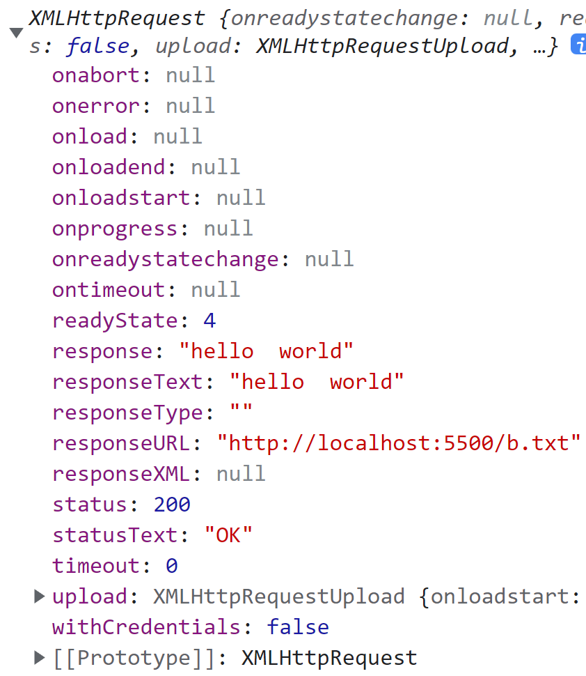
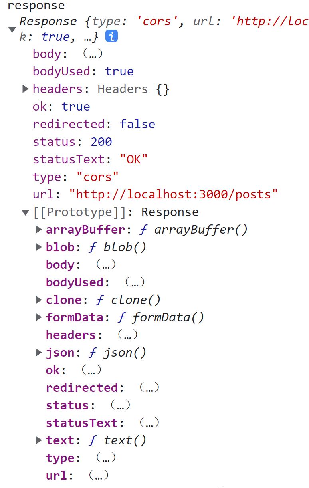
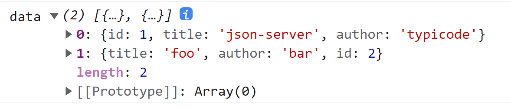
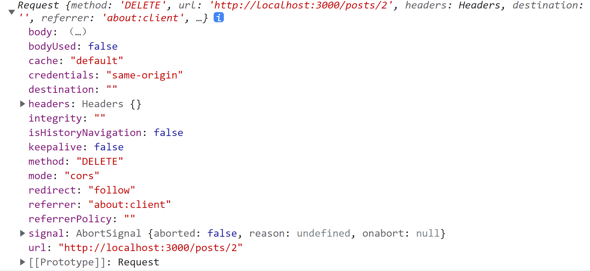
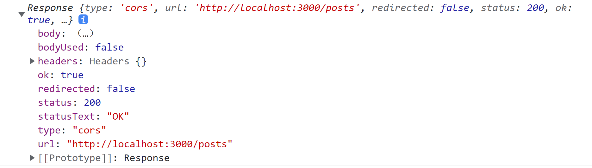
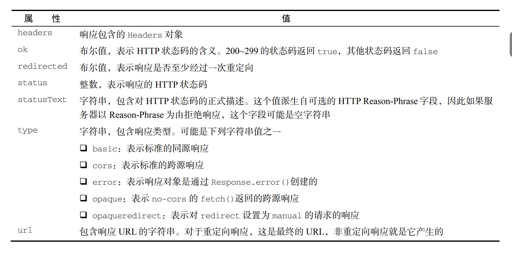

# 网络请求与远程资源

## 1 XMLHttpRequest 对象

所有现代浏览器都通过 XMLHttpRequest 构造函数原生支持 XHR 对象：

```javascript
let xhr = new XMLHttpRequest();
```

### 1.1 open() send()和abort()

#### 1.1.1 open() 准备请求

使用 XHR 对象首先要调用 open() 方法，这个方法接收 3 个参数：请求类型（"get"、"post"等）、请求URL，以及表示请求是否**异步**（是否阻塞代码执行）的布尔值。下面是一个例子：

```javascript
xhr.open("get", "example.php", false);
```

这行代码就可以向 example.php 发送一个同步的 GET 请求。关于这行代码需要说明几点。首先，这里的 URL 是相对于代码所在页面的，当然也可以使用绝对 URL。其次，调用 open() 不会实际发送请求，只是为发送请求做好准备。

>注意：只能访问**同源** URL，也就是域名相同、端口相同、协议相同。如果请求的 URL 与发送请求的页面在任何方面有所不同，则会抛出安全错误。

#### 1.1.2 send() 发送请求

要发送定义好的请求，必须像下面这样调用 send() 方法：

```javascript
xhr.open("get", "example.txt", false);
xhr.send(null);
```

send() 方法接收一个参数，是作为**请求体**发送的数据。如果不需要发送请求体，则必须传 null，因为这个参数在某些浏览器中是必需的。调用 send() 之后，请求就会发送到服务器。

因为这个请求是**同步**的，所以 JavaScript 代码会等待服务器响应之后再继续执行。收到响应后，XHR 对象的以下属性会被填充上数据。

* responseText：作为响应体返回的文本。
* responseXML：如果响应的内容类型是"text/xml"或"application/xml"，那就是包含响应数据的 XML DOM 文档。
* status：响应的 HTTP 状态。
* statusText：响应的 HTTP 状态描述。



#### 1.1.3 status状态码 responseText响应体 readyState阶段码 onreadystatechange阶段码变化事件

收到响应后，第一步要检查 status 属性以确保响应成功返回。一般来说，HTTP 状态码为 2xx 表示成功。此时，responseText 或 responseXML（如果内容类型正确）属性中会有内容。如果 HTTP 状态码是 304，则表示资源未修改过，是从浏览器缓存中直接拿取的。当然这也意味着响应有效。为确保收到正确的响应，应该检查这些状态码，如下所示：

```javascript
xhr.open("get", "example.txt", false);
xhr.send(null);
if ((xhr.status >= 200 && xhr.status < 300) || xhr.status == 304) {
    alert(xhr.responseText);
} else {
    alert("Request was unsuccessful: " + xhr.status);
}
```

以上代码可能显示服务器返回的内容，也可能显示错误消息，取决于 HTTP 响应的状态码。为确定下一步该执行什么操作，最好检查 status 而不是 statusText 属性，因为后者已经被证明在跨浏览器的情况下不可靠。无论是什么响应内容类型，responseText 属性始终会保存响应体，而 responseXML 则对于非 XML 数据是 null。

虽然可以像前面的例子一样发送同步请求，但多数情况下最好使用**异步**请求，这样可以不阻塞 JavaScript 代码继续执行。XHR 对象有一个 readyState 属性，表示当前处在请求/响应过程的哪个阶段。这个属性有如下可能的值：

* 0：未初始化（Uninitialized）。尚未调用 open() 方法。
*  1：已打开（Open）。已调用 open() 方法，尚未调用 send() 方法。
* 2：已发送（Sent）。已调用 send() 方法，尚未收到响应。
*  3：接收中（Receiving）。已经收到部分响应。
* 4：完成（Complete）。已经收到所有响应，可以使用了。

**每次 readyState 从一个值变成另一个值，都会触发 onreadystatechange 事件**。可以借此机会检查 readyState 的值。一般来说，我们唯一关心的 readyState 值是 4，表示数据已就绪。为保证跨浏览器兼容，onreadystatechange 事件处理程序应该在调用 open() 之前赋值。来看下面的例子：

```javascript
let xhr = new XMLHttpRequest();
xhr.onreadystatechange = function() {
    if (xhr.readyState == 4) {
        if ((xhr.status >= 200 && xhr.status < 300) || xhr.status == 304) {
            alert(xhr.responseText);
        } else {
            alert("Request was unsuccessful: " + xhr.status);
        }
    }
};
xhr.open("get", "example.txt", true);
xhr.send(null);
```

以上代码使用 DOM Level 0 风格为 XHR 对象添加了事件处理程序，因为并不是所有浏览器都支持 DOM Level 2 风格。与其他事件处理程序不同，onreadystatechange 事件处理程序不会收到 event 对象。在事件处理程序中，必须使用 XHR 对象本身来确定接下来该做什么。 

#### 1.1.4 abort() 取消请求

在收到响应之前如果想取消异步请求，可以调用 abort() 方法：

```javascript
xhr.abort();
```

调用这个方法后，XHR 对象会停止触发事件，并阻止访问这个对象上任何与响应相关的属性。中断请求后，应该取消对 XHR 对象的引用。由于内存问题，不推荐重用 XHR 对象。

### 1.2 HTTP 头部

每个 HTTP 请求和响应都会携带一些头部字段，这些字段可能对开发者有用。XHR 对象会通过一些方法暴露与请求和响应相关的头部字段。
默认情况下，XHR 请求会发送以下头部字段：

* Accept：浏览器可以处理的内容类型。
* Accept-Charset：浏览器可以显示的字符集。
* Accept-Encoding：浏览器可以处理的压缩编码类型。
* Accept-Language：浏览器使用的语言。
* Connection：浏览器与服务器的连接类型。
* Cookie：页面中设置的Cookie。
* Host：发送请求的页面所在的域。
* Referer：发送请求的页面的URI。注意，这个字段在 HTTP 规范中就拼错了，所以考虑到兼容
  性也必须将错就错。（正确的拼写应该是Referrer）
*  User-Agent：浏览器的用户代理字符串。

虽然不同浏览器发送的确切头部字段可能各不相同，但这些通常都是会发送的。

#### 1.2.1 setRequestHeader() 设置请求头部

如果需要发送额外的请求头部，可以使用 setRequestHeader()方法。这个方法接收两个参数：头部字段的名称和值。为保证请求头部被发送，必须在open() 之后、send() 之前调用 setRequestHeader()，如下面的例子所示：

```javascript
let xhr = new XMLHttpRequest();
xhr.onreadystatechange = function() {
    if (xhr.readyState == 4) {
        if ((xhr.status >= 200 && xhr.status < 300) || xhr.status == 304) {
            alert(xhr.responseText);
        } else {
            alert("Request was unsuccessful: " + xhr.status);
        }
    }
};
xhr.open("get", "example.php", true);
xhr.setRequestHeader("MyHeader", "MyValue");
xhr.send(null);
```

服务器通过读取自定义头部可以确定适当的操作。自定义头部一定要区别于浏览器正常发送的头部，否则可能影响服务器正常响应。有些浏览器允许重写默认头部，有些浏览器则不允许。

#### 1.2.2 getResponseHeader() 获取响应头部

服务器可以使用头部向浏览器传递额外的结构化数据。

可以使用 getResponseHeader() 方法从 XHR 对象获取响应头部，只要传入要获取头部的名称即可。如果想取得所有响应头部，可以使用 getAllResponseHeaders() 方法，这个方法会返回包含所有响应头部的**字符串**（而不是对象）。下面是调用这两个方法的例子：

```javascript
let myHeader = xhr.getResponseHeader("content-length"); 
let allHeaders = xhr.getAllResponseHeaders();
```

getAllResponseHeaders() 方法通常返回类似如下的字符串：

```
Date: Sun, 14 Nov 2004 18:04:03 GMT
Server: Apache/1.3.29 (Unix)
Vary: Accept
X-Powered-By: PHP/4.3.8
Connection: close
Content-Type: text/html; charset=iso-8859-1
```

通过解析以上头部字段的输出，就可以知道服务器发送的所有头部，而不需要单独去检查了。

### 1.3 GET 请求

最常用的请求方法是 GET 请求，用于向服务器查询某些信息。必要时，需要在 GET 请求的 URL 后面添加查询字符串参数。对 XHR 而言，查询字符串必须正确**编码**后添加到 URL 后面，然后再传给 open() 方法。

发送 GET 请求最常见的一个错误是查询字符串格式不对。查询字符串中的每个名和值都必须使用encodeURIComponent() 编码，所有名/值对必须以和号（&）分隔，如下面的例子所示：

```javascript
xhr.open("get", "example.php?name1=value1&name2=value2", true);
```

可以使用以下函数将查询字符串参数添加到现有的 URL 末尾：

```javascript
function addURLParam(url, name, value) {
    url += (url.indexOf("?") == -1 ? "?" : "&");
    url += encodeURIComponent(name) + "=" + encodeURIComponent(value);
    return url;
}
```

这里定义了一个 addURLParam() 函数，它接收 3 个参数：要添加查询字符串的 URL、查询参数和参数值。首先，这个函数会检查 URL 中是否已经包含问号（以确定是否已经存在其他参数）。如果没有，则加上一个问号；否则就加上一个和号。然后，分别对参数名和参数值进行编码，并添加到 URL 末尾。

最后一步是返回更新后的 URL。

可以使用这个函数构建请求 URL，如下面的例子所示：

```javascript
let url = "example.php";
// 添加参数
url = addURLParam(url, "name", "Nicholas");
url = addURLParam(url, "book", "Professional JavaScript");
// 初始化请求
xhr.open("get", url, false);
```

这里使用 addURLParam() 函数可以保证通过 XHR 发送请求的 URL 格式正确。

### 1.4 POST 请求

第二个最常用的请求是 POST 请求，用于向服务器发送应该保存的数据。每个 POST 请求都应该在请求体中携带提交的数据，而 GET 请求则不然。POST 请求的请求体可以包含非常多的数据，而且数据可以是任意格式。要初始化 POST 请求，open() 方法的第一个参数要传"post"，比如：

```javascript
xhr.open("post", "example.php", true);
```

接下来就是要给 send() 方法传入要发送的数据。因为 XHR 最初主要设计用于发送 XML，所以可以传入序列化之后的 XML DOM 文档作为请求体。当然，也可以传入任意字符串。

默认情况下，对服务器而言，POST 请求与提交表单是不一样的。服务器逻辑需要读取原始 POST 数据才能取得浏览器发送的数据。不过，可以使用 XHR 模拟表单提交。为此：

1. 第一步需要把 Content-Type 头部设置为`application/x-www-formurlencoded`，这是提交表单时使用的内容类型。
2. 第二步是创建对应格式的字符串。POST 数据此时使用与查询字符串相同的格式。如果网页中确实有一个表单需要序列化并通过 XHR 发送到服务器，则可以使用 serialize() 函数来创建相应的字符串，如下所示：

```javascript
function submitData() {
    let xhr = new XMLHttpRequest();
    xhr.onreadystatechange = function() {
        if (xhr.readyState == 4) {
            if ((xhr.status >= 200 && xhr.status < 300) || xhr.status == 304) {
                alert(xhr.responseText);
            } else {
                alert("Request was unsuccessful: " + xhr.status);
            }
        }
    };
    xhr.open("post", "postexample.php", true);
    xhr.setRequestHeader("Content-Type", "application/x-www-form-urlencoded");
    let form = document.getElementById("user-info");
    xhr.send(serialize(form));
}
```

### 1.5 XMLHttpRequest Level 2

XHR 对象作为事实标准的迅速流行，也促使W3C 为规范这一行为而制定了正式标准。

XMLHttpRequest Level 1 只是把已经存在的 XHR 对象的实现细节明确了一下。XMLHttpRequest Level 2 又进一步发展了 XHR 对象。并非所有浏览器都实现了 XMLHttpRequest Level 2 的所有部分，但所有浏览器都实现了其中部分功能。

#### 1.5.1 FormData 类型

现代 Web 应用程序中经常需要对表单数据进行序列化，因此 XMLHttpRequest Level 2 新增了 FormData 类型。FormData 类型便于表单序列化，也便于创建与表单类似格式的数据然后通过 XHR 发送。下面的代码创建了一个 FormData 对象，并填充了一些数据：

```javascript
let data = new FormData();
data.append("name", "Nicholas");
```

append() 方法接收两个参数：键和值，相当于表单字段名称和该字段的值。可以像这样添加任意多个键/值对数据。此外，通过直接给 FormData 构造函数传入一个表单元素，也可以将表单中的数据作为键/值对填充进去：

```javascript
let data = new FormData(document.forms[0]);
```

有了 FormData 实例，可以像下面这样直接传给 XHR 对象的 send() 方法：

```javascript
let xhr = new XMLHttpRequest();
xhr.onreadystatechange = function() {
    if (xhr.readyState == 4) {
        if ((xhr.status >= 200 && xhr.status < 300) || xhr.status == 304) {
            alert(xhr.responseText);
        } else {
            alert("Request was unsuccessful: " + xhr.status);
        }
    }
};
xhr.open("post", "postexample.php", true);
let form = document.getElementById("user-info");
xhr.send(new FormData(form));
```

使用 FormData 的另一个方便之处是不再需要给 XHR 对象显式设置任何请求头部了。XHR 对象能够识别作为 FormData 实例传入的数据类型并自动配置相应的头部。

#### 1.5.2 timeout 超时

IE8 给 XHR 对象增加了一个 timeout 属性，用于表示发送请求后等待多少毫秒，如果响应不成功就中断请求。之后所有浏览器都在自己的 XHR 实现中增加了这个属性。在给 timeout 属性设置了一个时间且在该时间过后没有收到响应时，XHR 对象就会触发 timeout 事件，调用 ontimeout 事件处理程序。这个特性后来也被添加到了XMLHttpRequest Level 2 规范。下面看一个例子：

```javascript
let xhr = new XMLHttpRequest();
xhr.onreadystatechange = function() {
    if (xhr.readyState == 4) {
        try {
            if ((xhr.status >= 200 && xhr.status < 300) || xhr.status == 304) {
                alert(xhr.responseText);
            } else {
                alert("Request was unsuccessful: " + xhr.status);
            }
        } catch (ex) {
            // 假设由ontimeout 处理
        }
    }
};
xhr.open("get", "timeout.php", true);
xhr.timeout = 1000; // 设置1 秒超时
xhr.ontimeout = function() {
    alert("Request did not return in a second.");
};
xhr.send(null);
```

这个例子演示了使用 timeout 设置超时。给 timeout 设置 1000 毫秒意味着，如果请求没有在1秒钟内返回则会中断。此时则会触发 ontimeout 事件处理程序，readyState 仍然会变成4，因此也会调用 onreadystatechange 事件处理程序。不过，如果在超时之后访问 status 属性则会发生错误。为做好防护，可以把检查 status 属性的代码封装在 try/catch 语句中。

#### 1.5.3 overrideMimeType()方法

Firefox 首先引入了 overrideMimeType() 方法用于重写 XHR 响应的 MIME 类型。这个特性后来也被添加到了XMLHttpRequest Level 2。因为响应返回的 MIME 类型决定了XHR 对象如何处理响应，所以如果有办法覆盖服务器返回的类型，那么是有帮助的。

假设服务器实际发送了 XML 数据，但响应头设置的 MIME 类型是 text/plain。结果就会导致虽然数据是 XML，但 responseXML 属性值是 null。此时调用 overrideMimeType() 可以保证将响应当成 XML 而不是纯文本来处理：

```javascript
let xhr = new XMLHttpRequest();
xhr.open("get", "text.php", true);
xhr.overrideMimeType("text/xml");
xhr.send(null);
```

这个例子强制让 XHR 把响应当成  XML 而不是纯文本来处理。为了正确覆盖响应的 MIME 类型，必须在调用 send()之前调用 overrideMimeType()。

## 2 Progress Events 进度事件

Progress Events 是 W3C 的工作草案，定义了客户端-服务器端通信。这些事件最初只针对 XHR，现在也推广到了其他类似的 API。有以下 6 个进度相关的事件。

* loadstart：在接收到响应的第一个字节时触发。
* progress：在接收响应期间反复触发。
* error：在请求出错时触发。
* abort：在调用 abort() 终止连接时触发。
* load：在成功接收完响应时触发。
* loadend：在通信完成时，且在 error、abort 或 load 之后触发。

每次请求都会首先触发 loadstart 事件，之后是一个或多个 progress 事件，接着是 error、abort 或 load 中的一个，最后以 loadend 事件结束。这些事件大部分都很好理解，但其中有两个需要说明一下。

### 2.1 load 事件

Firefox 最初在实现 XHR 的时候，曾致力于简化交互模式。最终，增加了一个 load 事件用于**替代 readystatechange 事件**。load 事件在响应接收完成后立即触发，这样就不用检查 readyState 属性了。

onload 事件处理程序会收到一个 event 对象，其 target 属性设置为 XHR 实例，在这个实例上可以访问所有XHR 对象属性和方法。不过，并不是所有浏览器都实现了这个事件的 event 对象。考虑到跨浏览器兼容，还是需要像下面这样使用XHR 对象变量：

```javascript
let xhr = new XMLHttpRequest();
xhr.onload = function() {
    if ((xhr.status >= 200 && xhr.status < 300) || xhr.status == 304) {
        alert(xhr.responseText);
    } else {
        alert("Request was unsuccessful: " + xhr.status);
    }
};
xhr.open("get", "altevents.php", true);
xhr.send(null);
```

只要是从服务器收到响应，无论状态码是什么，都会触发 load 事件。这意味着还需要检查 status 属性才能确定数据是否有效。Firefox、Opera、Chrome 和 Safari 都支持 load 事件。

### 2.2 progress 事件

Mozilla 在 XHR 对象上另一个创新是 progress 事件，在浏览器接收数据期间，这个事件会反复触发。每次触发时，onprogress 事件处理程序都会收到 event 对象，其 target 属性是XHR 对象，且包含3 个额外属性：lengthComputable、position 和 totalSize。其中：

* lengthComputable 是一个布尔值，表示进度信息是否可用；
* position 是接收到的字节数；
* totalSize 是响应的Content-Length 头部定义的总字节数。

有了这些信息，就可以给用户提供进度条了。以下代码演示了如何向用户展示进度：

```javascript
let xhr = new XMLHttpRequest();
xhr.onload = function(event) {
    if ((xhr.status >= 200 && xhr.status < 300) || xhr.status == 304) {
        alert(xhr.responseText);
    } else {
        alert("Request was unsuccessful: " + xhr.status);
    }
};
xhr.onprogress = function(event) {
    let divStatus = document.getElementById("status");
    if (event.lengthComputable) {
        divStatus.innerHTML = "Received " + event.position + " of " +
            event.totalSize +
            " bytes";
    }
};
xhr.open("get", "altevents.php", true);
xhr.send(null);
```

为了保证正确执行，必须在调用 open() 之前添加 onprogress 事件处理程序。在前面的例子中，每次触发 progress 事件都会更新 HTML 元素中的信息。假设响应有 Content-Length 头部，就可以利用这些信息计算出已经收到响应的百分比。

## 3 跨源资源共享

通过 XHR 进行Ajax 通信的一个主要限制是跨源安全策略。默认情况下，XHR 只能访问与发起请求的页面在同一个域内的资源。这个安全限制可以防止某些恶意行为。不过，浏览器也需要支持合法跨源访问的能力。跨源资源共享（CORS，Cross-Origin Resource Sharing）定义了浏览器与服务器如何实现跨源通信。

CORS 背后的基本思路就是使用自定义的 HTTP 头部允许浏览器和服务器相互了解，以确实请求或响应应该成功还是失败。对于简单的请求，比如 GET 或 POST 请求，没有自定义头部，而且请求体是 text/plain 类型，这样的请求在发送时会有一个额外的头部叫 Origin。Origin 头部包含发送请求的页面的源（协议、域名和端口），以便服务器确定是否为其提供响应。下面是 Origin 头部的一个示例：

```
Origin: http://www.nczonline.net
```

如果服务器决定响应请求，那么应该发送 Access-Control-Allow-Origin 头部，包含相同的源；或者如果资源是公开的，那么就包含"*"。比如：

```
Access-Control-Allow-Origin: http://www.nczonline.net
```

如果没有这个头部，或者有但源不匹配，则表明不会响应浏览器请求。否则，服务器就会处理这个请求。注意，无论请求还是响应都不会包含 cookie 信息。现代浏览器通过 XMLHttpRequest 对象原生支持 CORS。在尝试访问不同源的资源时，这个行为会被自动触发。要向不同域的源发送请求，可以使用标准 XHR 对象并给 open() 方法传入一个绝对 URL，比如：

```javascript
let xhr = new XMLHttpRequest();
xhr.onreadystatechange = function() {
    if (xhr.readyState == 4) {
        if ((xhr.status >= 200 && xhr.status < 300) || xhr.status == 304) {
            alert(xhr.responseText);
        } else {
            alert("Request was unsuccessful: " + xhr.status);
        }
    }
};
xhr.open("get", "http://www.somewhere-else.com/page/", true);
xhr.send(null);
```

跨域 XHR 对象允许访问 status 和 statusText 属性，也允许同步请求。出于安全考虑，跨域 XHR 对象也施加了一些额外限制。

* 不能使用 setRequestHeader() 设置自定义头部。
* 不能发送和接收 cookie。
* getAllResponseHeaders() 方法始终返回空字符串。

因为无论同域还是跨域请求都使用同一个接口，所以最好在访问本地资源时使用相对 URL，在访问远程资源时使用绝对 URL。这样可以更明确地区分使用场景，同时避免出现访问本地资源时出现头部或 cookie 信息访问受限的问题。

### 3.1 预检请求

CORS 通过一种叫预检请求（preflighted request）的服务器验证机制，允许使用自定义头部、除GET和POST 之外的方法，以及不同请求体内容类型。在要发送涉及上述某种高级选项的请求时，会先向服务器发送一个“预检”请求。这个请求使用 OPTIONS 方法发送并包含以下头部。

* Origin：与简单请求相同。
* Access-Control-Request-Method：请求希望使用的方法。
* Access-Control-Request-Headers：（可选）要使用的逗号分隔的自定义头部列表。

下面是一个假设的POST 请求，包含自定义的 NCZ 头部：

```
Origin: http://www.nczonline.net
Access-Control-Request-Method: POST
Access-Control-Request-Headers: NCZ
```

在这个请求发送后，服务器可以确定是否允许这种类型的请求。服务器会通过在响应中发送如下头部与浏览器沟通这些信息。

* Access-Control-Allow-Origin：与简单请求相同。
* Access-Control-Allow-Methods：允许的方法（逗号分隔的列表）。
* Access-Control-Allow-Headers：服务器允许的头部（逗号分隔的列表）。

* Access-Control-Max-Age：缓存预检请求的秒数。

例如：

```
Access-Control-Allow-Origin: http://www.nczonline.net
Access-Control-Allow-Methods: POST, GET
Access-Control-Allow-Headers: NCZ
Access-Control-Max-Age: 1728000
```

预检请求返回后，结果会按响应指定的时间缓存一段时间。换句话说，只有第一次发送这种类型的请求时才会多发送一次额外的 HTTP 请求。

### 3.2 凭据请求
默认情况下，跨源请求不提供凭据（cookie、HTTP 认证和客户端SSL 证书）。可以通过将 withCredentials 属性设置为true 来表明请求会发送凭据。如果服务器允许带凭据的请求，那么可以在响应中包含如下 HTTP 头部：

```
Access-Control-Allow-Credentials: true
```

如果发送了凭据请求而服务器返回的响应中没有这个头部，则浏览器不会把响应交给 JavaScript（responseText 是空字符串，status 是0，onerror()被调用）。注意，服务器也可以在预检请求的响应中发送这个HTTP 头部，以表明这个源允许发送凭据请求。

## 4 Fetch API

Fetch API 能够执行 XHR 能执行的所有任务，更加易用，接口更佳现代化。

### 4.1 基本用法

fetch() 方法暴露在全局作用域中。调用 fetch() 方法即可发送请求。

#### 4.1.1 发送请求

fetch() 方法有一个必需的参数 input，可以是 URL 或者一个 Requset 实例。也可以传一个可选的参数 init，代表自定义请求配置。返回值是一个 Promise 对象。

**GET 请求**

```javascript
fetch('http://localhost:3000/posts')
```

**POST 请求**

```javascript
fetch('http://localhost:3000/posts', {
    method: 'POST',
    body: JSON.stringify({
        title: 'foo',
        author: 'bar'
    }),
    headers: new Headers({
        'Content-Type': 'application/json'
    })
})
```

**[自定义请求配置](https://developer.mozilla.org/zh-CN/docs/Web/API/fetch#%E8%AF%AD%E6%B3%95)**

- `method`: 请求使用的方法，如 `GET`、`POST`。
- `headers`: 请求的头信息，形式为 [`Headers`](https://developer.mozilla.org/zh-CN/docs/Web/API/Headers) 的对象或包含 [`ByteString`](https://developer.mozilla.org/zh-CN/docs/Web/JavaScript/Reference/Global_Objects/String) 值的对象字面量。
- `body`: 请求的 body 信息：可能是一个 [`Blob`](https://developer.mozilla.org/zh-CN/docs/Web/API/Blob)、`BufferSource`、[`FormData`](https://developer.mozilla.org/zh-CN/docs/Web/API/FormData)、[`URLSearchParams`](https://developer.mozilla.org/zh-CN/docs/Web/API/URLSearchParams) 或者 [`USVString`](https://developer.mozilla.org/zh-CN/docs/Web/JavaScript/Reference/Global_Objects/String) 对象。注意 GET 或 HEAD 方法的请求不能包含 body 信息。
- `mode`: 请求的模式，如 `cors`、`no-cors` 或者 `same-origin`。
- `credentials`: 请求的 credentials，如 `omit`、`same-origin` 或者 `include`。为了在当前域名内自动发送 cookie，必须提供这个选项，从 Chrome 50 开始，这个属性也可以接受 [`FederatedCredential` (en-US)](https://developer.mozilla.org/en-US/docs/Web/API/FederatedCredential) 实例或是一个 [`PasswordCredential` (en-US)](https://developer.mozilla.org/en-US/docs/Web/API/PasswordCredential) 实例。
- `cache`: 请求的 cache 模式：`default`、 `no-store`、 `reload` 、 `no-cache`、 `force-cache` 或者 `only-if-cached`。
- `redirect`: 可用的 redirect 模式：`follow` (自动重定向), `error` (如果产生重定向将自动终止并且抛出一个错误），或者 `manual` (手动处理重定向)。在 Chrome 中默认使用 `follow`（Chrome 47 之前的默认值是 `manual`）。
- `referrer`: 一个 [`USVString`](https://developer.mozilla.org/zh-CN/docs/Web/JavaScript/Reference/Global_Objects/String) 可以是 `no-referrer`、`client` 或一个 URL。默认是 `client`。
- `referrerPolicy`: 指定了 HTTP 头部 referer 字段的值。可能为以下值之一：`no-referrer`、 `no-referrer-when-downgrade`、`origin`、`origin-when-cross-origin`、 `unsafe-url`。
- `integrity`: 包括请求的 [subresource integrity](https://developer.mozilla.org/zh-CN/docs/Web/Security/Subresource_Integrity) 值（例如： `sha256-BpfBw7ivV8q2jLiT13fxDYAe2tJllusRSZ273h2nFSE=`）。

#### 4.1.2 获取响应

请求完成、资源可用时，期约会解决为一个 Response 对象。这个对象是 API 的封装，可以通过它取得相应资源。

```javascript
fetch('http://localhost:3000/posts').then(response => {
    console.log('response', response)
    return response.json()
}).then(data => {
    console.log('data', data)
})
```





#### 4.1.3 返回 Promise 对象

只要接收到了服务器返回的响应，就返回**解决**的 Promise 对象，解决值是一个 Response 实例；如果没收到服务器的响应，返回**拒绝**的 Promise 对象，拒绝原因是一个 TypeError 对象。

* 请求成功（即状态码是200），会执行**解决**处理程序。即使请求失败（即状态码是404或500），也会执行**解决**处理程序。如果想区分这两种情况，应该判断 Response 实例的 ok 属性。

  ```javascript
  fetch('/bar')
      .then((response) => {
      console.log(response.status); // 200
      console.log(response.ok); // true
  });
  fetch('/does-not-exist')
      .then((response) => {
      console.log(response.status); // 404
      console.log(response.ok); // false
  });
  ```

* 如果没有接收到服务器的响应（如请求超时、违反 CORS、无网络连接等），则会执行**拒绝**处理程序。

  ```javascript
  fetch('/no-response').catch(error => {
      console.log('error', error)
  })
  ```

### 4.2 请求模式

使用 init 对象参数，可以配置 fetch() 在请求体中发送各种序列化的数据。

#### 4.2.1 发送 JSON 数据

```javascript
let payload = JSON.stringify({
    foo: 'bar'
});
let jsonHeaders = new Headers({
    'Content-Type': 'application/json'
});
fetch('http://localhost:3000/posts', {
    method: 'POST', // 发送请求体时必须使用一种 HTTP 方法
    body: payload,
    headers: jsonHeaders
});
```

#### 4.2.2 发送请求参数

```javascript
let payload = 'foo=bar&baz=qux';
let paramHeaders = new Headers({
    'Content-Type': 'application/x-www-form-urlencoded; charset=UTF-8'
});
fetch('/send-me-params', {
    method: 'POST', // 发送请求体时必须使用一种 HTTP 方法
    body: payload,
    headers: paramHeaders
});
```

#### 4.2.3 发送文件

```javascript
let imageFormData = new FormData();
let imageInput = document.querySelector("input[type='file']");
imageFormData.append('image', imageInput.files[0]);
fetch('/img-upload', {
    method: 'POST',
    body: imageFormData
}); 
```

### 4.3 中断请求

支持通过 `AbortController/AbortSignal` 对中断请求。调用 AbortController. abort() 会中断所有网络传输，特别适合希望停止传输大型负载的情况。中断进行中的 fetch() 请求会导致包含错误的拒绝。

```javascript
let abortController = new AbortController();
fetch('http://localhost:3000/posts', { signal: abortController.signal })
    .catch(() => console.log('aborted!'))

// 10 毫秒后中断请求
setTimeout(() => abortController.abort(), 10)
```

### 4.4 Headers 对象

Headers 对象是所有请求和响应头部的容器，存在于 Request 实例和 Response 实例中。Request 实例中的 Headers 对象可以通过 `Request.prototype.headers` 访问。Response 实例中的 Headers 对象可以通过 `Response.prototype.headers`访问。

#### 4.4.1 实例方法

Headers 有与 Map 类型相似的 get()、set()、has() 和 delete() 等实例方法。

```javascript
const headers = new Headers([['a', 'b'], ['c', 'd']])
headers.set('foo', 'bar')
console.log(headers.has('foo'))     // true
console.log(headers.get('foo'))     // bar
headers.delete('foo')
console.log(headers.get('foo'))     // undefined
```

不同于 Map，初始化 Headers 时可以传入一个对象。

```javascript
const headers = new Headers({ foo: 'bar' })
```

一个 HTTP 头部可以有多个值，Headers 对象通过 append() 方法支持添加多个值。Headers 实例中还不存在的头部上调用 append() 方法相当于调用 set()。后续调用会以逗号为分隔符拼接多个值。

```javascript
const headers = new Headers()

headers.append('foo', 'bar')
headers.append('foo', 'baz')

console.log(headers.get('foo'))		// bar, baz
```

### 4.5 Request 对象

Request 对象是获取资源请求的接口。这个接口暴露了请求的相关信息，也暴露了使用请求体的不同方式，即 json() 方法、text() 方法等。

#### 4.5.1 创建

可以通过构造函数初始化 Request 对象。为此需要传入一个 input 参数，一般是 URL。

```javascript
const request = new Resquest('http://localhost:3000/posts')
```

Request 构造函数也接收第二个参数——一个 init 对象。这个 init 对象与前面介绍的 fetch() 的 init 对象一样。

```javascript
const request = new Request('http://localhost:3000/posts/2',{method:'DELETE'})
console.log(request)
```



#### 4.5.2 克隆

有两种不同的方式来创建 Request 对象的副本：使用 Request 构造函数和使用实例的 clone() 方法。

注：只有 bodyUsed 属性为 false 的 Request 对象才能被克隆。不然会抛出 TypeError 异常。

##### **使用 Request 构造函数**

把已有的 Request 对象作为参数传入构造函数：

```javascript
const request1 = new Request('http://localhost:3000/posts')
const request2 = new Request(request1)
```

也可以再传入一个 init 对象，来代替已有的配置：

```javascript
const request1 = new Request('http://localhost:3000/posts/2')
const request2 = new Request(request1, { method: 'DELETE' })
```

注，这种方式得到的不是一摸一样的副本：

* request1 的 bodyUsed 属性会被标记为 true。
* 如果源对象与创建的新对象不同源，则 referrer 属性会被清除。
* 如果源对象的 mode 为 navigate，则会被转换为 same-origin。

##### 使用 clone() 方法

第二种克隆 Request 对象的方式是使用 clone()方法。这个方法会创建一模一样的副本，任何值都不会被覆盖， bodyUsed 属性也不会改变。

```javascript
const request1 = new Request('http://localhost:3000/posts/2')
const request2 = request1.clone()
```

#### 4.5.3 用法

调用 fetch() 方法时，可以直接传入 Request 对象，也可以再传入 init 对象来覆盖  Request 对象中的配置。

```javascript
const req = new Request('http://localhost:3000/posts/2')
fetch(req, {method:'DELETE'})
```

注意：fetch() 方法不能使用 bodyUsed 属性为 true 的 Request 对象。否则抛出 TypeError 异常。

### 4.6 Response 对象

Response 对象是获取资源响应的接口。这个接口暴露了响应的相关信息，也暴露了使 用响应体的不同方式。

#### 4.6.1 获取

fetch() 解决为一个成功的期约后，得到的值就是一个 Response 对象。

```javascript
fetch('http://localhost:3000/posts').then(response => {
    console.log(response)
})
```



#### 4.6.2 克隆

注：只有 bodyUsed 属性为 false 的 Response 对象才能被克隆。不然会抛出 TypeError 异常。

使用 clone() 方法来克隆：

```javascript
fetch('http://localhost:3000/posts').then(response => {
    const c = response.clone()
    })
```

#### 4.6.3 用法

Response 对象包含一组只读属性：



注：有响应体的 Response 对象只能读取一次。（不包含响应体的 Response 对象不受此限制。）

### 4.7 Body 接口

Request 和 Response 都实现了 Body 接口。这个接口为两个类型提供了只读的 body 属性（实现为 ReadableStream）、只读的 bodyUsed 布尔值（表示 body 流是否已读）和一组方法，用于从流中读取内容并将结果转换为某种 JavaScript 对象类型。

#### 4.7.1 对于 Request 对象

可以使用以下方法：

* `Body.arrayBuffer()` 
  * 返回解决一个[`ArrayBuffer`](https://developer.mozilla.org/zh-CN/docs/Web/JavaScript/Reference/Global_Objects/ArrayBuffer)表示的请求主体的 promise.

* `Body.blob()` 
  * 返回解决一个[`Blob`](https://developer.mozilla.org/zh-CN/docs/Web/API/Blob)表示的请求主体的 promise.

* `Body.formData()`
  * 返回解决一个[`FormData`](https://developer.mozilla.org/zh-CN/docs/Web/API/FormData)表示的请求主体的 promise.

* `Body.json()` 
  * 返回解决一个`JSON`表示的请求主体的 promise.

* `Body.text()` 
  * 返回解决一个[`USVString`](https://developer.mozilla.org/zh-CN/docs/Web/JavaScript/Reference/Global_Objects/String)(文本) 表示的请求主体的 promise.

#### 4.7.2 对于 Response 对象

* `Body.arrayBuffer()` 
  * 读取 [`Response`](https://developer.mozilla.org/zh-CN/docs/Web/API/Response) 对象并且将它设置为已读（因为 Responses 对象被设置为了 stream 的方式，所以它们只能被读取一次），并返回一个被解析为 [`ArrayBuffer`](https://developer.mozilla.org/zh-CN/docs/Web/JavaScript/Reference/Global_Objects/ArrayBuffer) 格式的 Promise 对象。

* `Body.blob()` 
  * 读取 [`Response`](https://developer.mozilla.org/zh-CN/docs/Web/API/Response) 对象并且将它设置为已读（因为 Responses 对象被设置为了 stream 的方式，所以它们只能被读取一次），并返回一个被解析为 [`Blob`](https://developer.mozilla.org/zh-CN/docs/Web/API/Blob) 格式的 Promise 对象。

* `Body.formData()`
  * 读取[`Response`](https://developer.mozilla.org/zh-CN/docs/Web/API/Response) 对象并且将它设置为已读（因为 Responses 对象被设置为了 stream 的方式，所以它们只能被读取一次），并返回一个被解析为 [`FormData`](https://developer.mozilla.org/zh-CN/docs/Web/API/FormData) 格式的 Promise 对象。

* `Body.json()`
  * 读取 [`Response`](https://developer.mozilla.org/zh-CN/docs/Web/API/Response) 对象并且将它设置为已读（因为 Responses 对象被设置为了 stream 的方式，所以它们只能被读取一次），并返回一个被解析为 `JSON` 格式的 Promise 对象。

* `Body.text()`
  * 读取 [`Response`](https://developer.mozilla.org/zh-CN/docs/Web/API/Response) 对象并且将它设置为已读（因为 Responses 对象被设置为了 stream 的方式，所以它们只能被读取一次），并返回一个被解析为 [`USVString`](https://developer.mozilla.org/zh-CN/docs/Web/JavaScript/Reference/Global_Objects/String) 格式的 Promise 对象。
