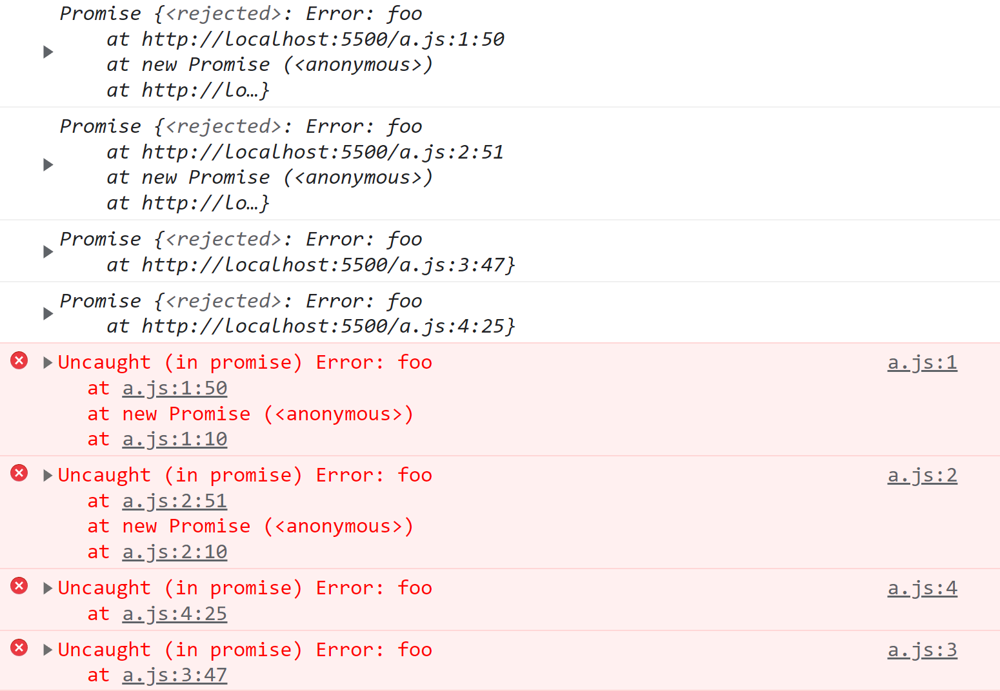

## 1 期约的状态

### 1.1 期约的三种状态

通过实例化 Promise 来定义一个**期约对象**，实例化期约时必须传入一个**执行器函数**：

```javascript
let p = new Promise(()=>{})

setTimeout(console.log, 0, p)	// Promise { <pending> }
```

>解释：`setTimeout(console.log, 0, p)` 可以打印出期约的状态 。

期约可能处于以下3种状态：

* 待定，pending
* 兑现，fulfilled 也叫 resolved
* 拒绝，rejected

最初，期约处于 pending 状态。处于 pending 状态的期约可以落定为 resolved 状态或者 rejected 状态。期约状态落定后不可更改。期约的状态是私有的，无法通过 JavaScript 代码检测到，也不能通过期约外部的 JavaScript 代码来修改期约的状态。

### 1.2 期约的解决值或拒绝理由

期约的状态代表期约是否完成，pending 代表尚未开始或者未完成，resolved 代表**已成功完成**，rejected 代表**未成功完成**。比如，期约向服务器发送请求。如果响应的状态码是200，那么期约就把状态改为 resolved；如果响应的状态码是404，那么期约就把状态改为 rejected。

期约成功完成时可能需要返回一个**解决值**（value），未成功完成时可能需要返回一个**拒绝理由**（reason）。这两个值是可选的，并且默认值是 undefined。比如在前面的例子中，期约收到的200状态码的响应时，需要返回响应体；收到404状态码的响应时，需要返回错误信息。	

```javascript
const p = new Promise((resolve, reject)=>{resolve('foo')})
	
setTimeout(console.log, 0, p)	// Promise {<fulfilled>: 'foo'} 解决值
```

```javascript
const p = new Promise((resolve, reject)=>{reject('bar')})	// 报错：Uncaught (in promise) bar

setTimeout(console.log, 0, p)	// Promise {<rejected>: 'bar'} 拒绝理由
```

### 1.3 控制期约的状态

通过调用执行器函数的两个参数可以控制期约的状态，这两个函数一般会被命名为 resolve() 和 reject()。调用resolve() 可以把期约状态从 pending 改为 resolved，调用 reject() 可以把期约状态从 pending 改为 rejected。调用 reject() 也会抛出错误，**这个错误不能被 try-catch 捕获，只能由拒绝处理程序捕获**。

```javascript
let p = new Promise((resolve, reject)=>{
    resolve()
})

setTimeout(console.log, 0, p)	// Promise {<fulfilled>: undefined}
```

```javascript
let p = new Promise((resolve, reject)=>{
    reject()
})

setTimeout(console.log, 0, p)	
// Promise {<rejected>: undefined}
// 报错：Uncaught (in promise) undefined	
```

当 resolve() 或者 reject() 被调用之后，期约的状态就不能再变了。再调用 resolved() 或者 reject() 会静默失败。

```javascript
let p = new Promise((resolve, reject)=>{
    reject()
    resolve()	// 没有效果
})
```

期约的状态不是只能从 pending 开始，可以直接创建 resolved 状态或者 rejected 状态的期约。

### 1.4 Promise.resolve() 创建已解决的期约

通过 Promise.resolve() 可以实例化一个已解决的期约，解决值就是传入的第一个参数：

```javascript
let p = Promise.resolve('foo')

setTimeout(console.log, 0, p)	// Promise {<fulfilled>: 'foo'}
```

Promise.resolve() 是一个**幂等方法**，如果传入的参数是一个期约，那么它的行为类似一个空包装：

```javascript
let p1 = Promise.resolve('foo')

let p2 = Promise.resolve(p1)

setTimeout(console.log, 0, p2)	// Promise {<fulfilled>: 'foo'}
console.log(p1 === p2)			// true
```

```javascript
let p1 = Promise.reject('bar')

let p2 = Promise.resolve(p1)

setTimeout(console.log, 0, p2)	// Promise {<rejected>: 'bar'} 报错：Uncaught (in promise) bar
setTimeout(console.log, 0, p1 === p2)			// true
```

### 1.5 Promise.reject() 创建被拒绝的期约

通过 Promise.reject() 可以创建一个被拒绝的期约（会抛出一个**异步异常**），拒绝原因就是传入的第一个参数。这个参数也会传给后续的处理程序：
```javascript
let p1 = Promise.reject('foo')

p1.then(null, (e)=>console.log(e))	// foo
```

Promise.reject() **不是幂等的**，如果传给它一个期约对象，这个期约对象会成为它的拒绝原因。

```javascript
let p1 = Promise.resolve('foo')
let p2 = Promise.reject(p1)

setTimeout(console.log, 0, p2)	// Promise {<rejected>: Promise}
//报错：Uncaught (in promise) Promise {<fulfilled>: 'foo'}
```

## 2 期约的实例方法

期约实例的方法是连接外部**同步**代码与内部**异步**代码之间的桥梁。这些方法可以访问异步操作返回的数据，处理期约成功和失败的结果，连续对期约求值，或者添加只有期约进入终止状态时才会执行的代码。

### 2.1 then()

then() 是为期约添加处理程序的主要方法。then() 方法主要接受两个函数参数：onResolved() 处理程序和 onRejected() 处理程序。这两个参数都是可选的，如果提供的话， 则会在期约分别进入 resolved 或 rejected 状态时执行。

```javascript
function onResolved(value){
    console.log(value)
}

function onRejected(reason){
    console.log(reason)
}

const p = new Promise((resolve, reject)=>{
    resolve('foo')
})

p.then(onResolved, onRejected)	// foo
```

then() 返回一个**新**的期约实例：

```javascript
const p1 = new Promise(()=>{})
const p2 = p1.then()		// 新期约

setTimeout(console.log, 0, p1)          // Promise {<pending>}
setTimeout(console.log, 0, p2)          // Promise {<pending>}
setTimeout(console.log, 0, p1 === p2)   // false
```

**这个新期约（p2）实例基于 onResovled() 和 onRejected() 处理程序的返回值构建**。如果上一个期约（p1）是 resolve 状态，则通过 onResovled() 返回值来构建 then()返回的期约（p2）；如果上一个期约是 rejected 状态，则通过 onRejected() 返回值来构建 then() 返回的期约（p2）。

```javascript
const p1 = Promise.resolve('bar')
const p2 = p1.then((x) => { return x + '!' }, (e) => { return e + '@' })

setTimeout(console.log, 0, 'p1', p1)	// p1 Promise {<fulfilled>: 'bar'}
setTimeout(console.log, 0, 'p2', p2)	// p2 Promise {<fulfilled>: 'bar!'}
```

```javascript
const p1 = Promise.reject('bar')
const p2 = p1.then((x) => { return x + '!' }, (e) => { return e + '@' })

setTimeout(console.log, 0, 'p1', p1)	// p1 Promise {<rejected>: 'bar'}
setTimeout(console.log, 0, 'p2', p2)	// p2 Promise {<fulfilled>: 'bar@'}
```

#### 2.1.1 当期约落定为 resolved 状态时

如果期约（p1）落定为 resolved 状态，那么它的 then() 方法总是返回一个**新**的期约值，该值有3种情况：

1. 如果提供了 onResovled() 处理程序，then() 方法返回的期约值是 Promise.resolve() 包装上 onResovled() 处理程序的返回值。
2. 如果没有提供 onResovled() 处理程序，then() 方法返回的期约值是 Promise.resolve() 包装上一个期约（p1）解决之后的值。
3. 如果提供了 onResovled() 处理程序，但是没有显式的返回语句，then() 方法返回的期约值是 Promise.resolve()包装默认的返回值 undefined。

```javascript
const p1 = Promise.resolve('foo')

// 不传处理程序时，状态向后传递。p2值就是 Promise.resolve() 包装上p1
const p2 = p1.then()

setTimeout(console.log, 0, p2)  // Promise {<fulfilled>: 'foo'}
setTimeout(console.log, 0, p1 === p2)	// false

// 没有显式返回值，则返回undefined包装值
const p3 = p1.then(() => undefined)
const p4 = p1.then(() => { }) 
const p5 = p1.then(() => Promise.resolve())

setTimeout(console.log, 0, p3) // Promise {<fulfilled>: undefined}
setTimeout(console.log, 0, p4) // Promise {<fulfilled>: undefined}
setTimeout(console.log, 0, p5) // Promise {<fulfilled>: undefined}

// 如果有显式返回值，Promise.resolve() 会包装这个值
const p6 = p1.then(() => 'bar')
const p7 = p1.then(() => Promise.resolve('bar'))

setTimeout(console.log, 0, p6)  // Promise {<fulfilled>: 'bar'}
setTimeout(console.log, 0, p7)  // Promise {<fulfilled>: 'bar'}

// Promise.resolve() 会保留返回的期约
const p8 = p1.then(() => new Promise(() => { }))
const p9 = p1.then(() => Promise.reject()) // 报错

setTimeout(console.log, 0, p8)  // Promise {<pending>}
setTimeout(console.log, 0, p9)  // Promise {<rejected>: undefined} 

// 抛出异常会返回拒绝的期约
const p10 = p1.then(()=> {throw new Error('bar')}) // 报错

setTimeout(console.log, 0, p10) // Promise {<rejected>: Error: bar} 
```

#### 2.1.2 当期约落定为 rejected 状态时

如果期约（p1）落定为 rejected 状态，那么它的 then() 方法总是返回一个**新**的期约值。和期约落定为 resolved 状态一样，该值有3种情况：

1. 如果提供了 onRejected() 处理程序，then() 方法返回的期约值是 Promise.resolve() 包装上 onRejected() 处理程序的返回值。
2. 如果没有提供 onRejected() 处理程序，then() 方法返回的期约值是 Promise.resolve() 包装上一个期约（p1）解决之后的值。
3. 如果提供了 onRejected() 处理程序，但是没有显式的返回语句，then() 方法返回的期约值是 Promise.resolve()包装默认的返回值 undefined。

```javascript
const p1 = Promise.reject('foo')

// 不传处理程序时，状态向后传递。p2值就是 Promise.resolve() 包装上p1
const p2 = p1.then()	// 报错

setTimeout(console.log, 0, p2)  // Promise {<rejected>: 'foo'} 
setTimeout(console.log, 0, p1 === p2)   // false
 
// 没有显式返回值，则返回undefined包装值
const p3 = p1.then(null, () => undefined)
const p4 = p1.then(null, () => { })
const p5 = p1.then(null, () => Promise.resolve())

setTimeout(console.log, 0, p3) // Promise {<fulfilled>: undefined}
setTimeout(console.log, 0, p4) // Promise {<fulfilled>: undefined}
setTimeout(console.log, 0, p5) // Promise {<fulfilled>: undefined}

// 如果有显式返回值，Promise.resolve() 会包装这个值
const p6 = p1.then(null, () => 'bar')
const p7 = p1.then(null, () => Promise.resolve('bar'))

setTimeout(console.log, 0, p6)  // Promise {<fulfilled>: 'bar'}
setTimeout(console.log, 0, p7)  // Promise {<fulfilled>: 'bar'}

// Promise.resolve() 会保留返回的期约
const p8 = p1.then(null, () => new Promise(() => { }))
const p9 = p1.then(null, () => Promise.reject())	// 报错

setTimeout(console.log, 0, p8)  // Promise {<pending>}
setTimeout(console.log, 0, p9)  // Promise {<rejected>: undefined} 

// 抛出异常会返回拒绝的期约
const p10 = p1.then(() => { throw new Error('bar') })	// 报错

setTimeout(console.log, 0, p10) // Promise {<rejected>: 'foo'} 
```

### 2.2  catch()

catch() 方法用于给期约添加拒绝处理程序。这个方法只接收一个参数： onRejected() 处理程序。事实上，这个方法就是一个语法糖，调用它就相当于调用 `then(null, onRejected)`。

```javascript
const p1 = Promise.reject('foo')

p2 = p1.then(null, (reason) => { return reason })
p3 = p1.catch((reason) => { return reason })		// 语法糖

setTimeout(console.log, 0, p2)	// Promise {<fulfilled>: 'foo'}
setTimeout(console.log, 0, p3)	// Promise {<fulfilled>: 'foo'}
setTimeout(console.log, 0, p2 === p3) // false
```

### 2.3 finally()

finally()方法用于给期约添加 onFinally() 处理程序，这个处理程序在期约转换为解决或拒绝状态时都会执行。这个方法可以避免 onResolved 和 onRejected 处理程序中出现冗余代码。但 onFinally() 处理程序没有办法知道期约的状态是解决还是拒绝，所以这个方法主要用于添加清理代码。

```javascript
let p1 = Promise.resolve();
let p2 = Promise.reject();
let onFinally = function () {
    setTimeout(console.log, 0, 'Finally!')
}
p1.finally(onFinally); // Finally
p2.finally(onFinally); // Finally
```

finally()方法返回一个**新**的期约实例，这个新期约实例不同于 then()或 catch()方式返回的实例。因为 onFinally 被设计为一个状态无关的方法，所以在大多数情况下它将表现为**父期约的传递**。对于已解决状态和被拒绝状态都是如此。

```javascript
let p1 = Promise.resolve('foo');

// 这里都会原样后传
let p2 = p1.finally();
let p3 = p1.finally(() => undefined);
let p4 = p1.finally(() => {});
let p5 = p1.finally(() => Promise.resolve());
let p6 = p1.finally(() => 'bar');
let p7 = p1.finally(() => Promise.resolve('bar'));
let p8 = p1.finally(() => Error('qux'));

setTimeout(console.log, 0, p2); // Promise <resolved>: foo
setTimeout(console.log, 0, p3); // Promise <resolved>: foo
setTimeout(console.log, 0, p4); // Promise <resolved>: foo
setTimeout(console.log, 0, p5); // Promise <resolved>: foo
setTimeout(console.log, 0, p6); // Promise <resolved>: foo
setTimeout(console.log, 0, p7); // Promise <resolved>: foo
```

如果返回的是一个待定的期约，或者 onFinally() 处理程序抛出了错误（显式抛出或返回了一个拒绝期约），则会返回相应的期约（待定或拒绝）：

```javascript
// Promise.resolve()保留返回的期约
let p9 = p1.finally(() => new Promise(() => {}));
let p10 = p1.finally(() => Promise.reject());	// Uncaught (in promise): undefined

setTimeout(console.log, 0, p9); // Promise <pending>
setTimeout(console.log, 0, p10); // Promise <rejected>: undefined


let p11 = p1.finally(() => { throw 'baz'; }); // Uncaught (in promise) baz

setTimeout(console.log, 0, p11); // Promise <rejected>: baz
```

返回待定期约的情形并不常见，这是因为只要期约一解决，新期约仍然会原样后传初始的期约：

```javascript
let p1 = Promise.resolve('foo');

// 忽略解决的值
let p2 = p1.finally(
 () => new Promise(
     (resolve, reject) => setTimeout(() => resolve('bar'), 100)
 )
);

setTimeout(console.log, 0, p2); // Promise <pending>
setTimeout(() => setTimeout(console.log, 0, p2), 200);
// 200 毫秒后：
// Promise <resolved>: foo 
```

## 3 期约实例方法的特性

### 3.1 非重入特性

当期约进入落定状态时，与该状态相关的处理程序仅仅会被**排期**，而非立即执行。跟在添加这个处理程序的代码之后的**同步代码**一定会在处理程序之**前**先执行。即使期约一开始就是与附加处理程序关联的状态，执行顺序也是这样的。这个特性由 JavaScript 运行时保证，被称为“非重入”（non-reentrancy） 特性。

```javascript
const p1 = new Promise((resolve, reject) => { resolve('foo') })

p1.then((value)=>console.log(value))	// 2. 再执行这条语句

console.log('bar')	// 1. 先执行这条语句

// 先输出 bar，再输出 foo
```

在这个例子中，在一个解决期约上调用 then() 会把 onResolved 处理程序推进消息队列。但这个处理程序在当前线程上的同步代码执行完成前不会执行。因此，跟在 then()后面的同步代码一定先于处理程序执行。 

先添加处理程序后解决期约也是一样的。如果添加处理程序后，同步代码才改变期约状态，那么处理程序仍然会基于该状态变化表现出非重入特性。

```javascript
let synchronousResolve;
// 创建一个期约并将解决函数保存在一个局部变量中
let p = new Promise((resolve) => {
    synchronousResolve = function () {
        console.log('1: invoking resolve()');		// 1
        resolve();
        console.log('2: resolve() returns');		// 2
    };
});
p.then(() => console.log('4: then() handler executes'));	// 4
synchronousResolve();
console.log('3: synchronousResolve() returns');		// 3
```

**注**：非重入特性适用于onResolved/onRejected 处理程序、then()处理程序、catch() 处理程序和 finally() 处理程序。

### 3.2 临近处理程序的执行顺序

如果给期约添加了多个处理程序，当期约状态变化时，相关处理程序会按照**添加它们的顺序**依次执行。无论是  then()、catch()还是 finally()添加的处理程序都是如此。

### 3.3 传递解决值或拒绝理由

到了落定状态后，期约会提供其解决值（如果兑现）或其拒绝理由（如果拒绝）给相关状态的处理程序。拿到返回值后，就可以进一步对这个值进行操作。

在执行函数中，解决的值和拒绝的理由是分别作为 resolve() 和 reject() 的第一个参数往后传的。然后，这些值又会传给它们各自的处理程序，作为 onResolved() 或 onRejected() 处理程序的唯一参数。

```javascript
let p1 = new Promise((resolve, reject) => resolve('foo'));
p1.then((value) => console.log(value)); // foo

let p2 = new Promise((resolve, reject) => reject('bar'));
p2.catch((reason) => console.log(reason)); // bar 
```

Promise.resolve()和 Promise.reject()在被调用时就会接收解决值和拒绝理由。同样地，它们返回的期约也会像执行器一样把这些值传给 onResolved() 或 onRejected() 处理程序。

```javascript
let p1 = Promise.resolve('foo');
p1.then((value) => console.log(value)); // foo

let p2 = Promise.reject('bar');
p2.catch((reason) => console.log(reason)); // bar 
```

### 3.4 拒绝期约和拒绝错误处理

拒绝期约类似于 throw() 表达式，因为它们都代表一种程序状态，即需要中断或者特殊处理。**在期约的执行函数或处理程序中抛出错误会导致拒绝，对应的错误对象会成为拒绝的理由。**因此以下这些期约都会以一个错误对象为由被拒绝：

```javascript
let p1 = new Promise((resolve, reject) => reject(Error('foo')));
let p2 = new Promise((resolve, reject) => { throw Error('foo'); });
let p3 = Promise.resolve().then(() => { throw Error('foo'); });
let p4 = Promise.reject(Error('foo'));
setTimeout(console.log, 0, p1); // Promise <rejected>: Error: foo
setTimeout(console.log, 0, p2); // Promise <rejected>: Error: foo
setTimeout(console.log, 0, p3); // Promise <rejected>: Error: foo
setTimeout(console.log, 0, p4); // Promise <rejected>: Error: foo

// 也会抛出4个未捕获的错误
```

期约可以以任何理由拒绝，包括 undefined，但最好统一使用 Error 错误对象。这样做主要是因为创建 Error 错误对象可以让浏览器捕获错误对象中的栈追踪信息，而这些信息对调试是非常关键的。



所有错误都是异步抛出且未处理的，通过错误对象捕获的栈追踪信息展示了错误发生的路径。注意错误的顺序：Promise.resolve().then() 的错误最后才出现，这是因为它需要在运行时消息队列中添加处理程序；也就是说，在最终抛出未捕获错误之前它还会创建另一个期约。 

这个例子同样揭示了异步错误有意思的副作用。正常情况下，在通过 throw() 关键字抛出错误时， JavaScript 运行时的错误处理机制会停止执行抛出错误之后的任何指令：

```javascript
throw Error('foo');
console.log('bar'); // 这一行不会执行
// Uncaught Error: foo
```

但是，在期约中抛出错误时，因为错误实际上是从消息队列中异步抛出的，所以并不会阻止运行时继续执行同步指令：

```javascript
Promise.reject(Error('foo'));
console.log('bar');	// 这一行会执行
// bar
// Uncaught (in promise) Error: foo
```

如本章前面的 Promise.reject() 示例所示，异步错误只能通过异步的 onRejected 处理程序捕获：

```javascript
// 正确
Promise.reject(Error('foo')).catch((e) => {});

// 不正确，还是无法捕获错误
try {
    Promise.reject(Error('foo'));
} catch(e) {}
```

这不包括捕获执行函数中的错误，在解决或拒绝期约之前，仍然可以使用 try/catch 在执行函数中捕获错误：

```javascript
let p = new Promise((resolve, reject) => {
    try {
        throw Error('foo');
    } catch(e) {}
    resolve('bar');
});
setTimeout(console.log, 0, p); // Promise <resolved>: bar
```

then()和 catch()的 onRejected 处理程序在语义上相当于 try/catch。出发点都是捕获错误之后将其隔离，同时不影响正常逻辑执行。为此，onRejected 处理程序的任务应该是在捕获异步错误之后返回一个**解决**的期约。下面的例子中对比了同步错误处理与异步错误处理：

```javascript
console.log('begin synchronous execution');
try {
    throw Error('foo');
} catch(e) {
    console.log('caught error', e);
}
console.log('continue synchronous execution');
// begin synchronous execution
// caught error Error: foo
// continue synchronous execution

new Promise((resolve, reject) => {
    console.log('begin asynchronous execution');
    reject(Error('bar'));
}).catch((e) => {
    console.log('caught error', e);
}).then(() => {
    console.log('continue asynchronous execution');
});
// begin asynchronous execution
// caught error Error: bar
// continue asynchronous execution
```

## 4 期约连锁与期约合成

多个期约组合在一起可以构成强大的代码逻辑。这种组合可以通过两种方式实现：期约连锁与期约合成。前者就是一个期约接一个期约地拼接，后者则是将多个期约组合为一个期约。

### 4.1 期约连锁

把期约逐个地串联起来是一种非常有用的编程模式。之所以可以这样做，是因为每个期约实例的方法，比如then()、catch()和 finally()，都会返回一个**新**的期约对象，而这个新期约又有自己的实例方法。这样连缀方法调用就可以构成所谓的“期约连锁”。

```javascript
let p = new Promise((resolve, reject) => {
    console.log('first');
    resolve();
});

p.then(() => console.log('second'))
    .then(() => console.log('third'))
    .then(() => console.log('fourth'));

// first
// second
// third
// fourth 
```

这个实现最终执行了一连串同步任务。正因为如此，这种方式执行的任务没有那么有用，毕竟分别使用 4 个同步函数也可以做到：

```javascript
(() => console.log('first'))();
(() => console.log('second'))();
(() => console.log('third'))();
(() => console.log('fourth'))(); 
```

要真正执行异步任务，可以改写前面的例子，让每个执行器都返回一个期约实例。这样就可以让每 个后续期约都等待之前的期约，也就是串行化异步任务。比如，可以像下面这样让每个期约在一定时间后解决：

```javascript
let p1 = new Promise((resolve, reject) => {
    console.log('p1 executor');
    setTimeout(resolve, 1000);
});

p1.then(() => new Promise((resolve, reject) => {
    console.log('p2 executor');
    setTimeout(resolve, 1000);
}))
    .then(() => new Promise((resolve, reject) => {
        console.log('p3 executor');
        setTimeout(resolve, 1000);
    }))
    .then(() => new Promise((resolve, reject) => {
        console.log('p4 executor');
        setTimeout(resolve, 1000);
    })); 

// p1 executor（1 秒后）
// p2 executor（2 秒后）
// p3 executor（3 秒后）
// p4 executor（4 秒后）
```

每个后续的处理程序都会等待前一个期约解决，然后实例化一个新期约并返回它。这种结构可以简洁地将异步任务串行化，解决之前依赖回调的难题。

因为 then()、catch()和 finally()都返回期约，所以串联这些方法也很直观。

```javascript
let p = new Promise((resolve, reject) => {
    console.log('initial promise rejects');
    reject();
});

p.catch(() => console.log('reject handler'))
    .then(() => console.log('resolve handler'))
    .finally(() => console.log('finally handler'));
    
// initial promise rejects
// reject handler
// resolve handler
// finally handler
```

### 4.2 期约合成

Promise 提供两个将多个期约实例组合成一个期约的静态方法：Promise.all() 和 Promise.race()。 而合成后期约的行为取决于内部期约的行为。

#### 4.2.1 Promise.all()

Promise.all() 静态方法创建的期约会在一组期约全部解决之后再解决。这个静态方法接收一个可迭代对象，返回一个**新**期约：

```javascript
let p1 = Promise.all([
    Promise.resolve(),
    Promise.resolve()
]);

// 可迭代对象中的元素会通过 Promise.resolve()转换为期约
let p2 = Promise.all([3, 4]);

// 空的可迭代对象等价于 Promise.resolve()
let p3 = Promise.all([]);

// 无效的语法
let p4 = Promise.all(); // TypeError: cannot read Symbol.iterator of undefined
```

合成的期约只会在每个包含的期约都解决之后才解决：

```javascript
let p = Promise.all([
    Promise.resolve(),
    new Promise((resolve, reject) => setTimeout(resolve, 1000))
]);

setTimeout(console.log, 0, p); // Promise <pending>

p.then(() => setTimeout(console.log, 0, 'all() resolved!'));
// all() resolved!（大约 1 秒后）
```

如果**至少有一个**包含的期约待定，则合成的期约也会待定。如果**有一个**包含的期约拒绝，则合成的期约也会拒绝：

```javascript
// 永远待定
let p1 = Promise.all([new Promise(() => { })]);
setTimeout(console.log, 0, p1); // Promise <pending>

// 一次拒绝会导致最终期约拒绝
let p2 = Promise.all([
    Promise.resolve(),
    Promise.reject(),
    Promise.resolve()
]);

setTimeout(console.log, 0, p2); // Promise <rejected>
// Uncaught (in promise) undefined
```

如果所有期约都成功解决，则合成期约的解决值就是所有包含期约**解决值**的数组，按照迭代器顺序：

```javascript
let p = Promise.all([
    Promise.resolve(3),
    Promise.resolve(),
    Promise.resolve(4)
]);
p.then((values) => setTimeout(console.log, 0, values)); // [3, undefined, 4]
```

如果有期约拒绝，则**第一个**拒绝的期约会将自己的理由作为合成期约的拒绝理由。之后再拒绝的期约不会影响最终期约的拒绝理由。不过，这并不影响所有包含期约正常的拒绝操作。合成的期约会静默处理所有包含期约的拒绝操作：

```javascript
// 虽然只有第一个期约的拒绝理由会进入
// 拒绝处理程序，第二个期约的拒绝也
// 会被静默处理，不会有错误跑掉
let p = Promise.all([
    Promise.reject(3),
    new Promise((resolve, reject) => setTimeout(reject, 1000))
]);
p.catch((reason) => setTimeout(console.log, 0, reason)); // 3
// 没有未处理的错误
```

#### 4.2.2 Promise.race()

Promise.race() 静态方法返回一个包装期约，是一组集合中**最先解决或拒绝**的期约的**镜像**（新期约）。这个方法接收一个可迭代对象，返回一个**新**期约：

```javascript
let p1 = Promise.race([
    Promise.resolve(),
    Promise.resolve()
]);

// 可迭代对象中的元素会通过 Promise.resolve()转换为期约
let p2 = Promise.race([3, 4]);

// 空的可迭代对象等价于 new Promise(() => {})
let p3 = Promise.race([]);

// 无效的语法
let p4 = Promise.race();
// TypeError: cannot read Symbol.iterator of undefined
```

Promise.race()不会对解决或拒绝的期约区别对待。无论是解决还是拒绝，只要是第一个落定的期约，Promise.race()就会包装其解决值或拒绝理由并返回**新**期约：

```javascript
// 解决先发生，超时后的拒绝被忽略
let p1 = Promise.race([
    Promise.resolve(3),
    new Promise((resolve, reject) => setTimeout(reject, 1000))
]);
setTimeout(console.log, 0, p1); // Promise <resolved>: 3

// 拒绝先发生，超时后的解决被忽略
let p2 = Promise.race([
    Promise.reject(4),
    new Promise((resolve, reject) => setTimeout(resolve, 1000))
]);
setTimeout(console.log, 0, p2); // Promise <rejected>: 4

// 迭代顺序决定了落定顺序
let p3 = Promise.race([
    Promise.resolve(5),
    Promise.resolve(6),
    Promise.resolve(7)
]);
setTimeout(console.log, 0, p3); // Promise <resolved>: 5
```

如果有一个期约拒绝，只要它是第一个落定的，就会成为拒绝合成期约的理由。之后再拒绝的期约不会影响最终期约的拒绝理由。不过，这并不影响所有包含期约正常的拒绝操作。与 Promise.all() 类似，合成的期约会静默处理所有包含期约的拒绝操作，如下所示：

```javascript
// 虽然只有第一个期约的拒绝理由会进入
// 拒绝处理程序，第二个期约的拒绝也
// 会被静默处理，不会有错误跑掉
let p = Promise.race([
    Promise.reject(3),
    new Promise((resolve, reject) => setTimeout(reject, 1000))
]);
p.catch((reason) => setTimeout(console.log, 0, reason)); // 3
// 没有未处理的错误
```

## 5 异步函数

异步函数，也称为“async/await”（语法关键字），是 ES6 期约模式在 ECMAScript 函数中的应用。 async/await 是 ES8 规范新增的。这个特性从行为和语法上都增强了 JavaScript，让**以同步方式写的代码能够异步执行**。

下面来看一个最简单的例子，这个期约在超时之后会解决为一个值。如果程序中的其他代码要在这个值可用时访问它，则需要写一个**解决处理程序**：

```javascript
let p = new Promise((resolve, reject) => setTimeout(resolve, 1000, 3));
p.then((x) => console.log(x)); // 3
```

这其实是很不方便的，因为其他代码都必须塞到**期约处理程序**中。

ES8 的 async/await 旨在解决利用异步结构组织代码的问题。为此，ECMAScript 对函数进行了扩展， 为其增加了两个新关键字：async 和 await。

### 5.1 async

async 关键字用于声明异步函数。这个关键字可以用在函数声明、函数表达式、箭头函数和方法上：

```javascript
async function foo() { }
let bar = async function () { };
let baz = async () => { };
class Qux {
    async qux() { }
} 
```

使用 async 关键字可以让函数具有**异步特征**，但总体上其代码仍然是同步求值的。而在参数或闭包方面，异步函数仍然具有普通 JavaScript 函数的正常行为。正如下面的例子所示，foo()函数仍然会在后面的指令之前被求值：

```javascript
async function foo() {
    console.log(1);
}

foo();
console.log(2);

// 1
// 2
```

不过，异步函数如果使用 return 关键字返回了值（如果没有 return 则会返回 undefined），这个值会被 Promise.resolve() 包装成一个期约对象。异步函数始终返回期约对象。在函数外部调用这个函数可以得到它返回的期约：

```javascript
async function foo() {
 console.log(1);
 return 3;
}

// 给返回的期约添加一个解决处理程序
foo().then(console.log);
console.log(2);	// 先执行同步代码，再执行then方法中的异步代码

// 1
// 2
// 3 
```

异步函数的返回值期待（但实际上并不要求）一个实现 thenable 接口的对象，但常规的值也可以。

* 如果返回的是实现 thenable 接口的对象，则这个对象可以由提供给 then() 的处理程序**解包**。

* 如果不是，则返回值就被当作已经解决的期约。

```javascript
// 返回一个原始值
async function foo() {
    return 'foo';
}
foo().then(console.log);
// foo

// 返回一个没有实现 thenable 接口的对象
async function bar() {
    return ['bar'];
}
bar().then(console.log);
// ['bar']

// 返回一个实现了 thenable 接口的非期约对象，解包
async function baz() {
    const thenable = {
        then(callback) { callback('baz'); }
    };
    return thenable;
}
baz().then(console.log);
// baz

// 返回一个期约，解包
async function qux() {
    return Promise.resolve('qux');
}
qux().then(console.log);
// qux
```

与在期约处理程序中一样，在异步函数中抛出错误会返回拒绝的期约：

```javascript
async function foo() {
    console.log(1);
    throw 3;
}

// 给返回的期约添加一个拒绝处理程序
foo().catch(console.log);
console.log(2);

// 1
// 2
// 3
```

不过，拒绝期约的错误不会被异步函数捕获：

```javascript
async function foo() {
    console.log(1);
    Promise.reject(3);
}

// 给返回的期约添加一个拒绝处理程序
foo().catch(console.log);
console.log(2);

// 1
// 2
// Uncaught (in promise): 3
```

### 5.2 await

因为异步函数主要针对不会马上完成的任务，所以自然需要一种暂停和恢复执行的能力。使用 await 关键字可以暂停异步函数代码的执行，等待期约解决。

```javascript
async function foo() {
    let p = new Promise((resolve, reject) => setTimeout(resolve, 1000, 3));
    console.log(await p);
}
foo();
// 3 
```

注意，await 关键字会暂停执行异步函数后面的代码，让出 JavaScript 运行时的执行线程。await 关键字同样是尝试**解包**对象的值，然后将这个值传给表达式，再异步恢复异步函数的执行。

await 关键字的用法与 JavaScript 的一元操作一样。它可以单独使用，也可以在表达式中使用：

```javascript
// 异步打印"foo"
async function foo() {
    console.log(await Promise.resolve('foo'));
}
foo();
// foo

// 异步打印"bar"
async function bar() {
    return await Promise.resolve('bar');
}
bar().then(console.log);
// bar

// 1000 毫秒后异步打印"baz"
async function baz() {
    await new Promise((resolve, reject) => setTimeout(resolve, 1000));
    console.log('baz');
}
baz();
// baz（1000 毫秒后）
```

await 关键字期待（但实际上并不要求）一个实现 thenable 接口的对象，但常规的值也可以。如果是实现 thenable 接口的对象，则这个对象可以由 await 来**解包**。如果不是，则这个值就被当作已经解决的期约。

```javascript
// 等待一个原始值
async function foo() {
    console.log(await 'foo');
}
foo();
// foo

// 等待一个没有实现 thenable 接口的对象
async function bar() {
    console.log(await ['bar']);
}
bar();
// ['bar']

// 等待一个实现了 thenable 接口的非期约对象
async function baz() {
    const thenable = {
        then(callback) { callback('baz'); }
    };
    console.log(await thenable);
}
baz();
// baz

// 等待一个期约
async function qux() {
    console.log(await Promise.resolve('qux'));
}
qux();
// qux
```

等待会抛出错误的同步操作，会返回拒绝的期约：

```javascript
async function foo() {
    console.log(1);
    await (() => { throw 3; })();
}

// 给返回的期约添加一个拒绝处理程序
foo().catch(console.log);
console.log(2);

// 1
// 2
// 3 
```

如前面的例子所示，单独的 Promise.reject()不会被异步函数捕获，而会抛出未捕获错误。不过，对拒绝的期约使用 await 则会释放（unwrap）错误值（将拒绝期约返回）：

```javascript
async function foo() {
    console.log(1);
    await Promise.reject(3);
    console.log(4); // 这行代码不会执行
}

// 给返回的期约添加一个拒绝处理程序
foo().catch(console.log);
console.log(2);

// 1
// 2
// 3 
```

### 5.3 await 的限制

1. await 关键字必须在异步函数中使用，不能在顶级上下文如`<script>`标签或模块中使用。

2. 异步函数的特质不会扩展到嵌套函数。因此，await 关键字也只能直接出现在异步函数的定义中。在同步函数内部使用 await 会抛出 SyntaxError。
