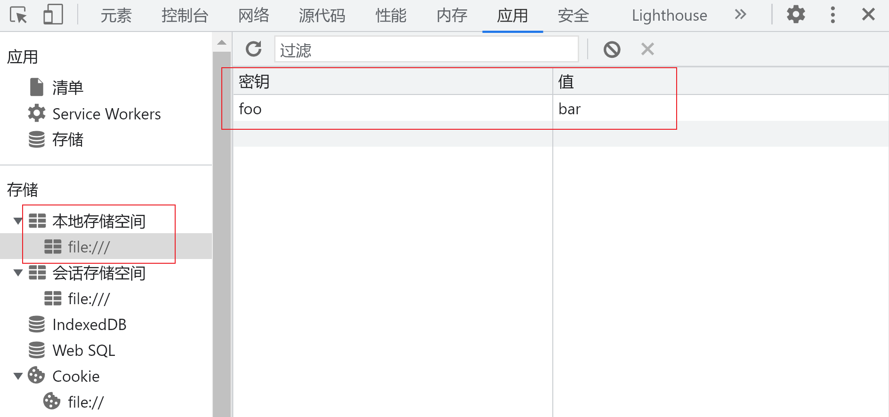
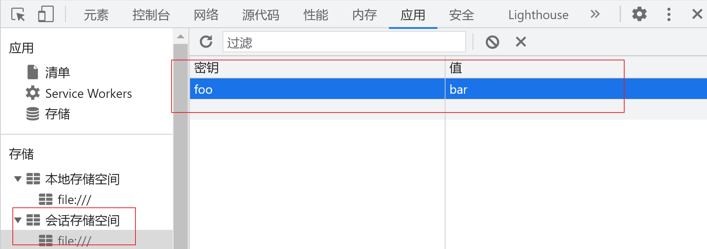

# 客户端存储

## 1 cookie

// TODO 封装 cookie 操作

## 2 Web Storage 

Web Storage 的第 2 版定义了两个**对象**：localStorage 和 sessionStorage。localStorage 是永久存储机制，sessionStorage 是跨会话的存储机制。这两种浏览器存储 API 提供了在浏览器中不受页面刷新影响而存储数据的两种方式。

注：只能存储字符串，每个 domain 最多存储 5 MB 数据。

### 2.1 localStorage

localStorage 存储持久数据，即使浏览器关闭也不会消失，除非手动清除。

#### 2.2.1 setItem() 存储数据

```javascript
localStorage.setItem('foo','bar')	// 设置
```



#### 2.2.2 getItem() 读取数据

```javascript
localStorage.setItem('foo', 'bar')
console.log(localStorage.getItem('foo'))	// 读取
```

#### 2.2.3 removeItem() 删除数据

```javascript
localStorage.setItem('foo', 'bar')
console.log(localStorage.getItem('foo'))
localStorage.removeItem('foo')		// 删除
```

#### 2.2.4 clear() 清空数据

```javascript
localStorage.setItem('foo', 'bar')
localStorage.setItem('baz', 'qux')
localStorage.clear()	// 清空
```

#### 2.2.5 key() 读取键名

读取第n个键值对的键名：

```javascript
localStorage.setItem('foo', 'bar')
localStorage.setItem('baz', 'qux')
localStorage.setItem('abc', '123')
localStorage.setItem('def', '456')
console.log(localStorage.key(2))	// 顺序不可靠
```

### 2.2 sessionStorage

sessionStorage 存储会话数据，浏览器关闭时数据消失。API 和 localStorage 完全相同

#### 2.2.1 setItem() 存储数据

```javascript
sessionStorage.setItem('foo','bar')
```



#### 2.2.2 getItem() 读取数据

```javascript
sessionStorage.setItem('foo','bar')
console.log(sessionStorage.getItem('foo'))	// bar
```

#### 2.2.3 removeItem() 删除数据

```javascript
sessionStorage.setItem('foo','bar')
sessionStorage.removeItem('foo')
```

#### 2.2.4 clear() 清空数据

```javascript
sessionStorage.setItem('foo','bar')
sessionStorage.setItem('baz','qux')
sessionStorage.clear()
```

#### 2.2.5 key() 读取键名

```javascript
sessionStorage.setItem('foo', 'bar')
sessionStorage.setItem('baz', 'qux')
console.log(sessionStorage.key(1))		// 顺序不可靠
```

### 2.3 storage 事件

当 localStorage 或者 sessionStorage 对象发生变化时，会触发 storage 事件。这个事件的 event 对象有如下 4 个属性：

* domain：存储变化对应的域。
* key：被设置或删除的键。
* newValue：键被设置的新值，若键被删除则为 null。
* oldValue：键变化之前的值。 

举例：

```javascript
window.addEventListener("storage",
(event) => console.log('Storage changed for ${event.domain}'));
```

