# DOM

## 1 DOM API

任何 HTML 都可以用 DOM 表示为一个由节点构成的层级结构。节点分为 12 种不同类型，最常用的是 Document 类型和 Element 类型。

### 1.1 Node 类型

所有的节点类型都实现了 Node 接口。也就是说，所有的节点类型都有 Node 中的属性和方法。

#### 属性：

* nodeType 节点类型
  * 由 12 个数值常量来表示。例如：Node.ELEMENT_NODE 为1。
* nodeName 节点名
  * 具体值取决于节点类型。
* nodeValue 节点值
  * 具体值取决于节点类型。
* ownerDocument 节点顶层 document 对象

**表示节点关系**：

* childNodes 子节点列表
  * 返回值是 NodeList 实例。NodeList 是一个类数组对象。节点关系变化时，NodeList 实例会自动更新。
  * 可以使用 NodeList 实例的 item(id) 方法或者 [id] 语法来获取子节点。
* parentNode 父节点
* previousSibling 前一个兄弟节点
* nextSibling 后一个兄弟节点
* firstChild 第一个子节点
* lastChild 最后一个子节点

#### 方法：

* hasChildNodes() 查询是否有子节点
  * 不需要参数
  * 返回值：true 表示有；false 表示没有

* appendChild() 添加子节点到子节点列表末尾
  * 接受一个参数：要添加的子节点
  * 返回值：添加的子节点
  * 会在 childNodes 末尾添加节点，节点关系指针会随之变化。
  * 把已有的节点传给该方法时，已有节点将从之前的位置移动到新位置。

* insetBefore() 添加子节点到参照节点前
  * 接受两个参数：要插入的子节点和参照节点
  * 返回值：插入的子节点
  * 传入的参照节点是 null 时，效果等同于 appendChild()
* replaceChild() 替换指定节点
  * 接受两个参数：要插入的节点和要替换的节点
  * 返回值：被替换的子节点
* removeChild() 删除节点
  * 接受一个参数：要删除的节点
  * 返回值：被删除的节点

* cloneNode() 克隆节点
  * 接受一个布尔值参数：true 代表深复制，复制节点和子 DOM；false 代表浅复制，只复制节点。
  * 返回值：新节点。该节点属于当前 document，但是没有指定父节点，也就是孤儿节点。
  * 只复制 HTML 属性，不复制 JavaScript 属性（比如绑定的事件）。
* normalize() 整理节点
  * 由于解析器实现的差异或 DOM 操作等原因，可能会出现并不包含文本的文本节点，或者文本节点层级之间互为同胞关系。在节点上调用 normalize() 方法会检测这个节点的所有后代，从中搜索上述两种情形。如果发现空文本节点，则将其删除；如果两个同胞节点是相邻的，则将其合并为一个文本节点。

### 1.2 Document 类型

Document 类型表示文档节点。在浏览器中，文档对象 document 表示整个 HTML 页面。document 是 window 对象的属性，因此是一个全局对象。因为实现了 Node 接口，所有 Node 身上的属性和方法 document 都有。

#### 继承自 Node：

属性：

* nodeType 值为 9
* nodeName 值为 "#document"
* nodeValue 值为 null
* parentNode 值为 null
* ownerDocument 值为 null

方法：

* 一般不会对 document 使用 appendChild()、removeChild() 和 replaceChild() 方法。因为 document 只有一个子节点：html 元素。

#### 属性：

便捷指针：

* documentElement 指向 html 元素
* activeElement 指向当前具有焦点的元素（HTML5 新增）
* body 指向 body 元素
* head 指向 head 元素（HTML5 新增）
* doctype 指向 doctype 元素

文档信息：

* title 页面标题
* URL 完整 URL
* domain 域名
* referrer 页面来源
* characterSet 字符集（HTML5 新增）

特殊集合：

* anchors
  * 包含文档中所有带 name 属性的元素。
* forms
  * 包含文档中所有 form 元素（与 document.getElementsByTagName ("form") 返回的结果相同）。
* images
  * 包含文档中所有 img 元素（与 document.getElementsByTagName ("img") 返回的结果相同)。
* links
  * 包含文档中所有带 href 属性的元素。


#### 方法：

获取元素：

* getElementById()
  * 接受一个参数：要获取元素的 id 属性值。参数必须完全匹配，区分大小写。
  * 返回值：找到返回元素；未找到返回 null。
  * 如果有多个相同 id 的元素，只返回第一个。
* getElementsByTagName()
  * 接受一个参数：要获取元素的标签名。参数规范区分大小写。
  * 返回值：一个 HTMLCollection 对象，表示具有该标签名的所有节点。
  * 该 HTMLCollection 实例身上的方法：
    * item(id) 或者 [id] 语法来获取节点。
    * namedItem(name) 或者 [name] 语法来通过 name 属性获取节点。如有多个只返回第一个。
* getElementsByName()
  * 接受一个参数：要获取元素的 name 属性值。
  * 返回值：一个 HTMLCollection 对象，表示具有 name 属性的所有节点。

文档写入：

* write() 
  * 将字符串文本写入网页

* writeln()
  * 将字符串文本写入网页并换行

* open() 
  * 打开文档写入流

* close()
  * 关闭文档写入流


### 1.3 Element 类型

Element 代表 HTML 中的元素。所有 HTML 元素都通过 HTMLElement 类型表示。

#### 继承自 Node：

* nodeType 等于 1
* nodeName 值为元素的标签名
* nodeValue 值为 null
*  parentNode 值为 Document 或 Element 对象

#### 继承自 Element：

所有 HTML 元素身上都有的标准属性：

* id，元素在文档中的唯一标识符；
* title，包含元素的额外信息，通常以提示条形式展示；
* lang，元素内容的语言代码（很少用）；
* dir，语言的书写方向（"ltr"表示从左到右，"rtl"表示从右到左，同样很少用）； 
* className，相当于 class 属性，用于指定元素的 CSS 类。

```html
<div id="myDiv" class="bd" title="Body text" lang="en" dir="ltr"></div>
```

```javascript
const div = document.getElementById('myDiv')
console.log(div.id)			// myDiv
console.log(div.title)		// Body text
console.log(div.lang)		// en
console.log(div.dir)		// ltr
console.log(div.className)	// bd
```

#### 属性：

* tagName 元素标签名

  * 等同于 nodeName 属性。元素标签名始终以**全大写**表示。

* attributes 

  每个元素的 attributes 属性包含一个 NamedNodeMap 实例，代表该元素属性的集合。

  > NamedNodeMap 的用法：
  >
  > 属性：
  >
  > * nodeName 属性名
  > * nodeValue 属性值
  >
  > 方法：
  >
  > * item(pos)，返回索引位置 pos 处的节点，也可以使用中括号来访问。
  >
  > * getNamedItem(name)，返回 nodeName 属性等于 name 的节点
  > * setNamedItem(node)，向列表中添加 node 节点，以其 nodeName 为索引
  > * removeNamedItem(name)，删除 nodeName 属性等于 name 的节点
  >
  > 举例：
  >
  > ```javascript
  > const div = document.getElementById('myDiv')
  > console.log(div.attributes)
  > ```

* style 元素样式

#### 方法：

创建元素：

* document.createElement()
  * 接受一个参数：要创建元素的标签名
  * 返回值：新创建的元素

操作属性：

* getAttribute()
  * 接受一个参数：要获取的属性名。属性名不区分大小写。
  * 返回值：若有该属性则返回属性值，否则返回 null
  
* setAttribute()
  * 接受两个参数：要设置的属性名和属性值
  * 设置的属性名将规范为小写形式。如果已存在则替换，否则新建。
  * 自定义属性名应该以 data- 为前缀
* removeAttribute()
  * 接受一个参数：要删除的属性名
  * 将属性完全从元素中删除


## 2 Selectors API

Selectors API 可以根据 CSS 选择符的模式匹配 DOM 元素，而不是使用 getElementById()和 getElementsByTagName()。

### 2.1 querySelector()

querySelector() 方法接收 CSS 选择符参数，返回匹配该模式的**第一个**后代元素，如果没有匹配项则返回 null。

在 Document 上使用 querySelector() 方法时，会从文档元素开始搜索；在 Element 上使用 querySelector() 方法时，则只会从当前元素的后代中查询。

```html
<div id="myDiv"></div>
<h2></h2>
<span class="msg"></span>
<h4 class='msg'></h4>
```

```javascript
const div = document.querySelector('#myDiv')
const h2 = document.querySelector('h2')		
const span = document.querySelector('.msg')		// 只能查询到第一个满足条件的元素
const h4 = document.querySelector('h4.msg')		// 查询同时满足类名和标签的元素
```

### 2.2 querySelectorAll()

querySelectorAll() 方法跟 querySelector()一样，也接收一个用于查询的参数，但它会返回**所有**匹配的节点，而不止一个。这个方法返回的是一个 NodeList 的**静态实例**。

```html
<div class="msg">0</span>
<span class="msg">1</span>
<span class="msg">2</span>
<span class="msg">3</span>
```

```javascript
const spans = document.querySelectorAll('span.msg')
console.log(spans)
```

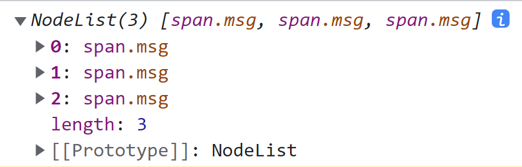

### 2.3 matches()

matches()方法接收一个 CSS 选择符参数，如果元素匹配则该选择符返回 true，否则返回 false。

使用 matches() 可以方便地检测某个元素会不会被 querySelector() 或 querySelectorAll()方法返回。

```html
<div></div>
```

```javascript
const div = document.querySelector('div')
console.log(div.matches('div'))		// true
```

## 3 HTML5 对 DOM 的扩展

### 3.1 CSS 类扩展

#### 3.1.1 getElementsByClassName()

getElementsByClassName() 方法暴露在 document 和所有元素上。

接受一个参数：一个或多个的类名。返回 HTMLCollection 实例。

```html
<div class="myClass">1</div>
<div class="myClass">2</div>
<div class="myClass">3</div>
<div class="myClass">4</div>
```

```javascript
const divs = document.getElementsByClassName('myClass')
console.log(divs)
```

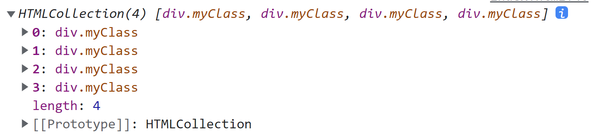

```html
<div id="myDiv">
    <span class="mySpan">1</span>
    <span class="mySpan">2</span>
    <span class="mySpan">3</span>
    <span class="mySpan">4</span>
</div>
```

```javascript
const div = document.getElementById('myDiv')
const spans = div.getElementsByClassName('mySpan')
console.log(spans)
```

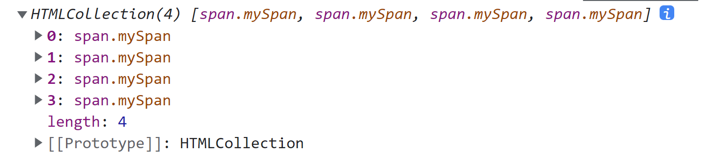

```html
<div class="myClass yourClass">1</div>
<div class="myClass">2</div>
<div class="myClass ourClass yourClass">3</div>
<div class="myClass ourClass">4</div>
```

```javascript
const divs = document.getElementsByClassName('myClass yourClass')
console.log(divs)
```

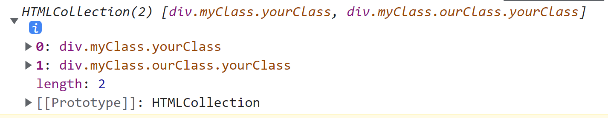

#### 3.1.2 classList 属性

使用元素的 classList 属性可以方便操作类名。classList 属性是一个 DOMTokenList 实例。

```html
<div id="myDiv" class="c1 c2 c3"></div>
```

```javascript
const div = document.getElementById('myDiv')
const c = div.classList

console.log(c)
```

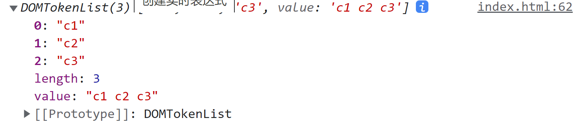

DOMTokenList 的属性和方法如下：

* length，表示包含多少类名。
* item(id)，或者 [id]，取第 id 个类名。

* add(value)，向类名列表中添加指定的字符串值 value。如果这个值已经存在，则什么也不做。
* contains(value)，返回布尔值，表示给定的 value 是否存在。 
* remove(value)，从类名列表中删除指定的字符串值 value。 
* toggle(value)，如果类名列表中已经存在指定的 value，则删除；如果不存在，则添加。

### 3.2 自定义数据属性

HTML5 允许给元素指定非标准的属性，但要使用前缀 data-以便告诉浏览器，这些属性既不包含与渲染有关的信息，也不包含元素的语义信息。除了前缀，自定义属性对命名是没有限制的，data-后面跟什么都可以。

```html
<div id="myDiv" data-appId="12345" data-myname="Nicholas"></div> 
```

定义了自定义数据属性后，可以通过元素的 dataset 属性来访问。dataset 属性是一个 DOMStringMap 的实例，包含一组键/值对映射。元素的每个 data-name 属性在 dataset 中都可以通 过 data-后面的字符串作为键来访问（例如，属性 data-myname、data-myName 可以通过 myname 访 问，但要注意 data-my-name、data-My-Name 要通过 myName 来访问）。

```html
<div id="myDiv" data-foo="foo" data-bar="bar"></div>
```

```javascript
const div = document.getElementById('myDiv')
const ds = div.dataset
console.log(ds)

console.log(ds.foo)	// foo

ds.bar = 'baz'
console.log(ds.bar)	// baz
```

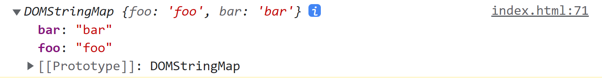

### 3.3 插入标记

#### 3.3.1 innerHTML 属性

**读取** innerHTML 属性时，会返回元素所有后代的 HTML 字符串。

```html
<div id="myDiv">hello world</div>
```

```javascript
const div = document.getElementById('myDiv')
console.log(div.innerHTML)  // hello world
```

**写入** innerHTML 时，则会根据提供的字符串值以新的 DOM 子树替代元素中原来后代的所有节点。

```html
<div id="myDiv">hello world</div>
```

```javascript
const div = document.getElementById('myDiv')
div.innerHTML = '<span>foo, bar</span>'		// 页面上会显示新 DOM
```

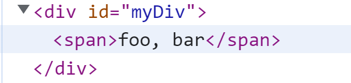

#### 3.3.2 outerHTML 属性

outerHTML与 innerHTML 是类似的，只不过作用范围包含调用它的节点。

**读取** outerHTML 属性时，会返回调用它的元素（及所有后代元素）的 HTML 字符串。

```html
<div id="myDiv">
    <span>1</span>
    <span>2</span>
    <span>3</span>
</div>
```

```javascript
const div = document.getElementById('myDiv')
console.log(div.outerHTML)
```

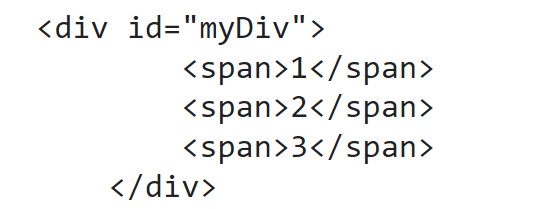

**写入** outerHTML 属性时，调用它的元素会被传入的 HTML 字符串经解释之后生成的 DOM 子树取代。

```html
<div id="myDiv"></div>
```

```javascript
const div = document.getElementById('myDiv')
div.outerHTML = '<span>hello, world</span>'
```

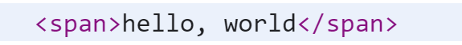

#### 3.3.3 innerText 属性

**读取** innerText 会按照深度优先的顺序将子树中所有**文本节点**的值拼接起来。

```html
<div id="myDiv">
    <span class="mySpan">1</span>
    <span class="mySpan">2</span>
    <span class="mySpan">3</span>
    <span class="mySpan">4</span>
</div>
```

```javascript
const div = document.getElementById('myDiv')
console.log(div.innerText)	// 1 2 3 4
```

**写入** innerText 会移除元素的所有后代并插入一个包含该值的**文本节点**。

```html
<div id="myDiv"> foo, bar </div>
```

```javascript
const div = document.getElementById('myDiv')
div.innerText = 'hello world'
```

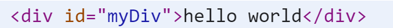

#### 3.3.4 outerText 属性

outerText 与 innerText 是类似的，只不过作用范围包含调用它的节点。

**读取**文本值时， outerText 与 innerText 实际上会返回同样的内容。

```html
<div id="myDiv">
    <span class="mySpan">1</span>
    <span class="mySpan">2</span>
    <span class="mySpan">3</span>
    <span class="mySpan">4</span>
</div>
```

```javascript
const div = document.getElementById('myDiv')
console.log(div.outerText)	// 1 2 3 4
```

**写入**文本值时，outerText 不止会移除所有后代节点，而是会替换整个元素。

```html
<div id="myDiv"> foo, bar</div>
```

```javascript
const div = document.getElementById('myDiv')
div.outerText = 'hello world'
```

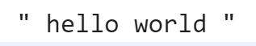
