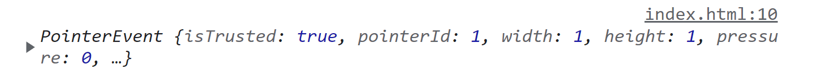
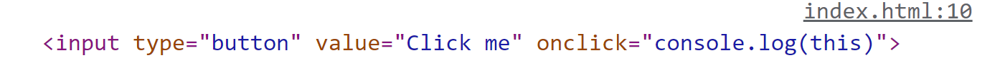

# 事件

## 1 事件流

**事件**意味着用户或浏览器执行的某种动作。比如，单击（click）、加载（load）、鼠标悬停 （mouseover）。**事件流**描述页面接收事件的顺序。有两种事件流：事件冒泡和事件捕获。

### 1.1 事件冒泡

事件冒泡指的是事件被定义为从最具体的元素触发，然后传播到没那么具体的元素。也就是从内向外触发。

### 1.2 事件捕获

事件捕获指的是事件被定义为从最不具体的元素触发，然后传播到具体的元素。也就是从外向内触发。

### 1.3 DOM2 事件流

DOM2 事件流规定了事件流分三个阶段：事件捕获，到达元素，事件冒泡。一般认为事件处理是**事件冒泡**的一部分。

## 2 事件监听器

为响应事件而调用的函数被称为事件处理程序（或事件监听器）。事件处理程序的名字 以"on"开头，因此 click 事件的处理程序叫作 onclick，而 load 事件的处理程序叫作 onload。

### 2.1 HTML 事件处理程序

给 HTML 元素加事件处理程序：

```html
<input type="button" value="Click me" onclick="console.log('hello world')"/>
```

以这种方式指定的事件处理程序有一些特殊的地方：

会创建一个函数来封装属性的值。这个函数有一个特殊的局部变量 event：

```html
<input type="button" value="Click me" onclick="console.log(event)"/>
```



在这个函数中，this 值相当于事件的目标元素：

```html
<input type="button" value="Click me" onclick="console.log(this)"/>
```



函数的作用域链被扩展了。在这个函数中， document 和元素自身的成员都可以被当成局部变量来访问：

```javascript
// 函数等价于使用了 with：
function() {
    with(document) {
        with(this) {
            // 属性值
        }
    }
} 
```

```html
<input type="button" value="Click Me" onclick="console.log(value)"> 	// Click Me
```

如果这个元素是一个表单输入框，则作用域链中还会包含表单元素：

```javascript
// 函数等价于：
function() {
    with(document) {
        with(this.form) {
            with(this) {
                // 属性值
            }
        }
    }
}
```

```html
<form method="post">
 <input type="text" name="username" value="">
 <input type="button" value="Echo Username" onclick="console.log(username.value)">
</form>
```

### 2.2 DOM0 事件处理程序

在 JavaScript 中指定事件处理程序，先取得元素的引用，然后把函数赋值给给元素的事件处理程序属性：

```html
<input type="button" value="Click me" id="btn">
```

```javascript
const btn = document.getElementById('btn')
btn.onclick = function(){
    console.log('hello world')
}
```

事件处理程序是普通函数（不是箭头函数时）this 等于元素值：

```javascript
const btn = document.getElementById('btn')
btn.onclick = function(){
    console.log(this)		// input 元素
}
```

事件处理程序是箭头函数时，this 等于 window 对象：

```javascript
const btn = document.getElementById('btn')
btn.onclick = ()=>{
    console.log(this)
}
```

移除事件处理程序，直接将属性值赋值为 null。

### 2.3 DOM2 事件处理程序

DOM2 定义了两个方法来添加事件处理程序：addEventListener() 和 removeEventListener()。

#### 2.3.1 addEventListener() 添加事件处理程序

addEventListener() 接收3个参数：事件名、事件处理程序和一个布尔值。布尔值为 true 时，表示在事件捕获阶段待用事件处理程序；布尔值为 false时，表示在事件冒泡阶段调用事件处理程序。默认 false。

事件处理程序是普通函数（不是箭头函数时）this 等于元素值：

```javascript
const btn = document.getElementById('btn')
btn.addEventListener('click', function () {
    console.log(this)   // input 元素
})
```

事件处理程序是箭头函数时，this 等于 window 对象：

```javascript
const btn = document.getElementById('btn')
btn.addEventListener('click', () => {
    console.log(this)   // Window 对象
})
```

使用 DOM2 方式可以给元素的一个事件添加**多个**事件处理程序：

```javascript
const btn = document.getElementById('btn')
btn.addEventListener('click', () => {
    console.log('foo')
})
btn.addEventListener('click', () => {
    console.log('bar')
})
// foo
// bar
```

#### 2.3.2 removeEventListener() 移除事件处理程序

通过 addEventListener() 添加的事件处理程序必须用 removeEventListener() 移除。

想要 removeEventListener() 有效果，就必须传给它和 addEventListener() 时**完全一样**的参数。

```javascript
const btn = document.getElementById('btn')

btn.addEventListener('click', ()=>{
    console.log('foo')
})

// 不起效果，因为传入的事件处理程序不是同一个
btn.removeEventListener('click',()=>[
    console.log('foo')		
])
```

```javascript
const btn = document.getElementById('btn')

// 定义事件处理程序
handler = ()=>{	
    console.log('foo')
}

btn.addEventListener('click', handler)

// 起效果
btn.removeEventListener('click', handler)
```

## 3 事件对象

无论使用哪种方式添加的事件监听器，所有相关信息都会被收集并存储在一个名为 event 的对象中。这个对象包含了一些基本信息，比如导致事件的元素、发生的事件类型，以及可能与特定事件相关的任何其他数据。

```javascript
const btn = document.getElementById('btn')
btn.addEventListener('click', (event)=>{	// 传不传参数均可
    console.log(event)
})
```

```javascript
btn.addEventListener('click', ()=>{		// 传不传参数均可
    console.log(event)
})
```

属性：

* currentTarget，元素，当前事件处理程序所在的元素
* target，元素，事件目标

在事件处理程序内部，this 对象始终等于 currentTarget 的值，而 target 只包含事件的实际目标。

更多属性和方法见 [MDN](https://developer.mozilla.org/zh-CN/docs/Web/API/Event) 。

注：event 对象只在事件处理程序执行期间存在，一旦执行完毕，就会被销毁。

## 4 事件类型

所有事件类型见 [MDN](https://developer.mozilla.org/zh-CN/docs/Web/Events)。

## 5 事件委托

多个子元素的事件可以委托给父元素，以达到节省事件处理程序所占内存的目的。使用 event.target 可以区分出事件具体发生在哪个子元素。

比如，想给多个 li 元素添加事件：

```html
    <ul id="list">
        <li>1</li>
        <li>2</li>
        <li>3</li>
        <li>4</li>
    </ul>
```

```javascript
const ul = document.querySelector('#list')
for(let li of ul.childNodes){
    li.addEventListener('click', function(){
        console.log(this)	// li 元素
    })
}
```

使用事件委托后：

```javascript
const ul = document.querySelector('#list')
ul.addEventListener('click',function(){
    console.log(this)			// ul 元素
    console.log(event.target)	// li 元素
})
```

