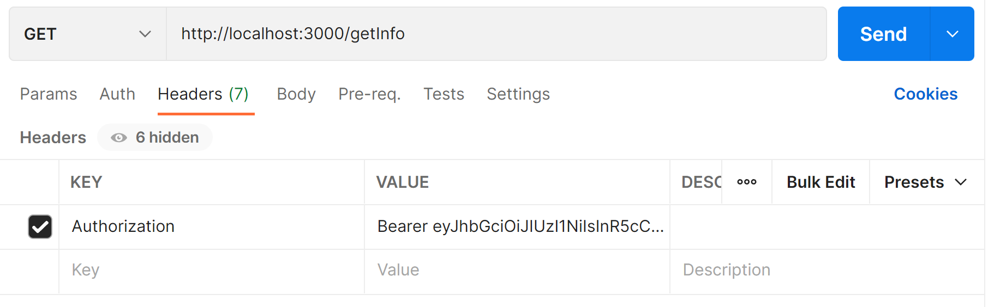

# Node.js

[官方文档](https://nodejs.org/dist/latest-v18.x/docs/api/)

## 1. fs 文件系统模块

fs 是 node 中内置的文件系统模块，可以对文件进行读写。

### 1.1 fs.readFile() 读取文件

`fs.readFile(path[, options], callback)`

* path \<string> | \<Buffer> | \<URL> |\<integer> filename or file descriptor
* options \<Object> | \<string>
  * encoding \<string> | \<null> Default: null
  * flag \<string> See support of file system flags. Default: 'r'.
  * signal \<AbortSignal> allows aborting an in-progress readFile
* callback \<Function>
  * err \<Error> | \<AggregateError>
  * data \<string> | \<Buffer>

eg：

```javascript
const fs = require('fs')

fs.readFile('./demo.txt', 'utf8', (err, value) => {
    if (err) {
        console.log('文件读取失败', err)
    }
    console.log('文件读取成功', value)
})
```

### 1.2 fs.writeFile() 写入文件

`fs.writeFile(file, data[, options], callback)`

* file \<string> | \<Buffer> | \<URL> | \<integer> filename or file descriptor

* data \<string> |\<Buffer> | \<TypedArray> | \<DataView> | \<Object>

* options \<Object> | \<string>
  * encoding \<string> | \<null> Default: 'utf8'
  * mode \<integer> Default: 0o666
  * flag \<string> See support of file system flags. Default: 'w'.
  * signal \<AbortSignal> allows aborting an in-progress writeFile
* callback \<Function>
  * err \<Error> | \<AggregateError>

```javascript
const fs = require('fs')

const text = 'hello world'
fs.writeFile('./demo.txt', text, { flag: 'a+' }, (err) => {
    if (err) {
        console.log('文件写入失败', err)
    }
    console.log('文件写入成功')
})
```

## 2. path 路径模块

path 是 node 中内置的路径处理模块，可以对文件和目录的路径进行处理。

### 2.1 `__dirname` 和` __filename`

在 node.js 中 `__dirname`代表当前文件所处目录的绝对路径，`__filename`代表当前文件的绝对路径。

### 2.2 path.join() 路径拼接

可以将多个路径片段拼接成格式化后完整的路径字符串。涉及路径拼接的操作尽可能使用这个方法，防止出错。

`path.join([...paths])`

* ...paths \<string> A sequence of path segments
* Returns: \<string>

eg：

```javascript
const path = require('path')

let fullPath = path.join('./files', 'demo.txt')
console.log(fullPath)	// files\demo.txt

fullPath = path.join(__dirname, 'demo.txt')
console.log(fullPath)	// 当前文件的绝对路径
```

### 2.3 path.basename() 获取路径最后一部分

获取路径中的最后一部分。如果路径代表一个文件，那就返回带扩展名的文件名，如果不想返回扩展名，需要添加第二个参数。如果路径代表一个目录，那就返回路径的最后一部分。

`path.basename(path[, suffix])`

* path \<string>

* suffix \<string> An optional suffix to remove

* Returns: \<string>

eg：

```javascript
const path = require('path')

let fullPath = './foo/bar/qux.html'
console.log(path.basename(fullPath))	// qux.html
console.log(path.basename(fullPath, '.html'))	// qux

fullPath = './foo/bar'
console.log(path.basename(fullPath))	// bar
```

### 2.4 path.extname() 获取路径中的扩展名

获取路径中的扩展名。如果路径代表一个文件，那就返回文件的扩展名（带小数点）。如果路径不代表一个文件，那就返回一个空串。

`path.extname(path)`

* path \<string>

* Returns: \<string>

eg：

```javascript
const path = require('path')

let fullPath = './foo/bar/qux.html'
console.log(path.extname(fullPath))		// .html

fullPath = './foo/bar/qux'
console.log(path.extname(fullPath))		// 空串
```

## 3 http 模块

http 是 node 中创建 web 服务器的模块。

创建一个简单的 http 服务器：

1. 导入 http 模块
2. 创建 http 服务器实例
3. 为 http 服务器实例绑定 request 事件
4. 启动服务器，监听端口

eg：

```javascript
const http = require('http')

const server = http.createServer()

server.on('request', (req, res) => {
    res.end('hello world')
})

server.listen('3000', () => {
    console.log('server is runing on port 3000')
})
```

运行后，浏览器中输入 http://localhost:3000/ 即可看到 hello world。

### 3.1 request 请求对象

给 http 实例绑定 request 事件处理函数时，传入的时间处理函数有两个形参：req 和 res。这其中第一个形参是一个 request 请求对象。这个对象是内部创建的，通过这个对象可以对客户端发送过来的请求进行处理。

常用属性：

#### 3.1.1 protocol / host / path / url / method

协议 / 主机名 / 路径 / URL / 请求方法

### 3.2 response 响应对象

给 http 实例绑定 request 事件处理函数时，传入的时间处理函数有两个形参：req 和 res。其中第二个形参是一个 response 响应对象。这个对象是内部创建的，通过这个对象可以响应客户端请求。

常用方法：

#### 3.2.1 response.end()

向客户端发送响应，向服务器发出响应完成信号。每个响应都必须调用 end() 方法。

`response.end([data[, encoding]][, callback])`

* data \<string> | \<Buffer>

* encoding \<string>

* callback \<Function>

* Returns: \<this>

#### 3.2.2 response.setHeader()

设置响应头。

`response.setHeader(name, value)`

* name \<string>

* value \<any>

* Returns: <http.ServerResponse>

eg：

```javascript
const http = require('http')

const server = http.createServer()

server.on('request', (req, res) => {
	// 设置响应头
    res.setHeader('Content-Type','text/html; charset=utf-8')
    
    // 发出响应
    res.end('你好，世界')
})

server.listen('3000', () => {
    console.log('server is runing on port 3000')
})
```

## 4. 模块化

### 4.1 node 中的模块分类

根据来源的不同，node 中模块分为3类：

* 内置模块：node 官方提供，无需安装就可以直接引用。比如：fs、path、http 等
* 自定义模块：用户创建的每个 .js 文件，都可以当作自定义模块
* 第三方模块：使用前需要先下载安装

eg，使用 require() 来引入模块：

```javascript
// 加载内置模块，传入模块名
const http = require('http')

// 加载自定义模块，传入路径，可以省略.js后缀
const foo = require('./foo')

// 加载第三方模块，传入模块名（需要提前下载安装）
const axios = require('axios')
```

### 4.2 模块作用域

为了防止全局变量污染，在模块中定义的变量，只能在模块内部访问，无法在外部访问到。

```javascript
// foo.js
const bar = 'baz'
function fn(){}
```

```javascript
// index.js
const foo = require('./foo')
console.log(foo)	// {} 空对象
```

### 4.3 CommonJS 模块化规范

模块化规范指的是使用什么样的语法来引用模块或者对外暴露成员。node 遵循了 CommonJS 规范：

1. 每个模块内部，module 对象代表当前模块
2. module 对象的 exports 属性是对外的接口
3. 使用 require() 函数来加载模块

#### 4.3.1 module 对象

每个自定义模块中都有一个 module 对象，这个对象身上存储了当前模块有关的信息。

##### module.exports 暴露成员

通过 module 的 exports 属性可以向外暴露模块成员。通过 require() 方法导入自定义模块时，拿到的就是自定义模块的 module.exports 对象。

```javascript
// foo.js
const bar = 'baz'
function fn(){}

module.exports = {
    bar,
    fn
}
```

```javascript
// index.js
const foo = require('./foo')
console.log(foo)	// { bar: 'baz', fn: [Function: fn] }
```

#### 4.3.2 exports 对象

由于使用 module.exports 向外暴露成员写法比较繁琐，所以 node 提供了 exports 对象简化操作。初始情况下，exports 和 module.exports 都指向同一个空对象。

```javascript
// foo.js
const bar = 'baz'
function fn() { }

exports.bar = 'baz'
exports.fn = fn
```

```javascript
// index.js
const foo = require('./foo')
console.log(foo)	// { bar: 'baz', fn: [Function: fn] }
```

如果给 exports 或者 module.exports 赋值为一个新的对象，那么这两个对象会失去联系。require() 函数只会去寻找  module.exports。

#### 4.3.3 require() 加载模块

使用 require() 函数来加载模块：

```javascript
require('fs')
require('./foo')
require('axios')
```

##### 模块加载机制

1. 使用 require() 引入模块时，模块在会进行缓存。之后使用 reuqire() 引入模块，会优先从缓存中加载，从而提高加载效率。

2. 使用 require() 引入模块时，node 会先从内置模块中寻找。

3. 使用 require() 引入自定义模块，必须传入以`./`或者`../`开头的路径标识符。

4. 使用 require() 引入自定义模块，如果省略了文件扩展名，会：
   1. 先按确切文件名进行加载
   2. 补全 .js 扩展名进行加载
   3. 补全 .json 扩展名进行加载
   4. 补全 .node 扩展名进行加载
5. 如果传给 require() 的模块标识符不是内置模块，也不以`./`和`../`开头，node 会从当前模块的父目录开始，尝试到 `node_modules`目录在查找第三方模块。如果找不到，会继续向父目录查找，直到系统根目录。
6. 如果将目录作为模块引入，会：
   1. 在该目录下查找 package.json，并寻找 main 属性，将属性值作为加载入口。
   2. 如果找不到 package.json 或者 main 入口解析失败，则试图将目录下的 index.js 作为入口

## 5. npm

node 中第三方模块也叫包（依赖）。npm 是 node 中自带的包管理工具，通过这个工具可以安装、升级、卸载包。

### 5.1 npm init 项目初始化

在项目目录下，运行 npm init 可以对 node 项目进行初始化。运行后，项目根目录会生成一个 package.json 文件。文件中会记录包括项目依赖包在内的项目信息。

```shell
npm init
```

运行这条命令后，需要交互式输入项目名称、版本号等信息。可以使用 -y 参数，对所有问题都回复 yes。

```shell
npm init -y
```

#### package.json

```json
{
  "name": "demo",		// 包名。上传到npm后，可以通过包名搜索到该包
  "version": "1.0.0",	// 版本号
  "description": "",	// 描述
  "main": "index.js",	// 入口文件
  "scripts": {
    "test": "echo \"Error: no test specified\" && exit 1"
  },
  "keywords": [],		// 关键字
  "author": "",			// 作者
  "license": "ISC",		// 开源协议
  "dependencies": {		// 依赖
    "axios": "^1.3.4"
  },
  "devDependencies": {	// 开发依赖
    "webpack": "^5.75.0"
  }
}

```


### 5.2 npm install 安装包

在项目目录下，输入命令：

```shell
npm install <包名>
```

简写：

```shell
npm i <包名>
```

#### -D 安装开发依赖

通过这种方式安装的包，会记录在 package.json 中的 dependencies 节点下。表示在开发环境和生产环境都会用到。如果某些包只会在项目的开发环境中使用，不会应用到生产环境，可以使用 --save-dev 或者 -D 参数：

```shell
npm i -D <包名> 
```

这样，包会记录在 package.json 中的 devDependencies 节点下。

#### -g 安装全局依赖

使用 -g 参数可以把包安装到全局（不在项目目录下）。

```shell
npm i -g <包名>
```

只有工具性质的包才有全局安装的必要性。eg：nodemon 可以监听文件变化，重启服务器，可以代替 node 命令来执行。

```shell
npm i -g nodemon
```

```shell
nodemon index.js
```


#### @ 指定版本

默认情况下，npm install 会安装最新版本的包。可以通过`@`来指定安装包的版本：

```shell
npm i <包名>@<版本号>
```

在不输入包名的情况下，会安装项目目录下 package.json 中所记录的所有依赖包：

```shell
npm install
// 或
npm i
```

### 5.3 npm uninstall 卸载包

在项目目录下，输入命令：

```shell
npm uninstall <包名>
```

即可卸载指定包，并将这个包从 package.json 中的依赖项中删除。

#### -g 卸载全局依赖

```shell
npm uninstall -g <包名>
```

## 6. Express

Express 是基于 node 的快速、开放、极简的 web 开发框架。Express 封装了 http 模块，开发效率更高。

### 6.1 安装

在项目的根目录下：

```shell
npm init
npm install express
```

### 6.2 起步

1. 引入依赖
2. 创建 web 服务器
3. 监听端口

```javascript
const express = require('express')

const app = express()

app.listen(3000, () => {
    console.log('express server is running at http://localhost:3000')
})
```

### 6.3 监听 GET / POST 请求

通过 app.get() 方法来监听 GET 请求。函数接收两个参数，第一个参数是路径名，第二个参数是回调函数。回调函数有两个参数，第一个参数是请求对象，第二个参数是响应对象。

```javascript
app.get('/', (req, res)=>{
    res.send('hello world')
})
```

通过 app.post() 方法来监听 POST 请求。

```javascript
app.post('/foo', (req, res)=>{
    res.send('post')
})
```

### 6.4 请求对象

#### 6.4.1 req.query 查询对象

通过请求对象身上的 query 属性可以获取查询对象。默认为空对象

```javascript
// 当客户端发送 get 请求：http://localhost:3000/?foo=a&bar=b

app.get('/', (req, res)=>{
    const query = req.query
    console.log(query)	// { foo: 'a', bar: 'b' }
})
```

#### 6.4.2 req.params 动态参数对象

通过请求对象身上的 params 属性可以获取动态参数对象。默认为空对象。例如：当请求URL为 `/posts/:id` 时，id 就是一个动态参数。

```javascript
// 当客户端发送 get 请求：http://localhost:3000/posts/3

app.get('/posts/:id', (req, res)=>{
    const params = req.params
    console.log(params)		// { id: '3' }
})
```

### 6.5 响应对象

#### 6.5.1 res.send() 发送响应

通过响应对象身上的 send() 方法，可以向客户端发送响应。

```javascript
app.get('/', (req, res)=>{
    res.send('hello world')
})
```

### 6.6 express.static() 托管静态资源

通过 express.static() 方法可以托管静态资源。express 在指定的静态资源目录中查找文件，并提供资源的当前路径。

```javascript
app.use(express.static('public'))
// eg: http://localhost:3000/index.html
// eg: http://localhost:3000/css/reset.css
// eg: http://localhost:3000/js/index.js
```

按照这种方式托管的静态资源，没有路径前缀。如果想设置一个路径前缀，可以：

```javascript
app.use('/public', express.static('public'))
// eg: http://localhost:3000/public/index.html
// eg: http://localhost:3000/public/css/reset.css
// eg: http://localhost:3000/public/js/index.js
```

如果想托管多个静态资源目录，可以多次调用：

```javascript
app.use(express.static('public'))
app.use(express.static('files'))
```

如果多个静态资源目录中存在多个同名文件，那么按照调用次序，访问时返回先调用的静态资源目录下的文件。

### 6.7 路由

在 express 中，路由指的是客户端请求和服务端处理函数之间的映射关系。

可以直接将路由挂载到 app 上

```javascript
app.get('/', ()=>{})
app.post('/foo', ()=>{})
```

可以将路由单独写成一个模块：

```javascript
// router.js

const express = require('express')
const router = express.Router()

router.get('/', (req, res) => {
    res.end('hello world')
})
router.post('/foo', () => { })

module.exports = router
```

```javascript
// index.js

const express = require('express')
const app = express()

const router = require('./router')
app.use(router)

app.listen(3000, () => {
    console.log('express server is running at http://localhost:3000')
})

// http://localhost:3000/foo
```

如果想给路由添加一个前缀：

```javascript
app.use('/api', router)

// http://localhost:3000/api/foo
```

### 6.8 中间件

中间件（middleware），是将具体业务和底层逻辑解耦的组件。express 中的中间件函数可以访问请求对象、响应对象和请求-响应周期中 next() 函数。

```javascript
// 中间件函数
const mw = (req, res, next)=>{
    console.log('a middleware function')
    next()
}
```

中间件可以执行以下功能：

* 执行业务代码
* 对请求对象和响应对象进行更改
* 结束请求-响应周期
* 调用堆栈中的下一个中间件

如果当前中间件函数没有结束请求-响应周期，那就必须调用 next() 函数来将控制权交给下一个中间件。否则，请求会被搁置。

中间件之间共享同一份 req 和 res。上游中间件对 req 和 res 的修改会传递给下游的中间件。

#### 6.8.1 全局生效

全局生效的中间件是请求到达服务器之后，都会触发的中间件。通过调用 app.use()，并传入中间件函数，可以使其全局生效。

```javascript
const mw = (req, res, next)=>{
    next()
}

app.use(mw)
```

注意：中间件要在路由之前定义注册。否则中间件无法工作。

#### 6.8.2 局部生效

局部生效的中间件只会在当前路由中生效。

```javascript
const mw = (req, res, next) => {
    next()
}

app.get('/foo', mw, (req, res) => {
    res.end('hello world')
})
```

也可以定义多个局部的中间件：

```javascript
const mw1 = (req, res, next) => {
    console.log('1')
    next()
}
const mw2 = (req, res, next) => {
    console.log('2')
    next()
}
const mw3 = (req, res, next) => {
    console.log('3')
    next()
}

// 两种方式均可：
router.get('/foo', mw1, mw2, mw3, (req, res) => {
    res.end('hello world')
})

router.get('/foo', [mw1, mw2, mw3], (req, res) => {
    res.end('hello world')
})
```

#### 6.8.3 分类

1. 应用级别的中间件

   通过 app.use() 或者 app.get() 和 app.post() 绑定到 app 实例上面的中间件。

   ```javascript
   const app = express()
   
   const mw = (req, res, next)=>{
       next()
   }
   
   app.use(mw)
   ```

2. 路由级别的中间件

   绑定到 express.Router() 实例上的中间件。和应用级别中间件没有什么区别，应用级别中间件绑定到 app 上，路由级别中间件绑定到 router 实例上。

   ```javascript
   // router.js
   const router = express.Router()
   
   const mw = (req, res, next)=>{
       next()
   }
   
   router.use(mv)
   
   module.exports = router
   ```

   ```javascript
   // index.js
   const router = require('./router')
   
   app.use(router)
   ```

3. 错误级别的中间件

   专门来捕获项目中抛出的异常，防止项目异常崩溃。错误级别的中间件处理函数有4个形参:

   ```javascript
   const mw = (req, res, next) => {
       throw new Error('error!')
   }
   app.get('/', mw, (req, res) => {
       res.end('hello world')
   })
   
   const errorHandler = (err, req, res, next) => {
       console.log(err.message)
       res.end('The error has been processed')
   }
   app.use(errorHandler)
   ```

   注意：错误级别的中间件必须注册在所有路由之后。

4. express 内置中间件

   express 内置的常用中间件函数：

   * express.static()：托管静态资源

     ```javascript
     app.use(express.static('./public'))
     ```

   * express.json()：解析 JSON 格式的请求体

     ```javascript
     app.use(express.json())
     ```

     注册了 express.json() 中间件之后，客户端发送过来的 json 格式的数据可以在路由处理函数中的 req.body 中获取：

     ```javascript
     app.post('/foo', (req, res) => {
         console.log(req.body)	// 可以拿到请求体数据
         res.end('hello world')
     })
     ```

   * express.urlencoded()：解析 URL-encoded 格式的请求体

     ```javascript
     app.use(express.urlencoded({ extended: false }))
     ```

     注册了 express.urlencoded() 中间件之后，客户端发送过来的表单数据，可以在路由处理函数中的 req.body 中获取。

5. 第三方中间件

   第三方的中间件，按需下载并注册即可。比如：使用 cors 这个第三方的中间件来解决跨域问题。

   ```shell
   npm install cors
   ```

   ```javascript
   const cors = require('cors')
   app.use(cors())
   ```

   注意：在路由之前进行注册。

## 7. MySQL

### 7.1 安装并配置

安装：

```shell
npm install mysql
```

配置：

```javascript
const mysql = require('mysql')
const db = mysql.createPool({
    host: 'localhost',
    user: 'root',
    passward: 'root',
    databse: 'express'
})
```

测试：

```javascript
const sql = 'select 1'
db.query(sql, (error, value) => {
    if (error) {
        throw error
    }
    console.log(value)	// [ RowDataPacket { '1': 1 } ]
})
```

### 7.2 增删查改

当前 express 库中 users 表结构如下，其中 id 字段自增：

```
+----+------+--------+
| id | name | age	 |
+----+------+--------+
|  1 | foo  | 18     |
+----+------+--------+
```

#### 增：

```javascript
const sql = 'insert into users(name, age) values(?, ?);'

const user = {
    name: 'bar',
    age: 24
}

db.query(sql, [user.name, user.age], (error, value) => {
    if (error) { throw error }
    console.log(`affectedRows: ${value.affectedRows}`)
    // affectedRows: 1
})
```

如果对象的属性和字段名一一对应，那么可以进行简写：

```javascript
const sql = 'insert into users set ?;'

const user = {
    name: 'bar',
    age: 24
}

db.query(sql, user, (error, value) => {
    if (error) { throw error }
    console.log(`affectedRows: ${value.affectedRows}`)
})
```

#### 删：

```javascript
const sql = 'delete from users where id=?'

const user = {
    id: 3
}

// 如果只传一个参数，那不必放在数组中
db.query(sql, user.id, (error, value) => {
    if (error) { throw error }
    console.log(`affectedRows: ${value.affectedRows}`)
})
```

#### 改：

```javascript
const sql = 'update users set name=?, age=? where id=?;'

const user = {
    id: 2,
    name: 'bar',
    age: 24
}

db.query(sql, [user.name, user.age, user.id], (error, value) => {
    if (error) { throw error }
    console.log(`affectedRows: ${value.affectedRows}`)
})
```

如果对象的属性和字段名一一对应，那么可以进行简写：

```javascript
const sql = 'update users set ? where id=?;'

const user = {
    id: 3,
    name: 'bar',
    age: 24
}

db.query(sql, [user, user.id], (error, value) => {
    if (error) { throw error }
    console.log(`affectedRows: ${value.affectedRows}`)
})
```

#### 查：

```javascript
const sql = 'select * from users'

db.query(sql, user.id, (error, value) => {
    if (error) { throw error }
    // value 是一个数组，每个元素是一条数据
    value.forEach(item => {
        console.log(item.id, item.name, item.age)
    })
})
```

## 8. 鉴权

### 8.1 session

安装并注册 express-session：

```shell
npm install express-session
```

```javascript
const session = require('express-session')

app.use(session({
    secret: 'secret key',
    resave: false,
    saveUninitialized: true
}))
```

注册后， session 信息会挂载到 req.session 中：

```javascript
app.post('/login', (req, res) => {
    console.log(req.session)
})
```

### 8.2 JWT 

JWT，JSON Web Token。通常由三部分组成，分别是 Header（头部）、Payload（载荷）和 Signature（签名）。

安装：

```shell
npm install jsonwebtoken express-jwt
```

其中 jsonwebtoken 用于生成 JWT 字符串，express-jwt 中间件用于将 JWT 字符串解析成 JSON 对象。

使用 jsonwebtoken  生成 token：

```javascript
const jwt = require('jsonwebtoken')
const secretKey = 'key'
const token = jwt.sign({ username: 'foo', password: 'bar' }, secretKey, { expiresIn: '3600s' })
console.log(token)
```

生成的 token 在前面加上 Bearer，放在每次请求的 Authorization 请求头中。



express-jwt 中间件注册后，解析出来的信息会挂载到 req.auth上。

```javascript
const { expressjwt } = require('express-jwt')
app.use(expressjwt({ secret: secretKey, algorithms: ["HS256"] }).unless({ path: ["/login"] }))

app.get('/getInfo', (req, res) => {
    res.send(req.auth)	//{"username":"foo","password":"bar","iat":1678352356,"exp":1678355956}
})
```

