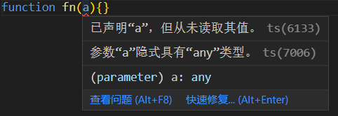

# 类型全解


## 1. any

any 包含所有的值，而且可以对其做任何操作。当 TS 无法确定类型是什么时，默认为 any。

如果 TS 推导出值的类型为 any，会抛出运行时异常（编辑器中会显示红色波浪线）：



如果想使用 any，必须显示进行注解：

```
function fn(a: any){} // 这样不会报错
```

> TSC 配置项：noImplicitAny
>
> 当 noImplicitAny 为 true 时，不允许推导出隐式 any 类型。
>
> noImplicitAny 属于 strict 配置项。strict 为 true 时，无需单独配置 noImplicitAny。

## 2. unknown

unknown 包含所有值，但是 TS 会要求对其检查并细化类型。unknown 可以比较、否定、使用 typeof 和 instanceof 进行细化类型。当确实无法预知一个值的类型时，应该使用 unknown，而不是 any。

TS 不会推导出 unknown 类型，必须显示注解：

```typescript
let a: unknown = 10
```

执行操作时，不能假定 unknown 类型的值是某种特定类型，必须先细化类型：

```typescript
let a: unknown = 10

let b = a + 10	// error TS18046: 'a' is of type 'unknown'.

let c = a as number + 10 // number
```

## 3. boolean

boolean 包含两个值：true 和 false。boolean 可以比较、否定。

可以让 TS 推导出值的类型：

```typescript
let x = true // boolean
```

一般**不会**将值的类型显示注解为 boolean：

```typescript
let y: boolean = true // boolean
```

可以让 TS 推导出值为某个具体的 boolean 值：

```typescript
const a = true	// true
```

可以明确告诉 TS 值为某个具体的布尔值：

```typescript
let b: true = true	// true
let c: true = false	// error TS2322: Type 'false' is not assignable to type 'true'.
```

### 类型字面量

上面的变量 a 和 b 不是普通的 boolean 类型，而是只为 true 的 boolean 类型。这种类型称为类型字面量，也就是仅仅表示一个值的类型。

## 4. number

number 包括所有的数字：整数、浮点数、Infinity、NaN。可以进行算数运算。

类型声明上和 boolean 一样，一般让 TS 自动推导出 number 类型，不会将值显示注解为 number。也可以将值的类型限制为某个值。

## 5. bigint

bigint 包括所有的大整数。可以进行算数运算。

类型声明和 boolean、number 一样。

## 6. string 

string 包括所有的字符串。可以进行拼接、切片等操作。

类型声明和 boolean、number、bigint 一样。

## 7. symbol

symbol 包括所有的符号。

可以让 TS 推导出值的类型：

```typescript
let a = Symbol('foo')	// symbol
```

使用 const 声明的符号， TS 会推导出 unique symbol 类型。但是在编辑器中会显示 typeof xxx，而不是 unique symbol：

```typescript
const b = Symbol('foo')	// typeof b
```

可以显示注解 const 变量的类型为 unique symbol：

```typescript
const c:unique symbol = Symbol('foo') // typeof c
```

## 8. 对象 object

TS 的对象类型表示对象的结构。

可以指明变量的类型为 object，但是不常用，因为 TS 更关心对象的结构：

```typescript
let x: object = { foo: 'bar' }
```

可以让 TS 自动推导出对象的结构：

```typescript
let a = {
    foo: {
        bar: 'baz'
    }
}
```

可以在花括号中明确描述：

```typescript
let b: { foo: number } = { foo: 10 }
```

使用 const 声明对象时，TS 不会把推导的类型缩窄：

```typescript
const b = { foo: 10 }	// {foo: number} 而不是 {foo: 10}
```

不可以添加额外属性或者缺少属性：

```typescript
let c: { foo: number }

c = {} // error TS2741: Property 'foo' is missing in type '{}' but required in type '{ foo: number; }'.

c = {
    foo: 10,
    bar: 8		
}	// error TS2322: Type '{ foo: number; bar: number; }' is not assignable to type '{ foo: number; }'.

```

### 8.1 明确赋值

如果先声明变量再进行初始化，TS 需要确保使用变量时已经明确为其赋值：

```typescript
let i:number
let j = i + 1	// error TS2454: Variable 'i' is used before being assigned.
```

当没有显式注解时，TS 会强制进行类型检查：

```typescript
let i 
let j = i + 1	// error TS18048: 'i' is possibly 'undefined'.
```

### 8.2 可选属性

默认情况下，TS 对属性的要求非常严格。但是也可以告诉 TS 某个属性可选，或者实际属性多于计划：

```typescript
let obj: {
    foo: number,
    bar?: string,	// 可选属性
    [key: number]: boolean	//索引签名
}
```

表示属性 foo 是必要的，bar 是可选的，还可以有**任意多**的数字属性。

`myKey?: T `，表示类型为 T 的 myKey 这个属性是可选属性。

 ### 8.3 索引签名

`[ key: T ]: U`，表示类型为 T 的键，对应值的类型为 U 。可以有任意多个 类型为 T 的键。不过，键的类型 T 必须可以赋值给 number 或者 string。

### 8.4 只读属性

可以使用 readonly 修饰符将某个属性标记为只读。指明为属性赋予初始值之后便无法修改。

```typescript
let obj: {
    readonly foo: number
} = {
    foo: 10
}

obj.foo = 8 // error TS2540: Cannot assign to 'foo' because it is a read-only property.
```

## 9. 数组

TS  中数组是特殊类型的对象。可以对其拼接、搜索、切片等等。使用数组类型时，应尽量保证元素的类型相同。

```typescript
let a = [1, 2, 3]		// number[]
let b = ['a', 'b', 'c']	// string[]
let c = [1, 'a']		// (string | number)[]

let d: string[] = ['a']		// 常用句法
let e: Array<string> = ['a'] // （长格式句法）两种声明数组类型的方法，无差别
```

声明并初始化数组时，TS 会对数组中的元素类型进行判断：

```typescript
let a = [1]	// number[]

a.push(2)
a.push('a')	// error TS2345: Argument of type 'string' is not assignable to parameter of type 'number'.
```

```typescript
let a = [1, 'a'] // (string | number)[]

a.push(2)
a.push('a')
```

```typescript
let a = []	// any[]

a.push(2)
a.push('a')
a.push(true)
```

使用 const 声明数组时，TS 不会把推导的类型缩窄：

```typescript
const x = [1, 'a']	// (string | number)[]

x[0] = 2
x[1] = 'b'
```

## 10. 元组

元组是数组的子类型，表明数组长度固定，每个位置上元素的类型也固定。

```typescript
let x: [number, number] = [1, 2]

x[1] = 3		// 可以就地修改元素
x[1] = 'a'		// 报错，不可以改变该位置上的元素类型

x.push(4)		// 可以新加元素
x.push('b')		// 报错，不可以新加不在声明中的元素类型
```

为了避免和数组混淆，必须**显示注解**元组类型：

```typescript
let a:[number] = [1]
let b:[number, boolean, string] = [1, true, 'a']
```

元组支持可选元素：

```typescript
let c:[number, boolean?][] = [
    [1],
    [2, true],
    [3]
]
```

元组支持**剩余元素**，可以用来为元组定义最小长度：

```typescript
let d:[number, ...number[]] = [1]	// 最少需要一个数字元素
let e:[number, boolean, ...string[]] = [1, true, 'a', 'b'] // 最少需要一个数字，一个布尔值
```

### 只读数组

只读数组类型用来创建**不可变**的数组。只读数组不能就地更改，如果想更改只读数组就必须使用非变型方法用其它变量接收（比如 .concat 和 .slice）。

必须**显式注解**只读数组：

```typescript
let a: readonly number[] = [1,2,3]

let b = a.concat(4)
let c = a.slice(1)
console.log(a)	// [1,2,3]
console.log(b)	// [1,2,3,4]
console.log(c)	// [2,3]

a.push(4) 	// error TS2339: Property 'push' does not exist on type 'readonly number[]'.
```

长格式句法：

```typescript
type A = readonly number[]
type B = ReadonlyArray<number>
type C = Readonly<number[]>

type D = readonly [number, string]
type E = Readonly<[number, string]>
```

## 11. null 和 undefined

null 类型只有一个值 null；undefined 类型只有一个值 undefined。

## 12. void 和 never

void 指函数没有显式返回值（比如 console.log），never 指函数根本不返回值（比如抛出异常或者死循环）。

```typescript
function fn(){} // 返回 void 的函数
```

```typescript
function fn(){while(true){}}	// 返回 never 的函数？
```

## 13. 枚举

枚举用来列举类型中包含的各个值。可以看作把键映射到值上的无序数据结构，可以将字符串映射到字符串或者数字上。

> 按约定，枚举名称使用大写单数形式，键也大写。

举例：

```typescript
enum Person{
    Foo,
    Bar,
    Baz
}
```

TS 可以为枚举类型的成员自动推导出数字：

```typescript
enum Person{
    Foo = 0,
    Bar = 1,
    Baz = 2
}
```

也可以自己指定数字：

```typescript
enum Person{
    Foo = 100,
    Bar = 200,
    Baz = 201
}
```

是可以使用点或者方括号语法来访问枚举值：

```typescript
let a = Person.Foo
let b = Person['Bar']
```

可以分开声明枚举值。但是，由于 TS 只能推导出一部分值，最好给每个成员显式赋值：

```typescript
enum Person{
    Foo = 0
}

enum Person{
    Bar = 1,
    Baz = 2
}
```

可以只给部分成员赋值，TS 会**尽力**推导出值：

```typescript
enum Person{
    Foo = 100,
    Bar = 150,
    Baz		// TS 会推导出 151
}
```

值可以是字符串或者数字或者混用：

```typescript
enum Person{
    Foo = 'foo',
    Bar = 150,
    Baz = 'baz'
}
```

不安全的访问操作：

```typescript
enum Person{
    Foo,
    Bar,
    Baz
}
let a = Person[3]	// string
console.log(a)		// undefined
```

可以使用 const enum 指定使用枚举的安全子集：

```typescript
const enum Person{
    Foo,
    Bar,
    Baz
}

// error TS2476: A const enum member can only be accessed using a string literal.
let a = Person[3]	
```

> 枚举容易导致出现安全问题，建议远离枚举。

# 类型别名、并集和交集

## 1. 类型别名 type

使用 type 给类型声明别名：

```typescript
type Age = number

type Person = {
    name: string
    age: Age
}

let p: Person = {
    name: 'foo',
    age: 10
}
```

同一类型不能声明两次：

```typescript
type Age = number
type Age = number // error TS2300: Duplicate identifier 'Age'.
```

类型别名采用**块级作用域**：

```typescript
type Foo = number

function fn(){
    type Foo = string
    let a: Foo = 'bar'
}

let b: Foo = 10
```

## 2. 并集 & 和交集 |

给定 A 和 B，并集指两者内容之和，交集指两者共有的内容。

TS 中类型的并集使用 | 表示，类型的交集使用 & 表示：

```typescript
type Foo = {
    a: number
    b: boolean
    c: string
}

type Bar = {
    a: number
    d: boolean
    e: string
}

type FooOrBarOrBoth = Foo | Bar
type FooAndBar = Foo & Bar
```

对于并集 FooOrBarOrBoth 来说，Foo 类型、 Bar 类型或者两者兼具的值都可以赋值给 FooOrBarOrBoth。

```typescript
let x: FooOrBarOrBoth = { 
    a: 10, 
    b: true, 
    c: ''
}

let y: FooOrBarOrBoth = { 
    a: 10, 
    d: true,
    e: ''
}

let z: FooOrBarOrBoth = {
    a: 10,
    b: true,
    c: '',
    d: false,
    e: ''
}
```

对于交集 FooAndBar 来说，必须同时有 Foo 类型和 Bar 类型的所有属性：

```typescript
let obj: FooAndBar = {
    a: 10,
    b: true,
    c: '',
    d: false,
    e: ''
}
```

