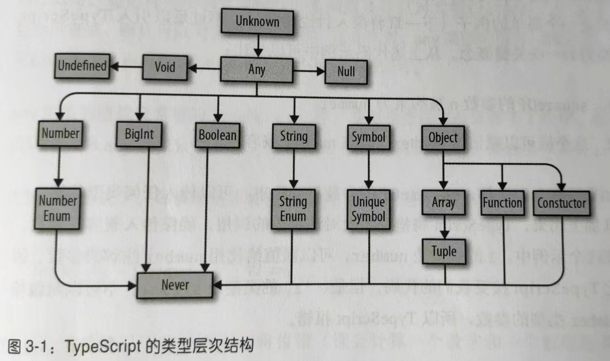

## 类型进阶

 ## 1. 类型之间的关系

### 1.1 子类型和超类型



子类型：如果 B 是 A 的子类型，那么在需要 A 的地方都可以放心使用 B。

超类型：如果 B 是 A 的超类型，那么在需要 B 的地方都可以放心使用 A。

举例：

1. Array 是 Object 的子类型，Object 是 Array 的超类型。需要 Object 的地方都可以放心使用 Array。
2. 如果 Bird 类扩展自 Animal 类，那么 Bird 是 Animal 的子类型，Animal 是 Bird 的超类型。需要 Animal 的地方都可以放心使用 Bird。

### 1.2 型变

型变的四种方式：

1. 不变：只能传入 T 类型
2. 协变：可以传入 T 类型或者是 T 的子类型
3. 逆变：可以传入 T 类型或者是 T 的超类型
4. 双变：可以传入 T 类型或者是 T 的子类型或者是 T 的超类型

在 TS 中，对象、类、数组和函数返回类型的每个成员会进行**协变**；函数的参数类型会进行**逆变**。

#### 1.2.1 结构型变

在 TS 中，对于预期的结构，可以传入属性的同类型或者子类型，但是不可以传入超类型。也就是说，如果想保证 A 对象可以赋值给 B 对象，A 对象中的每个属性必须 是 B 对象中对应属性的同类型或者子类型。

```typescript
// foo预期传入参数的id属性为 number | undefined
function foo(x: { id?: number }) { }

type A = {
    id: number
}

type B = {
    id?: number | string
}

let a: A = { id: 1 }
let b: B = { id: '001' }

foo(a)	// 可以，foo预期传入参数的id属性为 number | undefined，实际传入的是子类型 number
foo(b)	// 报错，，foo预期传入参数的id属性为 number | undefined，实际传入的是超类型 number | string | undefined
```

#### 1.2.2 函数型变

如果函数 A 的参数数量小于或等于函数 B 的参数数量，而且满足下面的条件，那么函数 A 是函数 B 的子类型：

1. 函数 A 的 this 类型没有指定，或者是函数 B 的 this 类型的同类型或超类型
2. 函数 A 的各个参数的类型是函数 B 对应参数的同类型或者超类型
3. 函数 A 的**返回类型**是函数 B 返回类型的同类型或者子类型

函数返回类型的**协变**是指一个函数是另一个函数的子类型，也即一个函数的返回类型是另一个函数返回类型的同类型或者子类型：

```typescript
// 函数类型协变
// C 是 B 的子类型，B 是 A 的子类型
class A { }
class B extends A {
    foo(){}
}
class C extends B {
    bar(){}
 }

// clone 接受一个函数参数，传入的函数接收一个B类型参数，返回一个B类型参数
function clone(f: (b: B) => B) { }

// 传入的函数接收B类型，返回B类型。显然可以
function b2b(b: B): B { return b }
clone(b2b)

// 传入的函数接收B类型，返回B的超类型。不可以
function b2a(b: B): A { return b as A }
clone(b2a)	// 报错

// 传入的函数接收B类型，返回B的子类型。可以
function b2c(b: B): C { return b as C }
clone(b2c)
```

函数参数的**逆变**是指，为了保证一个函数可赋值给另一个函数，该函数的参数类型包括 this 类型，都要是另一个函数相应参数的同类型或者超类型：

```typescript
// 函数参数逆变
// 传入的函数参数接收 B 类型的超类型。可以
function a2b(a: A): B { return a as B }
clone(a2b)

// 传入的函数参数接收 B 类型的子类型。不可以
function c2b(c: C): B { return c as B }
clone(c2b)	// 报错
```

### 1.3 可赋值性

可赋值性是指：判断需要类型 B 的地方，是否可以用类型 A。也就是说，A 类型是否可以赋值给 B 类型。

规则如下：

首先判断 B 是不是枚举类型。如果不是枚举类型，比如：数组、对象、函数、类等等，满足下面任意条件时，A 类型可以赋值给 B 类型：

1. A 是 B 的同类型或者子类型
2. A 是 any

如果 B 是枚举类型，满足下面任意条件时，A 类型可以赋值给枚举类型 B：

1. A 是枚举类型 B 的成员

2. B 至少有一个成员是 number 类型，而且 A 是 number 类型。

   ```typescript
   enum Foo {
       X = 1,
       Y = 2
   }
   
   let a = 3
   
   function fn(x: Foo) { }
   
   fn(a)
   ```

### 1.4 类型拓宽

声明可变的变量时，变量的类型会从字面值拓宽到基类型：

```typescript
let a = 10		// number
let b = true	// boolean
let c = 'c'		// string
let d = { foo: 'bar' }	// {foo: string}
```

声明不可变的变量时，变量的类型不会拓宽：

```typescript
const a = 'a'	// 'a'
const b = 0		// 0
```

声明变量时显示注解字面值可以阻止 TS 进行类型拓宽：

```typescript
let a: 10 = 10
let b: 'foo' = 'foo'
let c: true = true
```

不声明类型，直接初始化为 null 或者 undefined，类型会被拓宽为 any：

```typescript
let a = undefined	// any
let b = null		// any
```

但是该变量离开声明所在作用域时，会重新分配具体类型：

```typescript
function f() {
    let a = null	// any
    a = 'foo'		// any
    return a
}

f()	// 重新分配为 string 而不是 any
```

#### 1.4.1 const 类型

使用 const 类型作为类型断言，可以禁止类型拓宽：

```typescript
let a = { x: 10 }   // {x: number}

let b = { x: 10 } as const  //{readonly x: 10}
```

const 不仅会阻止类型拓宽，还会递归地把成员设置为 readonly。

#### 1.4.2 多余类型检查

**多余属性检查**：尝试将一个新鲜对象字面量类型 T 赋值给另一个类型 U 时，如果 T 中有不在 U 中的属性，TS 会报错。

**新鲜对象字面量**：指 TS 从对象字面量中推导出的类型。如果对象字面量有类型断言，或者把对象字面量赋值给变量，那么新鲜对象字面量类型将会被拓宽到常规的对象类型，也就不能称其为新鲜对象字面量。

### 1.5 细化

TS 类型检查器在检查代码的过程中利用流程语句（if，？，||，...）和类型查询（typeof，instanceof，in）来**细化**类型。

```typescript
// 传入的 x 是 number|string|undefined 类型
function foo(x?: number | string) {
    // 根据流程语句逐步细化
	// 判断 x 是 undefined 的情况
    if (x == undefined) {
        return
    }
	// 判断 x 是 number 的情况
    if (typeof x == 'number') {
        return x.toPrecision()
    }
	// 这里的 x 只能是 string 类型
    return x.repeat(2)
}
```

## 2. 全面性检查

TS 类型检查器为确保所有情况被覆盖，会进行全面性检查。

```typescript
// error TS2366: Function lacks ending return statement and return type does not include 'undefined'.
type Foo = 'A' | 'B' | 'C'
function bar(f: Foo): Foo {
    switch (f) {
        case 'A': return 'B'	
    }
    // 这里缺少 return 返回语句
}
```

## 3. 断言

当暂时无法向 TS 证明安全性时，可以使用断言来操作类型。

>断言不安全，应该尽量避免使用。

### 3.1 类型断言 as

可以向类型检查器来断定一个类型是自身的超类型或者子类型，但是不能断定为不相关的类型。

```typescript
class A { }
class B extends A {
    foo() { }
}
class C extends B {
    bar() { }
}

let b = new B()

function fn(x: B) { }
fn(b)

function fn1(x: A) { }
fn1(b as A)		// 断言为超类型

function fn2(x: C) { }
fn2(b as C)		// 断言为子类型

function fn3(x: number) { }
fn3(b as number)	// 不能断言为不相关的类型
```

另一种语法：

```typescript
fn1(<A>b)		// 另一种语法
fn2(<C>b)		// 另一种语法
```

### 3.2 非空断言 !

将可为空的类型断言为非空。比如将 T | undefined | null 断言为 T 而不是 undefined 或者 null。

举例：

```typescript
// 关闭对话框。通过 id 获取对话框 Dom，并将其从 Dom 树中移除
type Dialog = {
    id?: string
}

function closeDialog(dialog: Dialog) {
    if (!dialog) {
        return
    }
    setTimeout(() => {
        removeFromDom(
            dialog,
            // 断言 dialog.id 非空
            // 断言 document.getElementById() 一定返回非空值
            document.getElementById(dialog.id!)!
        )
    })
}

function removeFromDom(dialog: Dialog, element: Element) {
    // 断言 element.parentNode 非空
    element.parentNode!.removeChild(element)
    delete dialog.id
}
```

### 3.3 明确赋值断言 !

TS 通过明确赋值检查来确保使用变量时已经为其赋值。

举例：

```typescript
let id: string
id.toLowerCase()	// 报错
```

如果通过 getID() 来给 id 赋值：

```typescript
let id:string

getID()				// 执行后， id 已有值

id.toLowerCase()	// 不过，这里还是会报错

function getID(){
    id = '001'
}
```

可以通过明确赋值断言来告诉 TS，在读取 id 的时候，肯定已经为其赋值了：

```typescript
let id!:string		// 明确赋值断言

getID()

id.toLowerCase()	// 这里不会报错

function getID(){
    id = '001'
}
```

## 4. 对象类型进阶

### 4.1 对象类型的类型运算符

类型运算符不只有并集 | 和交集 & 两种。

#### 4.1.1 键入运算符 []

使用方括号表示法，可以在结构中查找类型：

```typescript
type MyResponse = {
    user: {
        id: string,
        friendList: {
            count: number,
            friends: {
                bar: string,
                baz: string
            }[]
        }
    }
}

// 键入运算符，只能使用方括号语法，不能使用点语法
type FriendList = MyResponse['user']['friendList']
```

#### 4.1.2 keyof 运算符

keyof 运算符可以获取对象所有键的类型，并合并为一个**字符字面量**类型：

```typescript
type MyResponse = {
    user: {
        id: string,
        friendList: {
            count: number,
            friends: {
                bar: string,
                baz: string
            }[]
        }
    }
}

type MyResponseKeys = keyof MyResponse      // 'user'
type UserKeys = keyof MyResponse['user']    // 'friendList' | 'id'
type FriendListLeys = keyof MyResponse['user']['friendList']    // 'count' | 'friends'
```

键入运算符和 keyof 运算符强大的地方在于，可以准确、安全地描述结构类型。

### 4.2 映射类型

TS 提供了类型更安全的映射类型。

```typescript
type Weekday = 'Mon' | 'Tue' | 'Wed' | 'Thu' | 'Fri'
type Day = Weekday | 'Sat' | 'Sun'

let nextDay: { [K in Weekday]: Day } = {
    Mon: 'Tue',
    Tue: "Wed",
    Wed: "Thu",
    Thu: "Fri",
    Fri: "Sat"
}
```

#### 内置的映射类型

TS 内置了一些映射类型：

1. Record< Keys, Values>：键的类型为 Keys，值的类型为 Values 的对象。
2. Partial< Object >：把 Object 中的每个字段都标记为可选的。
3. Required< Object >：把 Object 中每个字段都标记为必须的。
4. Readonly< Object >：把 Object 中每个字段都标记成只读的。
5. Pick< Object, Keys>：返回 Object 的子类型，只含指定的 keys。

举例：**Record 类型**。TS 内置的 Record 类型可以用来描述有映射关系的对象。

与常规的对象索引签名相比，Record 提供了更多的便利：使用常规的索引签名可以约束对象中值的类型，但是键只能用 string、number 或 symbol 类型；使用 Record 还可以约束对象的键为 string 和 number 的子类型。

```typescript
type Weekday = 'Mon' | 'Tue' | 'Wed' | 'Thu' | 'Fri'
type Day = Weekday | 'Sat' | 'Sun'

let nextDay: Record<Weekday, Day> = {
    'Mon': 'Tue',
    'Tue': 'Wed',
    'Wed': 'Thu',
    'Thu': 'Fri',
    'Fri': 'Sat'
}
```

## 5. 函数类型进阶

### is 运算符

类型细化的能力有限，只能细化当前作用域中变量的类型，一旦离开这个作用域，类型细化的能力不会带到新的作用域中：

```typescript
function isString(a: unknown): boolean {
    return typeof a === 'string'
}

function fn(input: string | number) {
    let res: string
    if (isString(input)) {
        // 报错，TS 无法推导出 input 是 string 类型
    	// isString 函数内部对类型的细化无法带到新的作用域
        res = input.toUpperCase()
    }
    res = input.toString()
    return res
}
```

可以自定义**类型防护措施**，来告诉类型检查器当返回 true 时，表明传给 isString() 的是字符串：

```typescript
// 类型防护措施
function isString(a: unknown): a is string {
    return typeof a === 'string'
}

function fn(input: string | number) {
    let res: string
    if (isString(input)) {
        res = input.toUpperCase()
    }
    res = input.toString()
    return res
}
```

如果函数细化了参数的类型，而且返回一个布尔值。那么可以使用 is 运算符来自定义类型防护措施，确保类型的细化能在作用域之间转移，在使用该函数的任何地方都可以使用。

## 6. 条件类型

条件类型的语法和三元表达式差不多，只是运算位于类型层面：

```typescript
type IsString<T> = T extends string ? true : false

type A = IsString<string>	// true
type B = IsString<number>	// false
```

### 6.1 条件分配

条件类型遵循分配率：

```typescript
type T = number
type A = string
type B = boolean

// Foo 和 Bar 等价
type Foo = (string | number) extends T ? A : B
type Bar = (string extends T ? A : B) | (number extends T ? A : B)
```

### 6.2 infer 关键字

可以在条件中使用 infer 关键字来声明泛型。TS 可以根据传入的类型进行推断：

```typescript
type Foo<T> = T extends unknown[] ? T[number] : T
type A = Foo<number[]> 	// number
```

```typescript
type Foo<T> = T extends (infer U)[] ? U : T
type A = Foo<number[]>	// number
```

### 6.3 内置的条件类型

1. Exclude<T, U>：计算在 T 中而不在 U 中的类型
2. Extract<T, U>：计算 T 中可复制给 U 的类型
3. NonNullable< T >：从 T 中排除 null 和 undefined
4. ReturnType< F >：计算函数的返回类型
5. InstanceType< C >：计算类构造方法的实例
