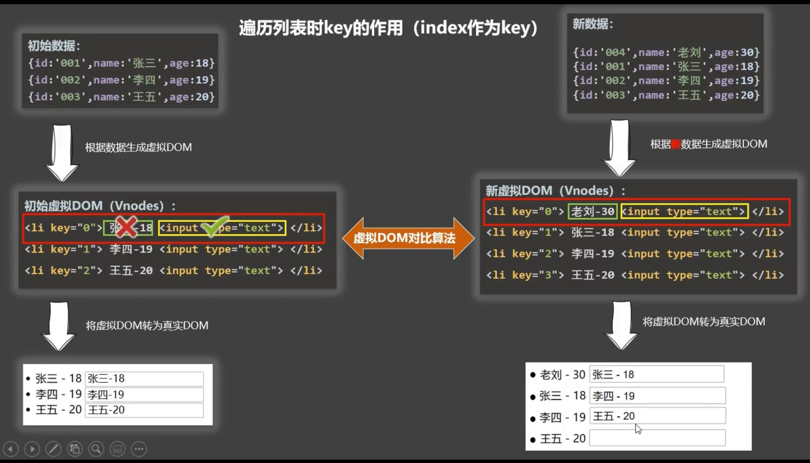
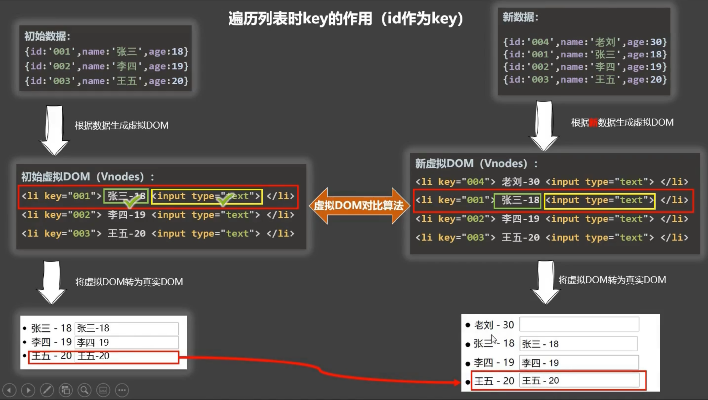

# 第一章 Vue 核心

## 1.1 Vue demo

```html
<html lang="en">
    <head>
        <meta charset="UTF-8" />
        <meta http-equiv="X-UA-Compatible" content="IE=edge" />
        <meta name="viewport" content="width=device-width, initial-scale=1.0" />
        <title>Document</title>
        <script src="../js/vue.js"></script>
    </head>
    <body>
        //容器
        <div id="root">
            <h1>hello {{msg}}</h1>
        </div>
        <script>
            //关闭生产环境的提示
            Vue.config.productionTip = false;

            //创建Vue的实例
            const vm = new Vue({
                //指定当前Vue实例为哪个容器服务，值通常为css选择器字符串
                el: "#root",

                //data中存放数据，数据供el指定的容器使用
                data: {
                    msg: "vue",
                },
            });
        </script>
    </body>
</html>
```

* 想要Vue工作，就必须创建一个Vue的实例，且要传入一个配置对象
* root容器  代码仍然需要符合html规范，不过混入了Vue的语法
* root容器中的代码被称为Vue模板
* 容器和Vue实例需要一一对应

* `{{ }}`中写js表达式。表达式会生成一个值，放在任何需要值的地方

* data中的数据发生变化时，模板中用到该数据中的地方也会发生改变

## 1.2 模板语法

### 1.2.1 插值语法

* 写法：`{{ }}`中插入**表达式**，可以读取data中的属性

  ```html
  //模板中
  <h1>hello {{msg}}</h1>
  
  //data中
  data:{
  	msg: "vue",
  }
  ```

* 功能：插值表达式用在标签体中，用于解析标签体内容

### 1.2.2 指令语法

#### 例如 v-bind

* 写法：`v-bind:href = "xxx"`，href可以替换成任一属性名，`xxx`是js表达式。`v-bind:` 可以简写为 `:`

  ```html
  //模板中
  <a v-bind:href="url" >跳转</a>
  
  //data中
  data:{
  	url: "https://www.baidu.com",
  }
  ```

* 功能：v-bind 可以给标签中任何一个属性动态绑定值

## 1.3 数据绑定

### 1.3.1 单向数据绑定 v-bind

* 数据只能从data流向页面。data中的数据发生变化，页面上对应的数据会变化。但是页面上的数据变化，data中对应的数据不会变化。

### 1.3.2 双向数据绑定 v-model

* 写法：`v-model:value = "xxx"`。`v-model:value`可以简写成`v-model`
* 功能：数据不仅能从data流向页面，还可以从页面流向data。页面上的数据和data中对应的数据双向绑定。两者其中一个发生变化，另一个同时进行变化。
* 备注：
  * v-model只能用在表单类元素中
  * `v-model:value`可以简写成`v-model`，因为v-model默认收集的就是value的值

### 补充：el和data的两种写法

#### 1. el的两种写法

1. 写在Vue的配置对象中
2. 使用`$mount`挂载

#### 2. data的两种写法

1. 对象式

   ```js
   const vm = new Vue({
       el:'#app',
       data:{
       	msg :'vue'
       }
   });
   ```

2. 函数式。但是，由Vue管理的函数不能写成箭头函数，因为箭头函数没有自己的this，就会向外查找，找到的是全局的window。

   ```js
   const vm = new Vue({
       el:'#app',
       data(){
           console.log(this)	//this是Vue实例对象
           return {
               msg :'vue'
           }
       }  
   });
   ```


## 1.4 MVVM模型

* M：Model，data中的数据
* V：View，模板代码
* VM：ViewModel，Vue实例

## 1.5 数据代理

* 通过一个对象代理对另一个对象中属性的操作

  ```js
  let obj = {
      x: 100,
  };
  
  let obj_proxy = {};
  Object.defineProperty(obj_proxy, "x", {
      get() {
          return obj.x;
      },
      set(val){
          obj.x = val
      }
  });
  
  obj_proxy.x = 200
  ```

  在以上的例子中，通过`obj_proxy`代理对`obj`中属性`x`的读写

## 1.6 Vue中的数据代理 


* 通过vm对象来代理data对象中属性的操作，方便操作data中的数据
* 原理：通过`Object.defineProperty()`把data对象中所有属性添加到vm上，为每一个添加到vm上的属性都指定getter和setter，在getter和setter中去读写data中的属性。

## 1.7 事件

### 1.7.1 事件处理

* 写法：`v-on:xxx`，`xxx`是事件类型。`v-on:xxx`可以简写成`＠xxx`

* 事件的回调写在methods中，最终会出现在vm上

  ```js
  //模板中
  <button @click="handleClick">不传参数</button>
  <button @click="handleClick1(0)">传参数,不保留event</button>
  <button @click="handleClick2(0,$event)">传参数,保留event</button>
  //js中
  const vm = new Vue({
      el: "#app",
      data() {
      	return {};
  	},
      methods: {
          handleClick(event) {
              console.log(event);
          },
          handleClick1(num) {
              console.log(num);
          },
          handleClick2(num, event) {
              console.log(num, event);
          },
     	},
  });
  ```

* 不给事件处理函数传参数时，默认传入event事件对象

* 给事件处理函数传参，参数列表中默认不保留event事件对象
* 给事件处理函数传参，可以使用`$`进行占位，保留event对象

* vm中的data会做数据代理、数据劫持，但是在methods中的函数不会做数据代理

### 1.7.2 Vue中的事件修饰符

1. `prevent`：阻止默认事件

   ```html
   //阻止默认事件后 只会执行handleClick() 页面不会跳转
   
   <a href="http://www.baidu.com" @click.prevent="handleClick">
       点击跳转
   </a>
   ```

   

2. `stop`：阻止事件冒泡

   ```html
   //阻止事件冒泡后 只会执行handleClick1() 不会执行handleClick2()
   //因为使用了.prevent 所以页面不会跳转
   
   <div @click="handleClick2">
       <a href="http://www.baidu.com" @click.stop.prevent="handleClick1">
           点击跳转
       </a>
   </div>
   ```

   

3. `once`：事件只触发一次

   ```html
   //事件只会触发一次 第二次点击div时 事件不会触发
   
   <div @click.once="alert('hello  vue')">div</div>
   ```

   

4. `capture`：使用事件的捕获模式

   ```html
   //默认情况下 捕获阶段不会触发事件 也就是先执行handleClick1() 然后执行handleClick2()
   //使用事件的捕获模式 捕获阶段会触发事件 也就是先执行handleClick2() 然后执行handleClick1()
   
   <div style='border:1px solid red;width: 200px ;height: 200px;' @click = 'handleClick2'>
       div2
       <div style='border:1px solid green;width: 100px ;height: 100px;'  @click = 'handleClick1'>
           div1
       </div>
   </div>
   ```

   

5. `self`：只有event.target是当前操作的元素时才触发事件

   ```html
   //默认情况下 handleClick()会触发两次 其中事件冒泡到div上时 event.target仍是button 
   //加上.self后 事件的event.target不是当前元素时不会触发事件 handleClick()只触发一次 
   
   <div
        style="border: 1px solid red; width: 200px; height: 200px"
        @click.self="handleClick"
        >
       <button @click="handleClick">点击按钮</button>
   </div>
   ```

   

6. `passive`：事件的默认行为立即执行，无需等待事件回调执行完毕

   * 默认情况下，事件动作触发，之后执行事件的回调函数，回调结束后，事件的默认行为才开始执行
   * 使用`.passive`后，事件的默认行为立即执行，无需等待事件的回调函数

### 1.7.3 键盘事件

* Vue中常用的按键别名如下：

  * 回车：enter
  * 删除：delete
  * 退出：esc
  * 空格：space
  * 换行：tab
  * 上：up
  * 下：down
  * 左：left
  * 右：right

  ```html
  //只有在enter键抬起之后 showInfo()才会触发 此处的enter是别名
  
  <input type="text" placeholder="按下回车提示输入" @keyup.enter="showInfo”/>
  ```

* Vue中没有提供别名的按键，可以使用原始的key值去绑定，但是要注意转为短横线命名方式

* 系统修饰键的用法比较特殊：ctrl、alt、shift、meta

  * 在配合keyup使用时，按下修饰键的同时，再按下其他按键，随后释放其他按键，事件才会触发

    ```html
    //ctrl+任意键按下后抬起都会触发事件
    <input type="text" @keyup.ctrl="showInfo" />
    ```

    ```html
    //只有 ctrl+y 按下后抬起 才会触发事件
    <input type="text" @keyup.ctrl.y="showInfo" />
    ```

  * 在配合keydown使用时，正常触发事件

## 1.8 计算属性

### 1.8.1 一个姓名拼接案例

* 使用methods的方式实现姓名拼接demo

  ```html
  <div id="app">
      姓:<input type="text " v-model="lastName" /> <br />
      名:<input type="text" v-model="firstName" /> <br />
      姓名:{{fullName()}}
  </div>
  ```

  ```js
  Vue.config.productionTip = false;
  const vm = new Vue({
      el: "#app",
      data() {
          return {
              lastName: "",
              firstName: "",
          };
      },
      methods: {
          fullName() {
              return this.lastName + "-" + this.firstName;
          },
      },
  });
  ```

* 注意：只要data中的数据发生变化，Vue就会重新解析模板，页面中所有用到该数据的地方都会发生变化。在上面的demo中，页面上输入姓或者名后，因为`fullName()`用到了发生改变的数据，所以Vue会重新调用`fullName()`

### 1.8.2 使用计算属性重写上述案例

```html
<div id="app">
    姓:<input type="text " v-model="lastName" /> <br />
    名:<input type="text" v-model="firstName" /> <br />
    姓名:{{fullName}}
</div>
<script>
    Vue.config.productionTip = false;
    const vm = new Vue({
        el: "#app",
        data() {
            return {
                lastName: "",
                firstName: "",
            };
        },
        computed: {
             fullName:{
                 //获取计算属性fullName的值时调用
                 get(){
                     //Vue已经将this的指向调整成了vm
                     return this.lastName + "-" + this.firstName;
                 },
                 //设置fullName的值时调用
                 set(newVal){
            		 arr = newVal.split('-')
                     this.lastName = arr[0];
                     this.firstName = arr[arr.length-1];
        		}
             }
        },
    });
</script>
```

```js
//如果只有getter，没有setter，可以简写如下：
fullName() {
    return this.lastName + "-" + this.firstName;
},
```

* 将同一函数定义为方法还是计算属性，相同点和不同点在哪里？

  >我们可以将同一函数定义为一个方法而不是一个计算属性。两种方式的最终结果确实是完全相同的。然而，不同的是**计算属性是基于它们的响应式依赖进行缓存的**。只在相关响应式依赖发生改变时它们才会重新求值。

  > 这就意味着只要 `lastName`和 `firstName`还没有发生改变，多次访问 `fullName` 计算属性会立即返回之前的计算结果，而不必再次执行函数。

* 什么时候调用计算属性？
  1. 初次读取`fullName`时
  2. 所依赖的数据发生变化时
* 计算属性会直接出现在vm上，直接读取即可。

## 1.9 监视属性

### 1.9.1 一个监视属性的案例

```html
<div id="app">
    <h2>今天天气很{{info}}</h2>
    <button @click="flag = !flag">点击切换</button>
</div>
<script>
    Vue.config.productionTip = false;
    const vm = new Vue({
        el: "#app",
        data() {
            return {
                flag: true,
                info:''
            };
        },
        watch: {
            flag: {
                //初始化时 让handler调用一下
                immediate:true,
                //当flag发生变化时 调用handler
                handler(newVal,oldVal) {
                    console.log(newVal,oldVal)
                    this.info = newVal?'凉爽':'炎热'
                },
            },
        },
    });
</script>
```

```html
<script>
    Vue.config.productionTip = false;
    const vm = new Vue({
        el: "#app",
        data() {
            return {
                flag: true,
                info: "",
            };
        },
    });
    //第二种写法
    vm.$watch("flag", {
        immediate: true,
        handler(newVal, oldVal) {
            console.log(newVal, oldVal);
            this.info = newVal ? "凉爽" : "炎热";
        },
    });
</script>
```

* 当监视属性变化时，回调函数自动调用，进行相关操作
* 监视的属性可以是data中的属性，也可以是计算属性。无论监视哪种属性，属性必须要存在。

### 1.9.2 深度监视

```html
//点击按钮 obj内的数据发生了变化 但是Vue无法检测到

<div id="app">
    <span>obj中的a的值是{{obj.a}}</span>
    <button @click="obj.a++">点击让a加1</button>
    <hr />
    <span>obj中的b的值是{{obj.b}}</span>
    <button @click="obj.b++">点击让b加1</button>
</div>
```

```js
const vm = new Vue({
    el: "#app",
    data() {
        return {
            obj: {
                a: 100,
                b: 200,
            },
        };
    },
    watch: {
        //监视对象，即使对象中的属性值发生了变化，由于地址值没有变化，Vue无法成功检测到
        "obj": {
            handler() {
                console.log("obj改变了");
            },
        },
    },
});
```

* 在上面这种情况中，即使`obj.a`或者`obj.b`变化，Vue也无法检测得到。因为obj中数据的地址值没有改变。

* 如果想让Vue检测到对象内的属性值的变化（深度监视），需要开启`deep`配置项（watch默认不开启深度监视）。

  ```js
  //深度监视，可以监视多级结构中所有属性的变化。
  watch: {
      //监视对象
      obj: {
          	deep: true,
              handler() {
              	console.log("obj改变了");
          	},
      },
  },
  ```

* Vue对数组的监听是浅监听，也就是它只能监听到数组的长度或者有无的变化。无法监视数组中的元素的变化，深度监视也不可以。

* 如果不需要`immediate`和`deep`配置项，可以简写监视属性的形式

  ```js
  watch: {
  	flag(newVal, oldVal) {
  		console.log(newVal, oldVal);
  		this.info = newVal ? "凉爽" : "炎热";
  	},
  },
  ```

  

  ```js
  //不可以写成箭头函数，因为可能造成this的指向有问题
  vm.$watch("flag", function (newVal, oldVal) {
      console.log(newVal, oldVal);
      this.info = newVal ? "凉爽" : "炎热";
  });
  ```

## 1.10 计算属性和监视属性对比

* computed能完成的功能，watch都能完成

* 如果函数中没有异步操作，对于相同的功能，使用计算属性更简洁
* 计算属性中无法执行异步操作，这时需要监视属性来做

* 注意：1. 所被Vue管理的函数，最好写成普通函数。这样this的指向才是vm或组件实例对象。2. 所有不被Vue管理的函数（定时器回调函数、ajax回调函数等），最好写成箭头函数。这样this的指向才是vm或组件实例对象。

## 1.11 class和style绑定

### 1.11.1 绑定class样式

1. 字符串写法

   ```css
   .basic {
       width: 400px;
       height: 100px;
       border: 1px solid black;
   }
   .sad {
       border: 4px dashed rgb(2, 197, 2);
       background-color: gray;
   }
   .normal {
       background-color: skyblue;
   }
   ```

   ```html
   <div class="basic" :class="style" @click="changeStyle">test</div>
   ```

   ```js
   const vm = new Vue({
       el: "#app",
       data() {
           return {
               style: "normal",
           };
       },
       methods: {
           changeStyle() {
               this.style = this.style === "normal" ? "sad" : "normal";
               console.log("changeStyle");
           },
       },
   });
   ```

   适用于字符串的类名不确定，需要动态指定

2. 第一种数组写法

   ```css
   .s1 {
       background-color: yellowgreen;
   }
   .s2 {
       font-size: 30px;
       text-shadow: 2px 2px 10px red;
   }
   .s3 {
       border-radius: 20px;
   }
   ```

   ```html
   <div :class="styleArr" @click="changeStyle">test</div>
   ```

   ```js
   const vm = new Vue({
       el: "#app",
       data() {
           return {
               styleArr: ["s1", "s2", "s3"],
           };
       },
   });
   ```

   适用于要绑定的样式个数不确定，名字也不确定

3. 第二种数组写法

   ```html
   <div class="basic" :class="[s1 ,s2, s3]" @click="changeStyle">test</div>
   ```

   ```js
    const vm = new Vue({
        el: "#app",
        data() {
            return {
                s1: "s1",
                s2: "s2",
                s3: "s3",
            };
        }
    });
   ```

4. 第一种对象写法

   ```
   <div class="basic" :class="styleObj">test</div>
   ```

   ```js
   const vm = new Vue({
       el: "#app",
       data() {
           return {
               styleObj: {
                   s1: true,
                   s2: true,
                   s3: true,
               },
           };
       },
   });
   ```

   适用于要绑定的样式名字、个数都确定，但是用动态决定用还是不用

5. 第二种对象写法

   ```html
   <div class="basic" :class="{s1,s2,s3}">test</div>
   ```

   ```js
   const vm = new Vue({
       el: "#app",
       data() {
           return {
               s1: true,
               s2: true,
               s3: true,
           };
       },
   });
   ```

### 1.11.2 绑定style样式

1. 第一种对象写法

   ```html
   <div :style="fontStyle">test</div>
   ```

   ```js
   const vm = new Vue({
       el: "#app",
       data() {
           return {
               fontStyle: {
                   fontSize: "50px",
               },
           };
       },
   });
   ```

2. 第二种对象写法

   ```html
   <div :style="{fontSize:size+'px'}">test</div>
   ```

   ```
   const vm = new Vue({
       el: "#app",
       data() {
           return {
               size:50
           };
       },
   });
   ```

3. 数组写法

   ```html
   <div :style="styleArr">test</div>
   ```

   ```js
   const vm = new Vue({
       el: "#app",
       data() {
           return {
               styleArr: [
                   {
                       fontSize: "50px",
                       color: "blue",
                   },
                   {
                       backgroundColor: "green",
                   },
               ],
           };
       },
   });           
   ```

## 1.12 条件渲染v-if v-show

### 1.12.1 v-show条件渲染

1. 写法：`v-show = 'true'`或`v-show = 'false'`，例：

   ```html
   <div class='block' v-show='false'>test</div>
   ```

2. 原理：存在于DOM上，但是在`<div>`上增加一个`style="display: none;"`

### 1.12.2 v-if条件渲染 和v-else-if、 v-else

1. 写法：`v-if = 'true'`或`v-if = 'false'`，例：

   ```html
   <div class='block' v-if='false'>test1</div>
   <div class='block' v-else if='false'>test2</div>
   <div class='block' v-else>test3</div>
   ```

2. 原理：DOM上不生成该`<div>`
3. `v-if`、`v-else-if`、`v-else`必须连续使用，中间不允许其他的`<div>`打断

### 1.12.3 怎么选择v-show 和 v-if

* 显示和隐藏切换的频率较高时，使用`v-show`
* 显示和隐藏切换的频率较低时，使用`v-if`

### 1.13.4 template

* 想一次控制多个div，可以在多个`<div>`外再包一个`<div>`，但是这种办法破坏了页面的结构（多了一层div）。解决方法：使用`<template>`。例：

  ```html
  //使用div
  <div v-if='false'>
      <div>test1</div>
      <div>test2</div>
      <div>test3</div>
  </div>
  
  //使用template
  <template v-if='false'>
      <div>test1</div>
      <div>test2</div>
      <div>test3</div>
  </template>
  ```

## 1.14 列表渲染v-for

### 1.14.1 遍历列表

1. 第一种形式：key用id值

   ```
   姓名:p1 年龄:18
   姓名:p2 年龄:19
   姓名:p3 年龄:20
   ```

   ```html
   <ul>
       <li v-for="p in person" :key="p.id">
           姓名:{{p.name}} 年龄:{{p.age}}
       </li>
   </ul>
   ```

   ```js
   data() {
       return {
           person: [
               { id: 1, name: "p1", age: 18 },
               { id: 2, name: "p2", age: 19 },
               { id: 3, name: "p3", age: 20 },
           ],
       };
   },
   ```

2. 第二种形式：key用index值

   ```
   姓名:p1 年龄:18
   姓名:p2 年龄:19
   姓名:p3 年龄:20
   ```
   
   ```html
   <ul>
       <li v-for="(p,index) in person" :key="index">
       	姓名:{{p.name}} 年龄:{{p.age}}
       </li>
   </ul>
   ```
   

### 1.14.2 遍历对象

```
a-100
b-200
c-300
```

```html
<ul>
    <li v-for="(value,key) in obj" :key="key">{{key}}-{{value}</li>
</ul>
```

```js
data() {
    return {
        obj: {
            a: 100,
            b: 200,
            c: 300,
        },
    };
}
```

### 1.14.3 遍历字符串

```
q - 0
w - 1
e - 2
r - 3
t - 4
```

```html
<ul>
    <li v-for="(s,index) in str" :key="index">
        {{s}} - {{index}}
    </li>
</ul>
```

```
data() {
    return {
        str: "qwert",
    };
}
```

### 1.14.4 遍历指定次数

```
1-0
2-1
3-2
4-3
5-4
```

```html
<ul>
    <li v-for="(num,index) in 5">{{num}}-{{index}}</li>
</ul>
```

## 1.15 v-for与key的原理

### 1.15.1 一个案例

```html
<button @click.once='add'>点击添加</button>
<ul>
    <li v-for="(item,index) in items" :key='item.id'>
        {{item.name}}-{{item.age}}
        <input type="txet">
    </li>
</ul>

<ul>
    <li v-for="(item,index) in items" :key='index'>
        {{item.name}}-{{item.age}}
        <input type="txet">
    </li>
</ul>
```

```js
const vm = new Vue({
    el: "#app",
    data() {
        return {
            items: [
                { id: 1, name: "p1", age: 18 },
                { id: 2, name: "p2", age: 19 },
                { id: 3, name: "p3", age: 20 },
            ],
        };
    },
    methods: {
        add(){
            const temp = {id:4,name:'p4',age:21}
            this.items.unshift(temp)
        }
    },
});
```

在输入框中输入一些信息，当点击按钮后，以`item.id`作为key的DOM不会发生错乱，但是以`index`作为key的DOM发生了错乱

### 1.15.2 遍历链表时key的作用





1. key是虚拟DOM对象的标识，当状态中的数据发生变时，Vue会根据**新数据**生成**新的虚拟DOM**。随后vue进行**新虚拟DOM**与**旧虚拟DOM**的差异比较,比较规则如下:

   * 旧虚拟DOM中找到了与新虚拟DOM相同的key：
     ①若虚拟DOM中内容没变，直接使用之前的真实DOM
     ②若虚拟DOM中内容变了，则生成新的真实DOM,随后替换掉页面中之前的真实DOM

   * 旧虚拟DOM中未找到与新虚拟DOM相同的key：
     创建新的真实DOM，随后渲染到到页面

2. 用 index作为key可能会引发的问题:

   * 若对数据进行：逆序添加、逆序删除等破坏顺序操作会产生没有必要的真实DOM更新==>界面效果没问题,但效率低。
   * 如果结构中还包含输入类的DOM：会产生错误DOM更新==>界面有问题

3. 开发中如何选择key?

   * 最好使用每条数据的**唯一标识**作为key，比如id、手机号、身份证号、学号等唯一值。

   * 如果不存在对数据的逆序添加、逆序删除等破坏顺序操作，仅用于渲染列表用于展示使用index作为key是没有问题的。

4. 如果遍历时不写key，vue会自动把index作为key

##  1.16 Vue数据监测原理 

Vue会监视data中所有层次的数据

### 1.16.1 Vue监测对象数据

1. 通过setter实现监视，且套在new Vue时就传入要监视的数据
2. 对象中后添加的属性，Vue默认不做响应式处理；如需给后添加的属性做响应式处理，需要用`Vue.set()`或`vm.$set()`

### 1.16.2 Vue监测数组数据

```html
//点击按钮后，页面上的数据没有发生变化，说明vue没有监测到

<button @click='click'>点击修改数据第一项</button>
<ul>
    <li v-for="(item,index) in items">{{index}} - {{item}}</li>
</ul>
```

```js
const vm = new Vue({
    el: "#app",
    data() {
        return {
            items: ["q", "w", "e", "r"],
        };
    },
    methods: {
        click(){
            this.items[0] = 'p'
        }
    },
});
```

* 直接通过索引值修改数组，Vue无法监测到这种变化。因为Vue不是靠setter监视数组数据变化的。
* 调用可以修改数组的7个方法，Vue会监测到变化。也可以用Vue.set()或者vm.$set()修改数组
  * `push()`
  * `pop()`
  * `shift()`
  * `unshift()`
  * `splice()`
  * `sort()`
  * `reverse()`
* Vue包裹了修改数组的7个方法，先调用原方法，再重新解析模板更新DOM。

## 1.17 Vue.set()与vm.$set()

### 1.17.1 API

>### [Vue.set( target, propertyName/index, value )](https://cn.vuejs.org/v2/api/#Vue-set)
>
>- **参数**：
>
>  - `{Object | Array} target`
>  - `{string | number} propertyName/index`
>  - `{any} value`
>
>- **返回值**：设置的值。
>
>- **用法**：
>
>  向响应式对象中添加一个 property，并确保这个新 property 同样是响应式的，且触发视图更新。它必须用于向响应式对象上添加新 property，因为 Vue 无法探测普通的新增 property (比如 `this.myObject.newProperty = 'hi'`)
>
>* **注意**：对象不能是 Vue 实例，或者 Vue 实例的根数据对象。

>### [vm.$set( target, propertyName/index, value )](https://cn.vuejs.org/v2/api/#vm-set)
>
>- **参数**：
>
>  - `{Object | Array} target`
>  - `{string | number} propertyName/index`
>  - `{any} value`
>
>- **返回值**：设置的值。
>
>- **用法**：
>
>  这是全局 `Vue.set` 的**别名**。

### 1.17.2 例子

* 案例：点击按钮，向obj上增加一个响应式的属性

```html
<button @click='handleClick'>添加属性</button>
<ul>
    <li v-for="(value,key) in obj" :key="key">
        {{key}} -- {{value}}
    </li>
</ul>
```

```js
const vm = new Vue({
    el: "#app",
    data() {
        return {
            obj: {
                a: 100,
                b: 200,
                c: 300,
            },
        };
    },
    methods: {
        handleClick(){
            // this.obj.d = 400 			//不是响应式的
            // Vue.set(this.obj,'d',400)	//使用Vue.set()
            this.$set(this.obj,'d',400)		//使用vm.$set()
        }
    },
});
```

### 1.17.3 注意

* 对象不能是 Vue 实例，或者 Vue 实例的根数据对象。

  ```js
  this.$set(this,'d',400) //错误
  this.$set(this.data,'d',400) //错误
  ```

## 1.18 数据劫持

* `vm._data` 不等于传入的data，而是经过了处理，这种处理叫做数据劫持

## 1.19 过滤器

1. 定义：自定义过滤器，用于常见的文本格式化。
2. 语法：
   * 注册全局过滤器：`Vue.filter(name,callback)`
   * 注册局部过滤器：`new Vue(filters:{ })`
   * 插值中使用过滤器：`{{ message | capitalize }}`
   * v-bind中使用过滤器：`<div v-bind:id="rawId | formatId"></div>`
3. 注意：
   * 过滤器本质上是js函数，可以接受额外参数（默认第一个参数是原本的数据），多个过滤器可以串联
   * 不会改变原来的数据，产生的是新数据

```html
//用计算属性和过滤器实现日期的格式化

<div id="app">
    {{timestamp}}
    <br />
    {{fmt}}
    <br>
    {{timestamp | timeFormater}}
</div>
```

```js
const vm = new Vue({
    el: "#app",
    data() {
        return {
            timestamp: Date.now(),
        };
    },
    filters:{
        timeFormater(timestamp){
            return dayjs(timestamp).format(
                "YYYY-MM-DD HH:mm:ss"
            );
        }
    },
    computed: {
        fmt() {
            return dayjs(this.timestamp).format(
                "YYYY-MM-DD HH:mm:ss"
            );
        },
    },
});
```

## 1.20 其他内置指令

之前提到的指令：

* `v-bind`：单向数据绑定，简写：`:`
* `v-model`：双向数据绑定
* `v-for`：遍历数组、对象、字符串
* `v-on`：绑定监听事件，简写：`@`
* `v-if` `v-else-if` `v-else`：条件渲染
* `v-show`：条件渲染

### 1.20.1 v-text

>* **预期**：`string`
>
>- **详细**：
>
>  更新元素的 `textContent`。如果要更新部分的 `textContent`，需要使用 `{{ Mustache }}` 插值。
>
>- **示例**：
>
>  ```html
>  <span v-text="msg"></span>
>  <!-- 和下面的一样 -->
>  <span>{{msg}}</span>
>  ```

* 注意：v-text会替换掉节点中的内容

### 1.20.2 v-html

>- **预期**：`string`
>
>- **详细**：
>
>  更新元素的 `innerHTML`。**注意：内容按普通 HTML 插入 - 不会作为 Vue 模板进行编译**。如果试图使用 `v-html` 组合模板，可以重新考虑是否通过使用组件来替代。
>
>- **示例**：
>
>  ```
>  <div v-html="html"></div>
>  ```

>* 在网站上动态渲染任意 HTML 是非常危险的，因为容易导致 [XSS 攻击](https://en.wikipedia.org/wiki/Cross-site_scripting)。只在可信内容上使用 `v-html`，**永不**用在用户提交的内容上。
>
>* 在[单文件组件](https://cn.vuejs.org/v2/guide/single-file-components.html)里，`scoped` 的样式不会应用在 `v-html` 内部，因为那部分 HTML 没有被 Vue 的模板编译器处理。如果你希望针对 `v-html` 的内容设置带作用域的 CSS，你可以替换为 [CSS Modules](https://vue-loader.vuejs.org/en/features/css-modules.html) 或用一个额外的全局 `<style>` 元素手动设置类似 BEM 的作用域策略。

### 1.20.3 v-cloak

>- **不需要表达式**
>
>- **用法**：
>
>  这个指令保持在元素上直到关联实例结束编译。和 CSS 规则如 `[v-cloak] { display: none }` 一起用时，这个指令可以隐藏未编译的 Mustache 标签直到实例准备完毕。
>
>- **示例**：
>
>  ```css
>  [v-cloak] {
>    display: none;
>  }
>  ```
>
>  ```html
>  <div v-cloak>
>    {{ message }}
>  </div>
>  ```
>
>  
>
>  不会显示，直到编译结束。

### 1.20.4 v-once

>- **不需要表达式**
>
>- **详细**：
>
>  只渲染元素和组件**一次**。随后的重新渲染，元素/组件及其所有的子节点将被视为静态内容并跳过。这可以用于优化更新性能。
>
>  ```html
>  <!-- 单个元素 -->
>  <span v-once>This will never change: {{msg}}</span>
>  <!-- 有子元素 -->
>  <div v-once>
>    <h1>comment</h1>
>    <p>{{msg}}</p>
>  </div>
>  <!-- 组件 -->
>  <my-component v-once :comment="msg"></my-component>
>  <!-- `v-for` 指令-->
>  <ul>
>    <li v-for="i in list" v-once>{{i}}</li>
>  </ul>
>  ```
>
>- **参考**：
>
>  - [数据绑定语法- 插值](https://cn.vuejs.org/v2/guide/syntax.html#插值)
>  - [组件 - 对低开销的静态组件使用 `v-once`](https://cn.vuejs.org/v2/guide/components-edge-cases.html#通过-v-once-创建低开销的静态组件)

### 1.20.5 v-pre

>- **不需要表达式**
>
>- **用法**：
>
>  跳过这个元素和它的子元素的编译过程。可以用来显示原始 Mustache 标签。跳过大量没有指令的节点会加快编译。
>
>- **示例**：
>
>  ```html
>  <span v-pre>{{ this will not be compiled }}</span>
>  ```

## 1.21 自定义指令

注册局部自定义指令：

```html
<div id="app">
    <h1>需求1</h1>
    <h2>当前的n值是: <span v-text="n"></span></h2>
    <h2>放大10倍后的n值是: <span v-big="n"></span></h2>
    <button @click="n++">点击n+1</button>

    <h1>需求2</h1>
    <input type="text" v-fbind:value="n" />
</div>
```

```js
const vm = new Vue({
    el: "#app",
    data() {
        return {
            n: 1,
            input: "",
        };
    },
    directives: {
        //什么时候调用？
        //1. 指令和元素成功绑定时
        //2. 指令所在的模板被重新解析时调用
        big(element, binding) {
            element.innerText = binding.value * 10;
        },
        
        fbind:{
            //指令和元素成功绑定时
            //注意：此处的this是window
            bind(el,binding){
                console.log(this)
                el.value = binding.value
            },
            //指令所在的元素被插入页面时
            inserted(el,binding){
                el.focus()
            },
            //指令所在得到模板被重新解析时
            update(el,binding){
                // console.log('update')
                // console.log('')
                el.value = binding.value
            }
        }
    },
});
```

注册全局自定义指令：

```js
Vue.directive('focus', {
  // 当被绑定的元素插入到 DOM 中时……
  inserted: function (el) {
    // 聚焦元素
    el.focus()
  }
})
```

## 1.22 生命周期


挂载流程：

* `init events & lifecycle`。初始化：生命周期、时间，但是数据代理还未开始。

* `beforeCreate`。此时：无法通过vm访问到data中的数据和methods中的方法。

* `init injections & reactivity`。初始化：数据监测、数据代理。

* `created`。此时：可以通过vm访问到data中的数据和methods中的方法。

* Vue开始解析模板，生成虚拟DOM，页面还不能显示解析好的内容。
* `beforeMount`。此时：页面呈现的是未经Vue编译的DOM。此时对DOM的操作最终都不奏效。
* 将内存中的虚拟DOM转为真实DOM插入页面中。
* `mounted`。此时：页面中呈现的是经过Vue编译的DOM。此时对DOM的操作均有效但应该尽可避免。至此，初始化过程结束。一般在此时进行：开启定时器，发送网络请求，订阅消息，绑定自定义事件等初始化操作。

更新流程：

* `beforeUpdate`。此时：数据是新的，但是页面还是旧的。即：页面尚未和数据保持同步。

* 根据新数据形成新的虚拟DOM，随后和旧的虚拟DOM进行比较，最终完成页面的更新，即完成了Model->View的更新。
* `updated`。此时：数据是最新的，页面也是新的，即：页面和数据保持同步。

销毁流程：

* `beforeDestroy`。此时：vm中data、method等都处于可用状态，马上执行销毁流程。一般在此关闭定时器、取消订阅消息、解绑自定义事件等等收尾操作。此时对数据进行操作不会触发更新DOM
* `destroyed`。

# 第二章 Vue组件化编程

## 2.1 非单文件组件

### 2.1.1 案例

1. 局部注册：

```html
<div id="app">
    <school></school>
    <hr />
    <student></student>
</div>
```

```js
const school =  Vue.extend({
    template:`
                <div>
                    <h1>学校名称：{{schoolName}}</h1>
                    <h1>学校地址：{{schoolAddr}}</h1>
                </div>
                `,
    //不用写el配置项，因为最终所有的组件都会被一个vm管理，由vm决定服务于哪个容器
    data() {
        return {
            schoolName: "buct",
            schoolAddr: "北三环",
        };
    },
});
const student =  Vue.extend({
    template:`
                <div>
                    <h1>学生姓名：{{studentName}}</h1>
                    <h1>学生年龄：{{studentAge}}</h1>
                </div>
                `,
    //不用写el配置项，因为最终所有的组件都会被一个vm管理，由vm决定服务于哪个容器
    data() {
        return {
            studentName: "tourry",
            studentAge: "18",
        };
    },
});

const vm  = new Vue({
    el:'#app',
    components:{
        //注册组件 局部注册
        school,
        student
    }
})
```

2. 全局注册：

```html
<div id="app1">
    <hello></hello>
</div>

<div id="app2">
    <hello></hello>
</div>
```

```js
const hello = Vue.extend({
    template:`<div>{{msg}}</div>`,
    data(){
        return {
            msg:'hello vue'
        }
    }
})
//全局注册组件，两个vm中都带有hello组件
Vue.component('hello',hello)
const vm1  = new Vue({
    el:'#app1',
})
const vm2  = new Vue({
    el:'#app2',
})
```

### 2.1.2 几个注意点

* 关于组件的名字：
  1. 一个单词组成：（在开发者工具中组件名都是首字母大写，可以在开发者工具种修改模式）
     * 第一种写法：（首字母小写）school
     * 第二种写法：（首字母大写）School
  2. 多个单词组成：
     * 第一种写法：（Kebab-case）my-school
     * 第二种写法：（CamelCase）MySchool（需要脚手架，不然报错）
  3. 备注
     * 组件名应该尽可能回避HTML中已有元素的名称，比如h2、H2
     * 可以使用name配置项指定组件在**开发者工具**中呈现的名字

* 关于组件标签：
  1. 第一种写法：`<school></school>`
  2. 第二种写法：`<school/>`
  3. 注意：不使用脚手架时，第二种写法会导致后续的组件无法渲染

* 定义组件的简写形式：

  ```js
  //不使用简写:
  const school = Vue.extend(options)
  
  //使用简写:
  const school = options
  ```

### 2.1.3 组件的嵌套

```html
<div id="app">
    <school></school>  
</div>
```

```js
//定义子组件
const student = {
    template: `
                <div>
                    <h1>学生名字：{{studentName}}</h1>
                    <h1>学生年龄：{{studentAge}}</h1>
                </div>
                `,
    data() {
        return {
            studentName: "tourry",
            studentAge: 18,
        };
    },
};

//定义父组件
const school = {
    template: `
                <div>
                    <h1>学校名称：{{schoolName}}</h1>
                    <h1>学校地址：{{schoolAddr}}</h1>
                    <student></student>
                </div>
                `,
    data() {
        return {
            schoolName: "buct",
            schoolAddr: "北三环",
        };
    },
    components:{
        student
    }
};


const vm = new Vue({
    el: "#app",
    components: {
        school
    },
});
```

## 2.2 VueComponent

1. 组件的本质是一个名为VueComponent()的构造函数，是Vue.extend

   生成的。

2. Vue会帮助我们执行 new VueComponent(options)
3. 每次调用Vue.extend()，得到的都是一个全新的VueComponent()

4. this指向：

   * 组件配置中，data()、methods中的函数、watch中的函数、computed中的函数，它们的this均是VueComponent实例对象
   * new Vue(options)配置中，data()、methods中的函数、watch中的函数、computed中的函数，它们的this均是Vue实例对象

5. ```js
   VueComponent.prototype.__proto__ === Vue.prototype
   ```

## 2.3 单文件组件

```vue
<template>
    <div>
        <div class="name">{{ name }}</div>
    </div>
</template>

<script>
export default {
    name: "Student",
    data() {
        return {
            name: "tourry",
        };
    },
};
</script>

<style scoped>
.name {
    background: rebeccapurple;
}
</style>
```

# 第三章 Vue 高级

## 3.1 脚手架创建Vue项目

```
1. 全局安装Vue-cli
npm install -g @vue/cli-service-global

2. 创建Vue项目
vue create vue-project

3. 根据提示定制即可
```

## 3.2 特殊标签：ref

>- **预期**：`string`
>
>  `ref` 被用来给元素或子组件注册引用信息。引用信息将会注册在父组件的 `$refs` 对象上。如果在普通的 DOM 元素上使用，引用指向的就是 DOM 元素；如果用在子组件上，引用就指向组件实例：
>
>  ```html
>  <!-- `vm.$refs.p` will be the DOM node -->
>  <p ref="p">hello</p>
>  
>  <!-- `vm.$refs.child` will be the child component instance -->
>  <child-component ref="child"></child-component>
>  ```
>
>  当 `v-for` 用于元素或组件的时候，引用信息将是包含 DOM 节点或组件实例的数组。
>
>  关于 ref 注册时间的重要说明：因为 ref 本身是作为渲染结果被创建的，在初始渲染的时候你不能访问它们 - 它们还不存在！`$refs` 也不是响应式的，因此你不应该试图用它在模板中做数据绑定。

## 3.3 Prop

>- **类型**：`Array<string> | Object`
>
>- **详细**：
>
>  props 可以是数组或对象，用于接收来自父组件的数据。props 可以是简单的数组，或者使用对象作为替代，对象允许配置高级选项，如类型检测、自定义验证和设置默认值。
>
>  你可以基于对象的语法使用以下选项：
>
>  - `type`：可以是下列原生构造函数中的一种：`String`、`Number`、`Boolean`、`Array`、`Object`、`Date`、`Function`、`Symbol`、任何自定义构造函数、或上述内容组成的数组。会检查一个 prop 是否是给定的类型，否则抛出警告。Prop 类型的[更多信息在此](https://cn.vuejs.org/v2/guide/components-props.html#Prop-类型)。
>  - `default`：`any`
>    为该 prop 指定一个默认值。如果该 prop 没有被传入，则换做用这个值。对象或数组的默认值必须从一个工厂函数返回。
>  - `required`：`Boolean`
>    定义该 prop 是否是必填项。在非生产环境中，如果这个值为 truthy 且该 prop 没有被传入的，则一个控制台警告将会被抛出。
>  - `validator`：`Function`
>    自定义验证函数会将该 prop 的值作为唯一的参数代入。在非生产环境下，如果该函数返回一个 falsy 的值 (也就是验证失败)，一个控制台警告将会被抛出。你可以在[这里](https://cn.vuejs.org/v2/guide/components-props.html#Prop-验证)查阅更多 prop 验证的相关信息。

### 3.3.1 利用prop传递函数实现子组件给父组件传递消息

步骤：

1. 在父组件中定义函数
2. 在子组件中使用props接收父组件定义的函数

举例：

父组件：App.vue 

```vue
<template>
  <div>
    <h1>name:{{ name }}</h1>
    <School :getName="getName"></School>
  </div>
</template>
<script>
import School from "./components/School";
export default {
  name: "App",
  components: {School},
  data() {
    return {
      name: ''
    }
  },
  methods: {
    getName(name) {
      console.log('父组件接受子组件传递的数据', name)
      this.name = name
    }
  }
}
</script>
```

子组件：School.vue

```vue
<template>
  <div>
    <h1>hello,{{ school.name }}</h1>
    <h1>hello,{{ school.addr }}</h1>
    <button @click="handleClick">点击给父组件传递name</button>
  </div>
</template>
<script>
export default {
  name: "School",
  props: ['getName'],
  data() {
    return {
      school: {
        name: 'BUCT',
        addr: 'Beijing'
      }
    }
  },
  methods: {
    handleClick() {
      this.getName(this.school.name)
    }
  }
}
</script>
```

## 3.4 混入：mixin

>## [基础](https://cn.vuejs.org/v2/guide/mixins.html#基础)
>
>混入 (mixin) 提供了一种非常灵活的方式，来分发 Vue 组件中的**可复用功能**。一个混入对象可以包含任意组件选项。当组件使用混入对象时，所有混入对象的选项将被 “混合” 进入该组件本身的选项。
>
>例子：
>
>```js
>// 定义一个混入对象
>var myMixin = {
>  created: function () {
>    this.hello()
>  },
>  methods: {
>    hello: function () {
>      console.log('hello from mixin!')
>    }
>  }
>}
>
>// 定义一个使用混入对象的组件
>var Component = Vue.extend({
>  mixins: [myMixin]
>})
>
>var component = new Component() // => "hello from mixin!"
>```
>
>## [选项合并](https://cn.vuejs.org/v2/guide/mixins.html#选项合并)
>
>当组件和混入对象含有同名选项时，这些选项将以恰当的方式进行 “合并”。
>
>比如，数据对象在内部会进行递归合并，并在发生冲突时以**组件数据优先**。
>
>```js
>var mixin = {
>  data: function () {
>    return {
>      message: 'hello',
>      foo: 'abc'
>    }
>  }
>}
>
>new Vue({
>  mixins: [mixin],
>  data: function () {
>    return {
>      message: 'goodbye',
>      bar: 'def'
>    }
>  },
>  created: function () {
>    console.log(this.$data)
>    // => { message: "goodbye", foo: "abc", bar: "def" }
>  }
>})
>```
>
>同名钩子函数将合并为一个数组，因此都将被调用。另外，混入对象的钩子将在组件自身钩子**之前**调用。
>
>```js
>var mixin = {
>  created: function () {
>    console.log('混入对象的钩子被调用')
>  }
>}
>
>new Vue({
>  mixins: [mixin],
>  created: function () {
>    console.log('组件钩子被调用')
>  }
>})
>
>// => "混入对象的钩子被调用"
>// => "组件钩子被调用"
>```
>
>值为对象的选项，例如 `methods`、`components` 和 `directives`，将被合并为同一个对象。两个对象键名冲突时，**取组件对象的键值对**。
>
>```js
>var mixin = {
>  methods: {
>    foo: function () {
>      console.log('foo')
>    },
>    conflicting: function () {
>      console.log('from mixin')
>    }
>  }
>}
>
>var vm = new Vue({
>  mixins: [mixin],
>  methods: {
>    bar: function () {
>      console.log('bar')
>    },
>    conflicting: function () {
>      console.log('from self')
>    }
>  }
>})
>
>vm.foo() // => "foo"
>vm.bar() // => "bar"
>vm.conflicting() // => "from self"
>```
>
>注意：`Vue.extend()` 也使用同样的策略进行合并。
>
>## [全局混入](https://cn.vuejs.org/v2/guide/mixins.html#全局混入)
>
>混入也可以进行全局注册。使用时格外小心！一旦使用全局混入，它将影响**每一个**之后创建的 Vue 实例。使用恰当时，这可以用来为自定义选项注入处理逻辑。
>
>```js
>// 为自定义的选项 'myOption' 注入一个处理器。
>Vue.mixin({
>  created: function () {
>    var myOption = this.$options.myOption
>    if (myOption) {
>      console.log(myOption)
>    }
>  }
>})
>
>new Vue({
>  myOption: 'hello!'
>})
>// => "hello!"
>```
>
>请谨慎使用全局混入，因为它会影响每个单独创建的 Vue 实例 (包括第三方组件)。大多数情况下，只应当应用于自定义选项，就像上面示例一样。推荐将其作为[插件](https://cn.vuejs.org/v2/guide/plugins.html)发布，以避免重复应用混入。

## 3.5 插件

>插件通常用来为 Vue 添加全局功能。插件的功能范围没有严格的限制 —— 一般有下面几种：
>
>1. 添加全局方法或者 property。如：[vue-custom-element](https://github.com/karol-f/vue-custom-element)
>2. 添加全局资源：指令 / 过滤器 / 过渡等。如 [vue-touch](https://github.com/vuejs/vue-touch)
>3. 通过全局混入来添加一些组件选项。如 [vue-router](https://github.com/vuejs/vue-router)
>4. 添加 Vue 实例方法，通过把它们添加到 `Vue.prototype` 上实现。
>5. 一个库，提供自己的 API，同时提供上面提到的一个或多个功能。如 [vue-router](https://github.com/vuejs/vue-router)
>
>## [使用插件](https://cn.vuejs.org/v2/guide/plugins.html#使用插件)
>
>通过全局方法 `Vue.use()` 使用插件。它需要在你调用 `new Vue()` 启动应用之前完成：
>
>```js
>// 调用 `MyPlugin.install(Vue)`
>Vue.use(MyPlugin)
>
>new Vue({
>  // ...组件选项
>})
>```
>
>也可以传入一个可选的选项对象：
>
>```js
>Vue.use(MyPlugin, { someOption: true })
>```
>
>`Vue.use` 会自动阻止多次注册相同插件，届时即使多次调用也只会注册一次该插件。
>
>Vue.js 官方提供的一些插件 (例如 `vue-router`) 在检测到 `Vue` 是可访问的全局变量时会自动调用 `Vue.use()`。然而在像 CommonJS 这样的模块环境中，你应该始终显式地调用 `Vue.use()`：
>
>```js
>// 用 Browserify 或 webpack 提供的 CommonJS 模块环境时
>var Vue = require('vue')
>var VueRouter = require('vue-router')
>
>// 不要忘了调用此方法
>Vue.use(VueRouter)
>```
>
>[awesome-vue](https://github.com/vuejs/awesome-vue#components--libraries) 集合了大量由社区贡献的插件和库。
>
>## [开发插件](https://cn.vuejs.org/v2/guide/plugins.html#开发插件)
>
>Vue.js 的插件应该暴露一个 `install` 方法。这个方法的第一个参数是 `Vue` 构造器，第二个参数是一个可选的选项对象：
>
>```js
>MyPlugin.install = function (Vue, options) {
>  // 1. 添加全局方法或 property
>  Vue.myGlobalMethod = function () {
>    // 逻辑...
>  }
>
>  // 2. 添加全局资源
>  Vue.directive('my-directive', {
>    bind (el, binding, vnode, oldVnode) {
>      // 逻辑...
>    }
>    ...
>  })
>
>  // 3. 注入组件选项
>  Vue.mixin({
>    created: function () {
>      // 逻辑...
>    }
>    ...
>  })
>
>  // 4. 添加实例方法
>  Vue.prototype.$myMethod = function (methodOptions) {
>    // 逻辑...
>  }
>}
>```

## 3.6 局部样式：scoped

```vue
<style scoped>
h1 {
  color: red;
}
</style>
```

## 3.7 浏览器本地存储WebStorage

1. 存储大小一般在5M左右。
2. 通过 `windows.localStorage` 和 `windows.sessionStorage` 实现本地存储。浏览器窗口关闭后 localStorage 内容不会消失，sessionStorage 内容会消失。
3. API
   1. `xxxStorage.setItem('key','value')`添加 kv
   2. `xxxStorage.getItem('key')`根据 k 获取 v
   3. `xxxStorage.removeItem('key')`删除 kv
   4. `xxxStorage.clear`清空所有 kv
4. 注意：如果`xxxStorage.getItem('key')`获取不到对应的 value ，会返回 null

## 3.8 组件自定义事件

这是一种组件间通信的方式，适用于子组件给父组件传递消息。在父组件中给子组件绑定自定义事件，并且在子组件中触发该自定义事件。

### 3.8.1 使用 `@` 或 `v-on` 绑定事件

举例：

在父组件 App 中：使用`@`绑定自定义事件

```vue
<template>
  <div class="app">
    <h1>name:{{ name }}</h1>
    <Student @get-student-name="getStudentName"></Student>
  </div>
</template>

<script>
import Student from "./components/Student";

export default {
  name: "App",
  components: {Student},
  data() {
    return {
      name: ''
    }
  },
  methods: {
    getStudentName(name) {
      console.log('app收到了学生名', name)
      this.name = name
    }
  }
}
</script>
```

在子组件 Student 中：使用 `$emit` 触发自定义事件

```vue
<template>
  <div class="demo">
    <h1>hello,{{ name }}</h1>
    <button @click="sendStudentName">button</button>
  </div>
</template>

<script>
export default {
  name: "Student",
  data() {
    return {
      name: 'Tourry'
    }
  },
  methods: {
    sendStudentName(){
      // 触发Student实例身上的get-student-name事件
      this.$emit('get-student-name',this.name)
    }
  }
}
</script>
```

### 3.8.2 使用 `ref` 绑定事件

在组件加载完毕时绑定自定义事件，灵活性更强 。举例：

在父组件 App 中：

```vue
<template>
  <div class="app">
    <h1>name:{{ name }}</h1>
    <Student ref="student"></Student>
  </div>
</template>

<script>
import Student from "./components/Student";

export default {
  name: "App",
  components: {Student},
  data() {
    return {
      name: ''
    }
  },
  mounted() {
    this.$refs.student.$on('get-student-name', this.getStudentName)
  }
}
</script>
```

**注意**：通过 `this.$refs.student.$on('get-student-name', 回调)` 这种方式绑定自定义事件时，回调函数要么配置在 methods 中，要么使用箭头函数。因为 this 指向被绑定自定义事件的组件实例对象。

子组件 Student 同 3.8.1 节

### 3.8.3 解绑事件

使用 `$off` 解绑事件。例，在子组件 Student 实例对象上中：

```js
this.$off('get-student-name') 			//解绑单自定义事件
this.$off(['get-student-name','demo2']) //解绑多个自定义事件
this.$off()								//解绑所有自定义事件
```

### 3.8.4 使用原生事件

组件上绑定的事件默认都是自定义事件，即使该事件的名称与原生事件名称相同，例如：

```vue
<Student ref="student" @click="test"></Student>
```

在 Student 的DOM元素上点击不会触发 ckick 事件。如果想用原生的 click 事件，需要在click 后加上修饰符 native。例如：

```vue
<Student ref="student" @click.native="test"></Student>
```

## 3.9 全局事件总线

思路：在 vm 上绑定一个 对象，所有的 vc 实例对象都能看得见这个对象并且可以调用`$on()`、 `$off()` 、`$emit()` 方法。

例子：Student 将数据 name 传递给兄弟组件 School

main.js 中：绑定 `$bus`

```js
import Vue from 'vue'
import App from './App.vue'

Vue.config.productionTip = false

new Vue({
    render: h => h(App),
    beforeCreate() {
        // 安装全局事件总线
        Vue.prototype.$bus = this
    }
}).$mount('#app')

```

School 组件中：在 `$bus` 上定义自定义事件

```vue
<template>
  <div>
    <h1>School:{{ name }}</h1>
  </div>
</template>

<script>
export default {
  name: "School",
  mounted() {
    this.$bus.$on('demo', (data) => {
      console.log('收到数据', data)
      this.name = data
    })
  },
  data() {
    return {
      name: '',
    }
  }
}
</script>
```

Student 组件中：触发 `$bus` 上的自定义事件，数据以参数的形式传递给了 School 组件

```vue
<template>
  <div>
    <h1>Student:{{ name }}</h1>
  </div>
</template>

<script>
export default {
  name: "Student",
  mounted() {
    this.$bus.$emit('demo', this.name)
  },
  data() {
    return {
      name: 'Tourry'
    }
  }
}
</script>
```

## 3.10 消息订阅与发布

思路：需要数据的组件进行消息订阅，传递数据的组件进行消息发布。

js库https://github.com/mroderick/PubSubJS

## 3.11 nextTick()

>### [Vue.nextTick( [callback, context\] )](https://cn.vuejs.org/v2/api/#Vue-nextTick)
>
>- **参数**：
>
>  - `{Function} [callback]`
>  - `{Object} [context]`
>
>- **用法**：
>
>  在下次 DOM 更新循环结束之后执行延迟回调。在修改数据之后立即使用这个方法，获取更新后的 DOM。
>
>  ```vue
>  // 修改数据
>  vm.msg = 'Hello'
>  // DOM 还没有更新
>  Vue.nextTick(function () {
>    // DOM 更新了
>  })
>  
>  // 作为一个 Promise 使用 (2.1.0 起新增，详见接下来的提示)
>  Vue.nextTick()
>    .then(function () {
>      // DOM 更新了
>    })
>  ```
>
>  > 2.1.0 起新增：如果没有提供回调且在支持 Promise 的环境中，则返回一个 Promise。请注意 Vue 不自带 Promise 的 polyfill，所以如果你的目标浏览器不原生支持 Promise (IE：你们都看我干嘛)，你得自己提供 polyfill。

## 3.12 过度与动画

js库https://github.com/animate-css/animate.css

例子：

```vue
<template>
  <div>
    <button @click="isShow = !isShow">显示与隐藏</button>
    <transition
        name="animate__animated animate__bounce"
        appear
        enter-active-class="animate__swing"
        leave-active-class="animate__backOutDown"
    >
      <h1 v-show="isShow">hello</h1>
    </transition>
  </div>
</template>

<script>
import 'animate.css'

export default {
  name: "School",
  data() {
    return {
      isShow: false
    }
  }
}
</script>

<style scoped>
h1 {
  background-color: #42b983;
}
</style>
```

## 3.12 配置代理

### 3.12.1 跨域

1. 浏览器同源策略：浏览器只能请求相同协议、主机名、端口号的地址。不满足这三个条件即跨域。
2. 解决方案：
   * cors：后端加特殊的请求头
   * jsonp
   * proxy

### 3.12.2 配置代理

在vue.config.js中配置devServer.proxy。

1. 第一种配置方式

   ```js
   devServer: {
   	proxy: 'http://localhost:5000'
   }
   ```

   两个缺点：1. 只能配置一台代理服务器 2. 不能控制哪些接口转发

2. 第二种配置方式（推荐）

   ```js
   proxy: {
       '/api': {
           target: 'http://localhost:5000',
           pathRewrite: {
               '^/api': ''
           },
           ws: true,
           changeOrigin: true
       },
       '/foo': {
           target: 'http://localhost:5001'
       }
   }
   ```

   `/api`是请求的前缀，配置`pathRewrite`，使得发送到后端的请求中不再有`/api`

## 3.12 插槽

作用：让父组件可以向子组件指定的位置插入 html 结构，也是一种组件间通信的方法，适用于父组件向子组件传递消息。

### 3.12.1 默认插槽

1. 子组件 Child 中定义一个插槽，插槽在定义时可以放入默认内容，如果插槽没有被使用，则显示默认内容。

   ```vue
   <template>
     <div>
       <slot>这是默认插槽内容</slot>
     </div>
   </template>
   ```

2. 父组件 App 中使用子组件的插槽，向子组件的插槽中放入内容

   ```vue
   <template>
     <div>
       <Child>
         <h1>向子组件的插槽中放入这段文字</h1>
       </Child>
     </div>
   </template>
   ```

### 3.12.2 具名插槽

1. 子组件 Child 在定义多个插槽时可以为插槽起名。

   ```vue
   <template>
     <div>
       <slot name="first">first插槽的默认内容</slot>
       <slot name="last">last插槽的默认内容</slot>
     </div>
   </template>
   ```

2. 父组件 App 将指定的内容放入指定的具名插槽

   ```vue
   <template>
     <div>
       <Child>
           
         <template v-slot:first>
             向子组件的first插槽中放入这段文字
   	  </template>
   
         <template #last>
   			向子组件的last插槽中放入这段文字
   	  </template>
       </Child>
     </div>
   </template>
   ```

3. 注意：

   * 只有`<template>`标签才可以使用具名插槽

   * `v-slot:first`可以简写成`#first`
   * 不带`name`属性的插槽会带有隐含的名字`default`

### 3.12.3 作用域插槽

数据放在子组件中，把数据传递给父组件。

1. 在子组件 Child 中，存有数据 msg，并想把这个数据交给父组件使用

   ```vue
   <template>
     <div>
       <slot :msg="msg">first插槽的默认内容</slot>
     </div>
   </template>
   
   <script>
   export default {
     name: "Child",
     data() {
       return {
         msg: 'hello vue'
       }
     }
   }
   </script>
   ```

2. 在父组件 App 中：

   ```vue
   <template>
     <div>
       <Child>
          // hello vue
         <template v-slot:default="{msg}">
           通过插槽收到子组件传递过来的数据：{{msg}}
         </template>
       </Child>
     </div>
   </template>
   ```

   
