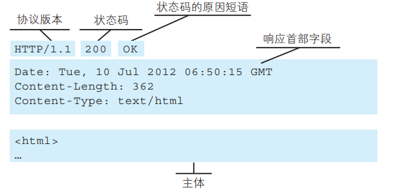
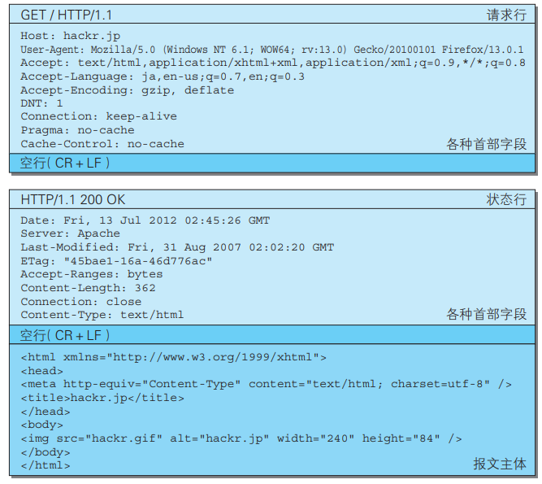

# 1. 网络基础

## 1.1 TCP/IP 协议族

TCP/IP 协议族是与互联网相关的**协议**的集合。按照层次可以分为以下4层：应用层、传输层、网络层和数据链路层。


### 1.1.1 应用层

eg：FTP / DNS / HTTP

### 1.1.2 传输层

传输层对上层应用层，提供处于网络连接中的两台计算机之间的数据传输。

eg：TCP / UDP

### 1.1.3 网络层

网络层用来处理在网络上流动的数据包。该层规定了通过怎样的路径（所谓的传输路线）到达对方计算机，并把数据包传送给对方。

eg：IP

### 1.1.4 数据链路层

用来处理网络连接的硬件部分。

eg：操作系统、驱动、网卡和光纤等。

## 1.2 IP 协议

IP 协议（Internet Protocol，网际协议）位于网络层，作用是把各种数据包传送给对方。要保证确实传送到目标地址，两个重要的条件是 IP 地址和 MAC 地址。

IP 地址表明了网络节点被分配到的地址，MAC 地址指的是网卡所属的固定地址。IP 地址可以和 MAC 地址进行配对。IP 地址可以改变，MAC 地址基本不会改变。

### 1.2.1 ARP 协议

IP 之间的通信依赖 MAC 地址。网络上，通信的双方通常需要经过多台网络设备的中转才能联系到对方。进行中转时，会用到利用下一站网络设备的 MAC 地址来搜索下一个中转目标。此时采用的是 ARP 协议（Address Resolution Protocol，地址解析协议），根据通信方的 IP 地址来反查对应的 MAC 地址。

## 1.3 TCP 协议

TCP 协议（Transmission Control Protocol，传输控制协议）位于传输层。为了方便数据传输，网络会将大块的数据分割成以报文段为单位的数据包进行管理。TCP 可以可靠地将数据传送给目标。


### 1.3.1 三次握手策略

为了可靠地传输数据，TCP 采用了三次握手的策略。握手过程中会使用 SYN（synchronize）和 ACK（acknowledgement）这两个标志。

首先，发送端会发送一个带有 SYN 标志的数据包。然后，接收端收到后会回传一个 带有 SYN/ACK 标志的数据包，以表示确认收到信息。最后，发送端会再传一个带有 ACK 标志的数据包代表“握手”结束。

如果在握手的某个过程中断，会再次以相同的顺序发送相同的数据包。

### 1.3.2 四次挥手策略

首先，发送端发送一个 FIN，表明不会再发送数据。然后接收端收到 FIN 后发送一个 ACK 表示确认。接收端再发送一个 FIN 表示不会再发送数据。最后发送端收到 FIN 后发送一个 ACK 给服务端。


## 1.4 DNS

DNS 协议（Domain Name System，域名系统）位于应用层，提供域名到 IP 地址之间的解析服务。DNS 协议提供通过域名查找 IP 地址，或逆向从 IP 地址反查域名的服务。


## 1.5 HTTP


## 1.6 URL 和 URI

### 1.6.1 URL 统一资源定位符

URL（Uniform Resource Locator，统一资源定位符），用来表示资源在互联网上所处的位置。

### 1.6.2 URI 统一资源标识符

URI（Uniform Resource Identifier，统一资源标识符），用字符串来标识某个互联网资源。

# 2. HTTP 协议

## 2.1 请求报文和响应报文

HTTP 协议规定，请求从客户端发出，服务端响应该请求并返回。

请求报文由请求方法，请求 URI，协议版本、可选的请求首部字段和内容实体构成。


> 请求 URI 可以放在请求行中，也可以放在请求首部的 Host 中。
>
> 如果不是访问特定资源而是对服务器本身发起请求，可以用一个 * 来代替请求 URI。
>
> eg：`OPTIONS * HTTP/1.1`

响应报文由协议版本、状态码、状态码的原因短语、可选的响应首部字段以及实体主体构成。



## 2.2 无状态

HTTP 是一种不保存状态，即无状态（stateless）协议。HTTP 协议自身不对请求和响应之间的通信状态进行保存。HTTP/1.1 虽然是无状态协议，但为了实现期望的保持状态功能， 于是引入了 Cookie 技术。有了 Cookie 再用 HTTP 协议通信，就可以管理状态了。

## 2.3 HTTP 方法


## 2.4 持久连接和管线化

使用浏览器浏览一个包含多张图片的 HTML 页面时，在发送请求访问 HTML 页面资源的同时，也会请求该 HTML 页面里包含的其他资源。因此，每次的请求都会造成无谓的 TCP 连接建立和断开， 增加通信量的开销。

为解决上述 TCP 连接的问题，HTTP/1.1 使用了**持久连接**的方法。持久连接的特点是，只要任意一端没有明确提出断开连接，则保持 TCP 连接状态。

持久连接使得多数请求以**管线化**（pipelining）方式发送成为可能。 从前发送请求后需等待并收到响应，才能发送下一个请求。管线化技术出现后，不用等待响应亦可直接发送下一个请求。 这样就能够做到同时并行发送多个请求，而不需要一个接一个地等待响应了。

## 2.5 Cookie

Cookie 技术通过在请求和响应报文中写入 Cookie 信息来控制客户端的状态。 Cookie 会根据从服务器端发送的响应报文内的一个叫做 Set-Cookie 的首部字段信息，通知客户端保存 Cookie。当下次客户端再往该服务器发送请求时，客户端会**自动**在请求报文中加入 Cookie 值后发送出去。

# 3. HTTP 报文

## 3.1 请求报文和响应报文

HTTP 报文可以分为报文首部和报文主体两块，并不一定需要报文主体。

请求报文和响应报文的结构：


请求报文和响应报文的实例：



其中，请求报文中的请求行包括请求的方法、请求 URI 和 HTTP 版本。响应报文中的状态行包括响应结果的状态码，原因短语和 HTTP 版本。首部字段中包含请求和响应的各种条件和属性的各类首部，包括通用首部、请求首部、响应首部和实体首部，也可能包括不在 RFC 中定义的首部。

## 3.2 编码提升传输效率

### 3.2.1 报文主体和实体主体

报文（message）指的是 HTTP 通信中的基本单位，由 8 位字节流组成。实体（entity）指的是请求和相应的有效载荷数据，由实体首部和实体主体组成。

HTTP 报文的主体用于传输请求或者响应的实体主体。通常，报文主体等于实体主体。只有当传输中进行编码操作时，实体主体的内容发生变化，才导致它和报文主体产生差异。

### 3.2.2 压缩传输的内容编码

HTTP 协议中的内容编码功能可以将实体进行压缩后传输。常用的内容编码有：gzip、compress 等

### 3.2.3 分割发送的分块传输编码

分块传输编码（Chunked Transfer Coding）会将实体主体分成多个块（chunk）。每一块都会用十六进制来标记块的大小，而实体主体的最后一块会使用“0(CR+LF)” 来标记。 使用分块传输编码的实体主体会由接收的客户端负责解码，恢复到编码前的实体主体。

## 3.3 发送多种数据的多部分对象集合 multipart

HTTP 协议可以发送一份报文主体中含有多种类型的实体（文本、图片、视频等）这是因为采用了多部分对象集合（Multipart）的方法，来容纳不同类型的数据。

在 HTTP 报文中使用多部分对象集合时，需要在首部字段里加上 Content-Type。

例如，`multipart/form-data`在 web 表单文件上传时使用。


使用 boundary 字符串来划分多部分对象集合指明的各类实体。在 boundary 字符串指定的各个实体的起始行之前插入“--”标记（例如： --AaB03x），而在多部分对象集合对应的字符串的最后插入“--”标记（例如：--AaB03x--）作为结束。

## 3.4 获取部分内容的范围请求 Range

在以前，如果在下载过程中遇到网络中断的情况，那么必须从头开始。HTTP 实现了恢复机制，可以从之前下载中断处恢复下载。

要实现该功能需要指定下载的实体范围。像这样，指定范围发送的请求叫做范围请求（Range Request）。 对一份 10 000 字节大小的资源，如果使用范围请求，可以只请求 5001~10 000 字节内的资源。


执行范围请求时，会用到首部字段 Range 来指定资源的 byte 范围。 byte 范围的指定形式如下：

1. 5001 - 10 000 字节：

   ```
   Range: bytes=5001-10000
   ```

2. 5001 字节之后的：

   ```
   Range: bytes=5001-
   ```

3. 从开始到 3000 字节和 5000 - 7000 字节：

   ```
   Range: bytes=-3000, 5000-7000
   ```

针对范围请求，响应会返回状态码为 206 Partial Content 的响应报文。另外，对于多重范围的范围请求，响应会在首部字段 Content-Type 标明 multipart/byteranges 后返回响应报文。 

如果服务器端无法响应范围请求，则会返回状态码 200 OK 和完整的实体内容。

## 3.5 内容协商返回最合适的内容

内容协商机制是指客户端和服务器端就响应的资源内容进行交涉， 然后提供给客户端最为适合的资源。内容协商会以响应资源的语言、字符集、编码方式等作为判断的基准。

* Accept
* Accept-Charset
* Accept-Encoding
* Accept-Language
* Content-Language

# 4. HTTP 状态码

## 4.1 状态码

状态码的职责是当客户端向服务器端发送请求时，描述返回的请求结果。状态码如 200 OK，以 3 位数字和原因短语组成。


常用的状态码有14种

## 4.2 2XX 成功

1. 200 OK，表示从客户端发来的请求在服务器端被正常处理了。
2. 204 No Content，表示请求已被成功处理，但是返回的响应报文不含实体主体。
3. 206 Partial Content，表示服务器成功执行了客户端的范围请求。

## 4.3 3XX 重定向

1. 301 Moved Permanently，永久性重定向。表示请求的资源已经被分配了新的 URI，以后应该使用资源新的 URI。
2. 302 Found，临时性重定向。表示请求的资源已经被分配了新的 URI，本次应该使用资源新的 URI。
3. 303 See Other，表示由于请求对应的资源存在着另一个 URI，应使用 GET 方法定向获取请求的资源。
4. 304 Not Modified，表示客户端发送附带条件的请求时，服务器端允许请求 访问资源，但未满足条件的情况。

5. 307 Temporary Redirect，临时性重定向。与 302 有着相同的含义。

## 4.4 4XX 客户端错误

1. 400 Bad Request，表示请求报文中存在语法错误。
2. 401 Unauthorized，表示发送的请求需要认证消息。
3. 403 Forbidden，表示请求资源的访问被服务器拒绝了。可能是权限不够。
4. 404 Not Found，表示服务器上无法找到请求的资源。

## 4.5 5XX 服务器错误

1. 500 Internal Server Error，表示服务器在执行请求是发生了错误。
2. 503 Service Unavailable，表示服务器暂时处于超负载或者正在停机维护。

# 5. Web 服务器

## 5.1 代理、网关、隧道

HTTP 通信时，除客户端和服务器以外，还有一些用于通信数据转 发的应用程序，例如代理、网关和隧道。它们可以配合服务器工作。

### 5.1.1 代理

代理服务器接收客户端发送的请求后转发给其他服务器，代理不改变请求 URI，会直接发送给源服务器。源服务器返回的响应经过代理服务器后再传给客户端。


### 5.1.2 网关

网关和代理相似。不过，网关可以使线路上的服务器提供非 HTTP 服务。


### 5.1.3 隧道

隧道可以建立起一条与其他服务器的通信线路。利用 SSL 等加密手段可以确保客户端和服务器之家进行安全通信。


## 5.2 缓存

缓存是指代理服务器或客户端本地磁盘内保存的资源副本。利用缓存可减少对源服务器的访问，因此也就节省了通信流量和通信时间。

当代理转发从服务器返回的响应时，代理服务器将会保存一份资源的副本。

### 5.2.1 有效期限

即使存在缓存，也会因为客户端的要求、缓存的有效期等因素，向源服务器确认资源的有效性。若判断缓存失效，缓存服务器将会再次从 源服务器上获取新资源。

### 5.2.2 客户端缓存

缓存不仅存在在缓存服务器中，还可以存在客户端浏览器中。当判定缓存过期后，会向源服务器确认资源的有效性。若判断浏览器缓存失效，浏览器会再次请求新资源。

# 6. HTTP 首部

## 6.1 HTTP 报文首部

请求报文：


响应报文：


## 6.2 HTTP 首部字段

HTTP 首部字段由字段名和字段值构成，中间用冒号分隔：

```
Content-Type: text/html
```

单个 HTTP 首部字段可以有多个值：

```
Keep-Alive: timeout=15, max=100
```

根据实际用途，HTTP 首部字段可以分为：通用首部字段、请求首部字段、响应首部字段、实体首部字段。


## 6.3 通用首部字段

通用首部字段指的是请求报文和响应报文双方都会使用的首部。

* Cache-Control：操作缓存工作机制；指令参数可选，多个指令之间用逗号分隔。

  ```
  Cache-Control: private, max-age=0, no-cache
  Cache-Control: no-store
  Cache-Control: max-age=604800
  ```

  * public：响应：可向任意方提供响应的缓存。
  * private：响应：仅向特定用户返回响应。
  * no-cache：请求：客户端不接收缓存资源：响应：缓存服务器不对资源进行缓存。
  * no-store：不应对请求或者响应进行缓存。
  * max-age：单位秒。请求：只接受比该时间少的缓存；响应：资源保存为缓存的最长时间。

* Connection：控制不再转发给代理的首部字段；管理持久连接

  * 首部字段名：不再转发的首部字段名。代理服务器转发时会删除该首部。
  * Keep-Alive：持久连接。HTTP 1.1 中默认连接就是持久连接
  * Close：关闭持久连接

* Date：表明创建 HTTP 报文的日期和时间

  ```
  Date: Tue, 03 Jul 2012 04:40:59 GMT
  ```

* Upgrade：检测是否可以使用更高的版本进行通信。产生的作用仅限于客户端和邻接服务器之间。因此使用 Upgrade 时，还需要额外指定 `Connection: Upgrade`

  ```
  Upgrade: TLS/1.0
  Connection: Upgrade
  ```

* Via：追踪客户端和服务器之间的请求和响应报文的传输路径。经常和 TRACE 方法一同使用。

  

## 6.4 请求首部字段

请求首部字段是客户端发送给服务端的请求中的字段。

* Accepct：通知服务器用户代理可以处理的媒体类型和相对优先级。可以使用 type/subtype 这种形式，一次性指定多种媒体。

  ```
  Accept: text/html,application/xhtml+xml,application/xml;q=0.9,*/*;q=0.8
  ```

  * 文本：text/html, text/plain, text/css, application/xhtml+xml, application/xml
  * 图片：image/jpeg, image/gif, image/png
  * 视频：video/mpeg, video/quicktime
  * 应用程序使用的二进制文件：application/octet-stream, application/zip

  可以使用 q= 来额外表示权重值，权重值 q 的范围是 0-1，1最大。默认权重 q=1.0。

* Accept-Charset：通知服务器用户代理支持的字符集和相对优先级。也可以使用 q= 来表示优先级。

* Accept-Encoding：通知服务器用户代理支持的内容编码和优先级。
  * gzip，compress，deflate，identity
  
* Accept-Language：通知服务器用户代理能够处理的语言集和相对优先级。

* Authorization：告知服务器用户代理的认证信息。

* Host：必要。告知服务器**请求的资源**所处的互联网主机名和端口号。

* Referer：告知服务器请求的原始资源的 URI。

* User-Agent：告知服务器浏览器和用户代理的名称。

* Range：范围请求。服务器会在处理请求后返回状态码为 206 Partial Content 的响应。无法处理该范围请求时，会返回状态码为 200 OK 的响应和全部资源。

## 6.5 响应首部字段

响应首部字段是服务端发送给客户端的响应报文中的字段。

* Accept-Ranges：告知客户端服务器是否能够处理范围请求。可处理范围请求时值为 bytes，反之为 none。

* Age：告知客户端源服务器在多久前创建了响应。单位秒。

* Location：将响应的接收方引导至另一个位置的资源。配合 3xx: Redirection 的响应，提供重定向的 URI。

* Retry-After：告知客户端应该在多久之后再次发送请求。配合 503  Service Unavailable 或者 3xx Redirect 响应一起使用。

* Server：告知客户端当前服务器上安装的 HTTP 服务器应用程序信息。

  ```
  Server: Apache/2.2.17 (Unix)
  ```

* WWW-Authenticate：用于 HTTP 的访问认证，告知客户端适用于请求 URI 的认证方案。

## 6.6 实体首部字段

实体首部字段是包含在请求报文和响应报文中的实体部分所使用的首部，用于补充内容的更新时间等与实体相关的信息。

* Allow：通知客户端能够支持该请求 URI 指定资源的所有 HTTP 方法。

  当服务器收到不支持的 HTTP 方法时，会以 405 Method Not Allowed 作为响应来返回。同时返回把所有能支持的 HTTP 方法写入 Allow 字段后返回。

  ```
  Allow: GET, HEAD
  ```

* Content-Encoding：告知客户端实体的主体选用的内容编码方式。

  * gzip,compress,deflate,identity

* Content-Language：告知客户端实体的主体使用的自然语言。

* Content-Length：表明了实体主体部分的大小（单位是字节）。

* Content-Range：告知客户端作为响应返回的实体的哪个部分符合范围请求。

* Content-Type：说明实体主体内对象的媒体类型。和首部 字段 Accept 一样，字段值用 type/subtype 形式赋值。

* Expires：将资源失效的日期告知客户端。缓存服务器在 接收到含有首部字段 Expires 的响应后，会以缓存来应答请求，在 Expires 字段值指定的时间之前，响应的副本会一直被保存。当超过指定的时间后，缓存服务器在请求发送过来时，会转向源服务器请求资源。

  源服务器不希望缓存服务器对资源缓存时，最好在 Expires 字段内写入与首部字段 Date 相同的时间值。 但是，当首部字段 Cache-Control 有指定 max-age 指令时，比起首部字段 Expires，会优先处理 max-age 指令。

* Last-Modified：指明资源最终的修改时间。

## 6.7 Cookie 相关首部字段

* Set-Cookie：响应首部字段中，开始状态管理所使用的 Cookie 信息

  

  

* Cookie：请求首部字段中，服务器收到的 Cookie 信息。

  首部字段 Cookie 会告知服务器，当客户端想获得 HTTP 状态管理支持时，就会在请求中包含从服务器接收到的 Cookie。接收到多个 Cookie 时，同样可以以多个 Cookie 形式发送。

# 7. HTTPS

HTTP 缺点：

1. 通信使用明文（不加密），内容可能会被窃听
2. 不验证通信方的身份，因此有可能遭遇伪装
3. 无法证明报文的完整性，所以有可能已遭篡改

HTTP 加上**加密处理**和**认证**以及**完整性保护**后即是 HTTPS。HTTPS 不是一种新的协议，只是 HTTP 通信接口部分使用 SSL（Secure Socket Layer，安全套接层） 和 TLS （Transport Layer Security，传输层安全）协议代替而已。通常，HTTP 直接和 TCP 通信。当使用 SSL 时，则演变成先和 SSL 通信，再由 SSL 和 TCP 通信了。简言之，所谓 HTTPS，其实就是 身披 SSL 协议这层外壳的 HTTP。

## 7.1 SSL

**共享**密钥加密：加密和解密同用一个密钥，加密时把密钥也发送给对方（**对称**加密）。

**公开**密钥加密：使用一对**非对称**的密钥，一把叫私钥，一把叫做公钥。私钥不能让任何人知道，公钥可以发送给任何人。发送密文的时候使用对方的公钥，接收密文之后使用自己的私钥进行解密。

**混合**加密机制：HTTPS 使用的是共享密钥加密和公开密钥加密两种模式混合的加密机制。因为公开密钥加密比共享密钥加密相比速度更慢，为了保证效率，可能使用公开密钥加密传输**密钥**，保证该密钥的安全，随后使用共享密钥加密交换报文。

## 7.2 证书

CA 证书：保证公钥的传输不被破攻击。

公开密钥加密方式还是存在一定的问题，那就是没有办法保证传输公开密钥的过程中不被攻击。为了解决上述问题，可以使用证书认证机构（CA）所颁发的证书来解决。

服务器先向证书认证机构申请公开密钥的证书。机构在判明服务器身份之后，对申请的公开密钥做数字签名，并将公开密钥加入到公钥证书中。随后，服务器将公钥证书发送给客户端。客户端使用数字证书认证机构的公开密钥对证书上的签名进行认证。认证机构的公开密钥一般都会内置在浏览器中。

## 7.3 TSL

TSL 是以 SSL 为原型开发的协议，有时会统一称该协议为 SSL。当前主流的版本是 SSL3.0 和 TLS1.0。

HTTPS 使用 SSL 时会变慢：

1. 通信量增加
2. 加密处理需要消耗更多的硬件资源

# 8. 认证

HTTP/1.1 使用的认证方式有：

* BASIC 认证（基本认证） 

* DIGEST 认证（摘要认证）
* SSL 客户端认证
* FormBase 认证（基于表单认证）

# 9. 基于 HTTP 的追加协议

## 9.1 WebSocket

Web 浏览器和 Web 服务器之间**全双工**通信标准。主要特点：

* 推送功能：服务器可以直接发送数据，不必等待客户端进行请求。
* 减少通信量：建立起 ws 连接之后，一直保持连接。相比 HTTP 开销少。

## 9.2 HTTP/2.0

7 项技术：

* 压缩
* 多路复用
* TLS 义务化
* 协商
* 客户端拉曳和服务端推送
* 流量控制
* WebSocket

## 9.3 WebDAV

WebDAV（Web-based Distributed Authoring and Versioning，基于万维网的分布式创作和版本控制）是一个分布式文件系统。

