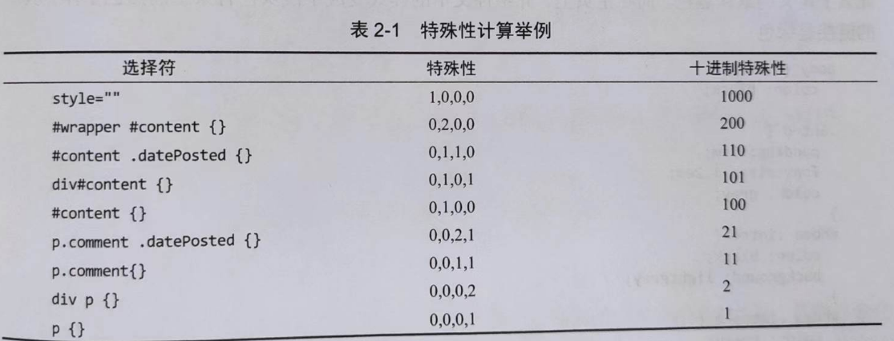

# 1 层叠

复杂的样式表中可能存在两条或者多条规则同时选择一个元素的情况。CSS 使用**层叠机制**来处理这种冲突。层叠机制的原理是为规则赋予不同的重要程度。

最重要的是**作者样式表**，即由网站开发者所写的样式。其次是**用户样式表**，用户可以通过浏览器的设置选项来应用自己的样式。排在最后的是**浏览器**（或用户代码）的**默认样式表**，它一般会被作者样式表覆盖掉。

为了给用户更高的优先权，CSS 允许用户使用 `!important`覆盖任何规则，包括网站作者使用的 `!important`标注的规则。`!important `需要放在属性声明的后面。

```css
p{
    font-size: 1.5em !important;
}
```

总结起来，层叠机制的**重要性**的级别从高到低如下：

1. 标注为 `!important` 的用户样式表
2. 标注为 `!important` 的作者样式表
3. 作者样式表
4. 用户样式表
5. 浏览器的默认样式

在此基础上，规则再按选择器的**特殊性**排序。特殊性高的选择器会覆盖特殊性低的选择器。如果两条规则的特殊性相等，则**后**定义的规则优先。

# 2 特殊性（优先级）

为了量化规则的特殊性，每种选择器都对应一个数值。一条规则的特殊性就是这些数值的累加值。这里的累加计算是基于位置的累加而不是基于数值的累加（如果一条规则所用的选择器不超过10个，也可以基于十进制数值计算特殊性）。选择器的特殊性对应以下4个级别（a b c d）：

1. 行内样式a=1
2. b等于id选择器的数目
3. c等于类选择器、伪类选择器以及属性选择器的数目
4. d等于元素选择器和伪元素选择器的数目
5. 通用选择器的特殊性是0



本质上讲，行内样式的优先级最高。使用id属性的规则优先级高于未使用id属性的规则。hi用类选择器的规则优先级高于只通过元素选择器的规则。

# 3 继承

有些属性，像是颜色和字体大小，会被使用他们的元素的后代所继承．比如把body元素的文本颜色设置成黑色，那么body元素所有的后代元素文本颜色都会继承这个颜色。

继承机制可以避免给一个元素的所有后代元素重复设置相同的样式。

# 4 为文档应用样式

## 4.1 link 和 style 元素

可以把样式放在style元素中，直接放在文档的head部分。

```html
<style>
    a{
        color:blueviolet;
    }
</style>
```

为了能够重用样式，通常需要将样式保存在一个外部文件中。有两种方法应用外部的样式表：

1. 使用 link 元素：

   ```html
   <link href="./style.css"/>
   ```

2. 使用 @import 指令：

   ```html
   <style>
       @import url(./style.css);
   </style>
   ```

上面两种方法中，更推荐使用 link 元素。

使用 link 和style 添加样式时，声明的顺序就是在HTML源代码中出现的顺序。根据层叠机制，这些顺序决定了优先级。

## 4.2 性能

浏览器只有掌握了页面布局的全部 CSS 信息才能给出最佳相应。

### 4.2.1 减少 HTTP 请求

线上网页最好把需要加载的 CSS 文件数量控制在1-2个。如果使用 link 元素加载一个 CSS 文件并且在其中使用@import，并不能就将请求的数量控制在1个。因为 link 标签会进行一次请求，并且 link 请求下来的内容中如果有 @import，还会继续请求文件，所以线上的网页尽量不要使用@import。

### 4.2.2 压缩和缓存内容

使用 GZIP 可以大幅度压缩 CSS 文件的大小。

理想情况下，浏览器应该只下载一个 CSS 文件，除非线上的文件出现变化。可以通过 HTTP 首部告诉浏览器把文件缓存一段时间。通过改变文件名的方式来告诉浏览器来清除缓存.

### 4.2.3 使用async和defer

如果在 HTML 中加入了 script 元素，那么浏览器会先将需要引入的 js 文件下载下来，下载并执行完毕后再继续渲染网页内容。这种渲染阻塞会严重拖慢网页的加载速度。一般的做法是，在 script 元素中添加 async 或者 defer 属性。


