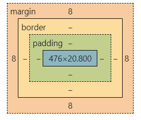
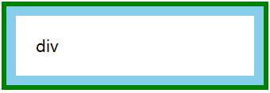
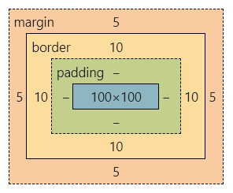
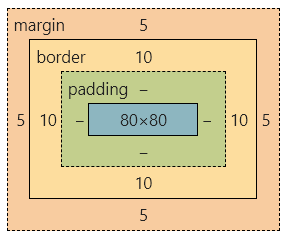
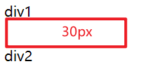
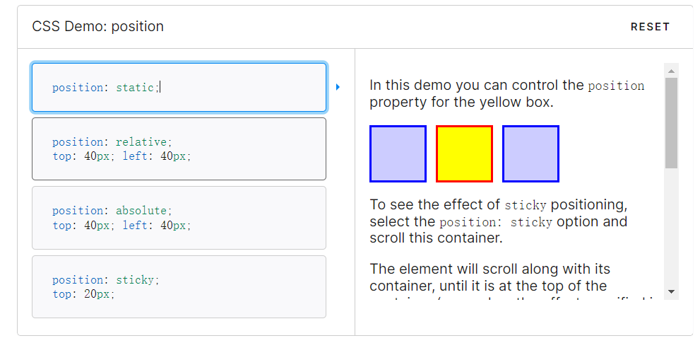
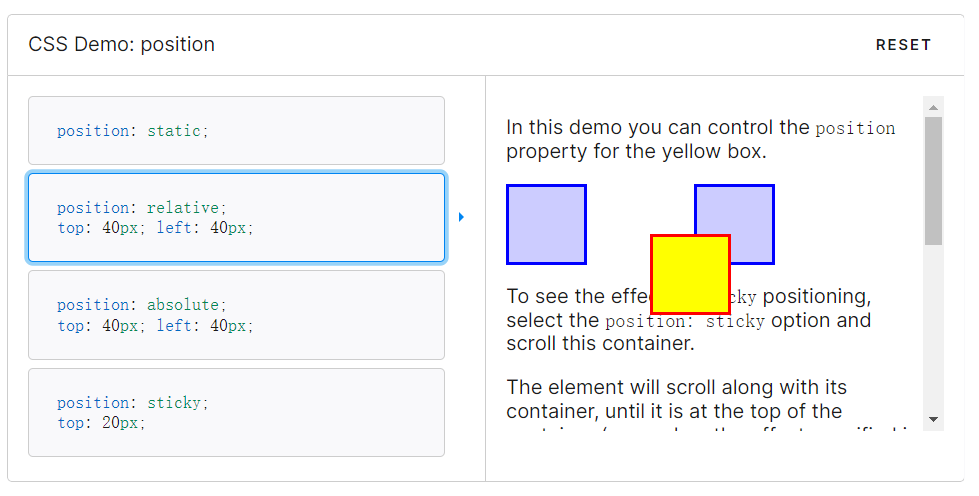
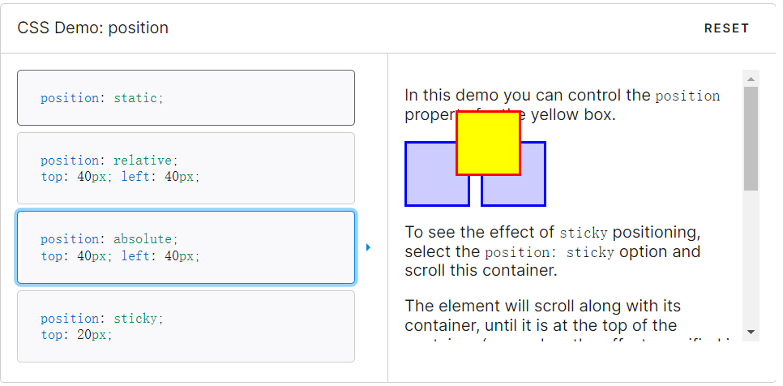
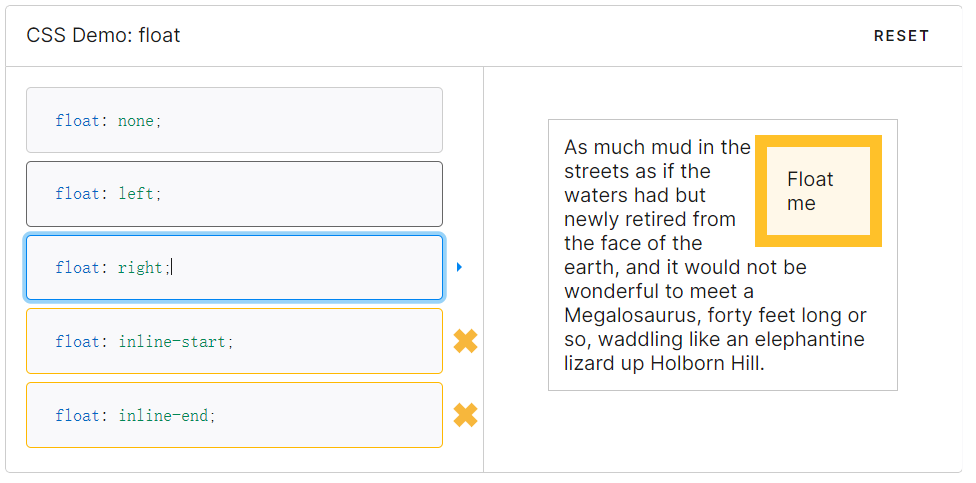
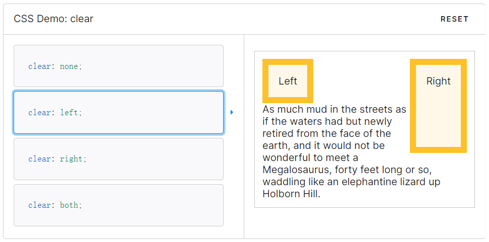

# 1 盒模型

页面中的所有元素都可以看作是一个矩形盒子，这个盒子包含元素的内容、内边距、边框和外边距。



内边距（padding）是内容区周围的空间。给元素设置背景通常会作用于元素的内容和内边距，内边距通常用于分割内容使其不至于散布到背景的边界。

边框（border）是内边距外侧的一条框线。这条框线可以是实线、虚线或者点划线。

外边距（margin）在边框的外部，用于控制元素在页面之间的距离。

有一个和边框类似的属性叫轮廓线（outline）。这个属性可以在边框外围画出一条线，但是不会影响布局。



## 1.1 box-sizing 宽高计算方式

box-sizing 的默认值是 content-box。此时，元素盒子的 width 和 height 属性应用到内容盒子，添加内边距和边框不会影响到内容盒子的大小。

```css
p {
    width: 100px;
    height: 100px;
    border: 10px solid;
    margin: 5px;
}
```



如果将 box-sizing 属性的值设置成 border-box，那么 width 和 height 属性的值将包括内边距和边框。此时，添加内边距和边框会挤占内容盒子的大小。这种方法计算盒子大小更直观。

```css
p {
    box-sizing: border-box;
    width: 100px;
    height: 100px;
    border: 10px solid;
    margin: 5px;
}
```



> 注意：如果内容、内边距、边框或者外边距的 width 和 height 使用的是百分比，那么这里的百分比是基于**包含块**的**宽度**（上面这里指父元素宽度）。 

## 1.2 min-width 最小宽度

min-width 和 max-width 可以设置盒子的最小宽度和最大宽度。min-height 和 max-height 可以设置盒子的最小高度和最大高度。

> 注意：在 CSS 中任何设定*高度值*的时候都应该慎重。元素的高度通常取决于元素的内容，不需要我们去设定。不然，一旦内容增多或者字号变大，内容就跑到盒子外边去了。

# 2 可见格式化模型

## 2.1 块级盒子和行内盒子

### 2.1.1 块级盒子

p、h1、article 是块级元素，作为元素，显示为内容块或者**块级盒子**（block）的形式。

块级盒子会沿着垂直方向堆叠，在垂直方向的间距由它们的上下外边距决定。

### 2.1.2 行内盒子

strong、span、time 是行内元素，内容以**行内盒子**（inline）的形式显示。

行内盒子沿文本流水平排列，随着文本的换行而换行。行内盒子的水平间距可以通过水平方向的内边距、边框和外边距来调节。但是，行内盒子的高度不受垂直方向的内边距、边框和外边距影响。而且，给行内盒子明确设置高度和宽度也不会起作用。

#### 外边距折叠

**常规文本流中块级盒子**在**垂直方向**上存在外边距折叠机制：多个垂直外边距相遇时会折叠成一个外边距，折叠后的外边距按较大的那个计算。

```html
<style>
    #div1{
        margin-bottom: 30px;
    }
    #div2{
        margin-top: 20px;
    }
</style>
<div id="div1">div1</div>
<div id="div2">div2</div>
```



### 2.1.3 display 盒子类型

可以通过 [display](https://developer.mozilla.org/zh-CN/docs/Web/CSS/display) 属性改变盒子类型：

* display 属性设置为 block，元素表现为块级盒子。
* display 属性设置为 inline，元素表现为行内盒子。

* display 属性设置为 inline-block，元素像行内盒子一样水平排列，但是内部像块级盒子一样，可以设置宽高、垂直内外边距。

* display 属性设置为 none，元素不显示。

### 2.1.4 匿名盒子

不明确元素会生成**匿名块盒子**。不能给匿名盒子添加样式。

## 2.2 position 定位类型

CSS 中有几种不同的定位模型，包括静态定位 static，相对定位 relative，绝对定位 absolute，固定定位 fixed。

默认情况下，position 属性的值是 static，所有元素盒子都在常规文档流中。



### 2.2.1 相对定位 relative

设置为相对定位后，元素仍然待在原位置，但是可以通过 top、right、bottom 和 left 使元素相对于原位置平移。无论是否平移，元素都会占据文档流中的初始位置。



### 2.2.2 绝对定位 absolute

设置绝对定位后，元素脱离文档流，不会再占据原位置，因此其他元素会重新定位。



#### 包含块

绝对定位元素的**包含块**是距离最近的**定位祖先**，也就是除了 position 为 static 之外的任意祖先元素。如果找不到，那就相对于 html 元素来定位。

#### z-index

绝对定位元素因为脱离了文档流，因此会遮盖其他元素。可以设置元素的 z-index 属性来控制 z 轴距离远近，z-index 越大的元素离人眼越近。

### 2.2.3 固定定位 fixed

固定定位与绝对定位类似，不同点在于固定定位元素的包含块是[视口](https://developer.mozilla.org/zh-CN/docs/Glossary/Viewport)（浏览器中可见内容的部分）。

## 2.3 float 浮动模型

浮动盒子脱离常规文档流，可以向左或者向右移动，直到外边沿接触到包含块的外边沿，或者另一个浮动盒子的外边沿。

如果浮动元素后面跟着的是常规文档流中的元素，那么这个元素的盒子就当浮动盒子不存在。但是，这个盒子中的**文本内容**会记住浮动元素的大小，并在排版时避开，造成文本环绕浮动盒子的效果。 



### 清除浮动

使用 clear 属性可以清除浮动，使得元素移动到浮动元素的下方。



清除元素时，浏览器会给元素上方添加足够大的外边距，使得元素垂直向下移动到浮动元素下方。因此，如果给已清除浮动的元素添加外边距，除非值超出浏览器添加的值，否则看不到效果。
