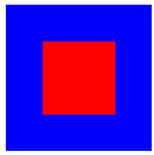
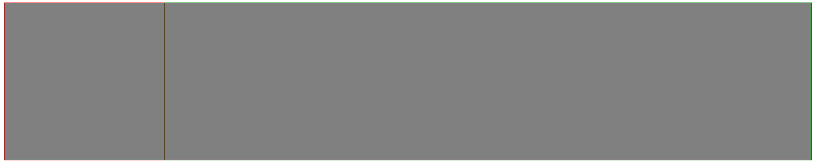
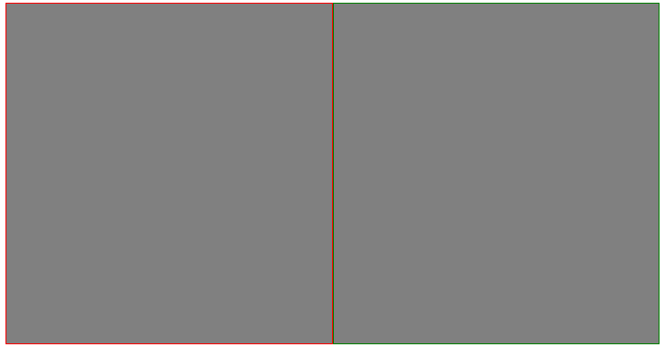
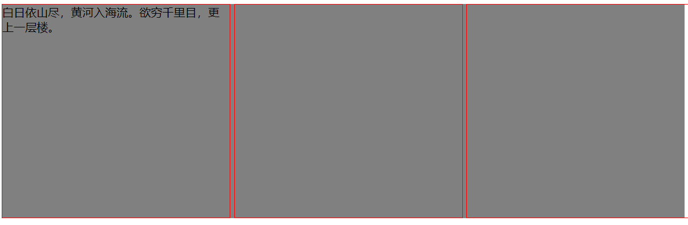

# 常见布局

## 1. 水平垂直居中



[参考地址](https://juejin.cn/post/6844903679242305544)

```html
<div class="container">
    <div class="item"></div>
</div>
```

```css
.container{
    height: 200px;
    width: 200px;
    background-color: blue;
}

.item{
    background-color: red;
}
```

### 仅针对居中元素宽高**固定**：

```css
.item{
    height: 100px;
    width: 100px;
}
```

#### absolute + 负 margin

```css
.container{
    position: relative;
}

.item{
    position: absolute;
    top: 50%;
    left: 50%;

    margin-top: -50px;
    margin-left: -50px;
}
```


#### absolute + margin auto

```css
.container{
    position: relative;
}

.item{
    position: absolute;
    top: 0;
    left: 0;
    right: 0;
    bottom: 0;
    margin: auto;
}
```


#### absolute + calc

```css
.container{
    position: relative;
}

.item{
    position: absolute;
    top: calc(50% - 50px);
    left: calc(50% - 50px);   
}
```


### 居中元素宽高**不固定**：

#### absolute + transform

```css
.container{
    position: relative;
}

.item{
    position: absolute;
    top: 50%;
    left: 50%;
    transform: translate(-50%, -50%);
}
```


#### flex

```css
.container{
    display: flex;

    justify-content: center;
    align-items: center;
}
```

或者：

```css
.container{
    display: flex;
}

.item{
	margin: auto;
}
```


#### grid

```css
.container{
    display: grid;
    place-items: center;
}
```

或者：

```css
.container{
    display: grid;
}

.item{
    align-self: center;
    justify-self: center;
}
```

其他方式水平垂直居中方法参照[地址](https://juejin.cn/post/6844903679242305544#heading-4)。

## 2. 左侧固定宽度、右侧自适应



```html
<div class="container">
  <div class="left"></div>
  <div class="main"></div>
</div>
```

```css
.container {
    background-color: gray;
    height: 300px;
}

.left {
    border: 1px solid red;
}

.main {
    border: 1px solid green;
}
```

### flex

```css
.container {
display: flex;
}

.left {
width: 300px;
}

.main {
flex: 1;
}
```


### grid

```css
.container {
    display: grid;
    grid-template-columns: 300px 1fr;
}
```

## 3. 两栏均分布局



```html
<div class="container">
    <div class="left"></div>
    <div class="right"></div>
</div>
```

```css
.container {
    background-color: gray;
    height: 300px;
}

.left {
    border: 1px solid red;
}

.right {
    border: 1px solid green;
}
```

### flex

```css
.container {
	display: flex;
}

.left {
	flex: 1;
}

.right {
	flex: 1;
}
```

### grid

```css
.container {
    display: grid;
    grid-template-columns: 1fr 1fr;
}
```

## 4. 三栏均分布局



```html
<div class="container">
    <div class="item">白日依山尽，黄河入海流。欲穷千里目，更上一层楼。</div>
    <div class="item"></div>
    <div class="item"></div>
</div>
```

```css
.container {
    background-color: gray;
    height: 300px;
}

.item {
	border: 1px solid red;
}11
```

### flex

```css
.container {
    display: flex;
    /* 控制间隙 */
    gap: 5px;  
}

.item {
    flex: 0 0 calc(100% / 3);
}
```

### grid

```css
.grid-container {
  display: grid;
  grid-template-columns: 1fr 1fr 1fr;
  gap: 5px;
}
```

