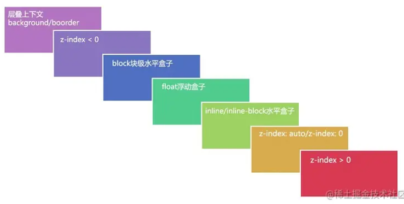

# CSS 篇

## 1. 盒模型

在 CSS 中，页面上的每个元素都可以看作一个盒子。CSS 中的盒模型有两种，可以通过 box-sizing 属性进行配置。默认情况下，box-sizing 的值为 content-box，表示元素的 width 只会包含 content。如果将 box-sizing 的值设置为 border-box，那么元素的 width 会包含 content、padding 和  border。

## 2. 选择器特殊性（权重、优先级）

选择器的特殊性一种有3种级别：

1. 最高，id 选择器（#app）
2. 其次，类选择器（.title）、伪类选择器（a:hover）、属性选择器（abbr[title]）
3. 最后，元素选择器（span）、伪元素选择器（span::before）

特殊地，行内样式的特殊性最高，通用选择器特殊性为0。

## 3. z-index 和层叠上下文

z-index 属性只在定位元素上有效。而且，不是说盒子的 z-index 的数值越高，盒子的层级就越在上面。z-index 要配合层叠上下文的概念来理解。

层叠规则：

先判断两个元素是否处于同一个**层叠上下文**中。如果是，谁的**层叠等级**大，谁就在上边。如果两个元素不在同一层叠上下文中，需要先比较他们所处层叠上下文的层叠等级。当两个元素**层叠等级**相同、**层叠顺序**相同时，在 DOM 结构中后面的元素层叠等级在前面元素之上。

层叠上下文：

具有层叠上下文的元素比普通元素在 Z 轴上更加靠上。HTML 中的根元素 `<html></html>` 自带根层叠上下文。普通元素将 position 属性设置为非 static 值，并设置 z-index 属性为数值即可生成层叠上下文。还有一些 CSS3 属性可以生成层叠上下文。

层叠等级：

在同一个层叠上下文中，描述元素在该层叠上下文中 Z 轴的上下顺序（比较 z-index 的数值即可）。在普通元素中，描述普通元素在 Z 轴上的上下顺序。

层叠顺序：

元素发生层叠时按照特定的顺序**规则**在 Z 轴上垂直显示。

## 4. 水平垂直居中

（//TODO 详见[博客](https://zhangtuo.online/archives/f7bcdff6.html)，需要整理一下布局相关语言）

* absolute + 负 margin / margin auto / calc / transform
* flex
* grid

## 5. 左侧固定，右侧自适应

* flex
* grid

## 6. 双栏、三栏布局

* flex
* grid

