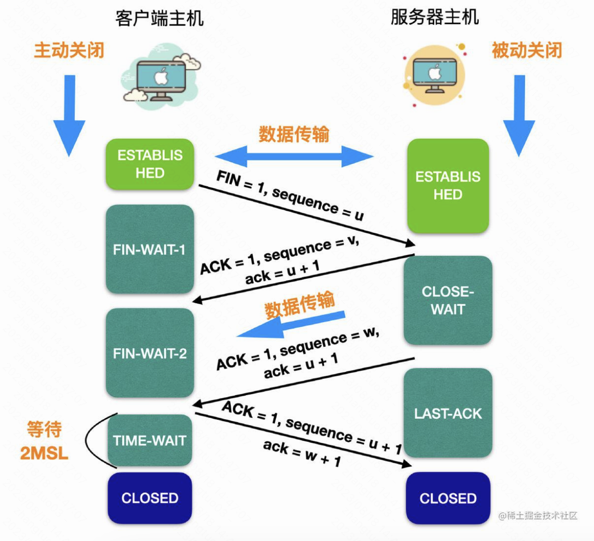

## js

* var let const 之间的异同点

  * **作用域**：
    * var 声明的变量属于函数作用域。在函数外使用 var 声明变量时，该变量会成为全局变量。

    * let 和 const 声明的变量属于块作用域。

  * **声明提升**：
    * var 存在声明提升。使用 var 声明变量时，变量的声明会提升到作用域的顶部，因此可以在声明变量的语句前访问到这个变量，值是 undefined。

    * let 和 const 不存在声明提升。在声明变量语句前访问变量会报错，也就是存在暂时性死区。

    * 函数有声明提升，类没有
    
  * **重复声明**：
    * 使用 var 声明的变量可以在同一作用域内重复声明。
    * 使用 let 和 const 声明的变量不可以在同一作用域内重复声明。
  * **赋值**：
    * var 和 let 可以先声明后赋值，赋值后可以重新赋值。
    * const 必须在声明变量时同时赋值，赋值后不可以重新赋值。
  
  * *代码规范*：一般来说，声明变量时，优先使用 const，如果认为这个变量会重新分配，那就使用 let，任何时候都不要使用 var。
  
* for-in 和 for-of 区别

  * for-in 用来遍历对象除 Symbol 外的可枚举属性名，包括继承的可枚举属性。for-in 会根据对象属性描述符上的 enumerable 来判断对象的属性是否可枚举。不保证遍历顺序。一般是，先遍历数字属性再遍历字符串属性，数字属性按数字大小排列，字符串属性按添加顺序遍历。
  * for-of 用来遍历可迭代对象。for-of 会根据可迭代对象身上的 [Symbol.iterator] 方法进行遍历。常见的可迭代对象有数组、字符串、map、set、arguments 对象、NodeList 对象。
  * 直观感受是，for-in 用来遍历键，for-of 用来遍历值。
  
* 数据类型

  * boolean string number undefined null symbol bigint object
    * symbol es6
    * bigint es2019
      * 可以表示大于 2^53-1 的数值

  * null 和 undefined 区别
    * null 代表空值，undefined 代表未定义的值。undefined 是自己出现的，一般不会显式赋值一个变量为 undefined
    * null 出现场景：
      * 声明对象但是暂不赋值，一般初始化为 null
      * 当变量不再被使用时，赋值为 null 来解除引用
    * undefined 出现场景：
      * typeof 后跟一个没声明的变量
      * 声明变量但没赋值
      * 函数没有 return，或者 return 空表达式
      * 定义形参但没有传参
      * 对象上没有对应的属性
  * 为什么 null 会被 typeof 判断成对象
    * JavaScript 设计上的失误。在 JavaScript 最初的实现中，JavaScript 中的值是由一个表示类型的标签和实际数据值表示的（对象的类型标签是 0）。由于 null 代表的是空指针（大多数平台下值为 0x00），因此，null的类型标签也成为了 0，typeof null就错误的返回了"object"。

  - 如何检测数据类型，不同场景不同方案

    - instanceof  和 typeof 区别
      - typeof 检测变量的类型，可以准确检测除 null 外的基本数据类型和函数
      - instanceof 用来检测右侧构造函数是否出现在左侧实例对象的原型链上
    - 判断空对象
      - Object.keys(obj).length === 0 配合 obj.constructor === Object
      - Object.prototype.toString().call(obj) 配合 JSON.stringify(value) === '{}'
    - 判断数组
      - isArray
    - 通用的解决方案是调用 Object.prototype.toString().call(obj)
  - 基本类型和引用类型的区别
    - 定义：基本类型值指的是简单的数据段；引用类型值指那些可能由多个值构成的对象
    - 内存空间：js 内存分为栈内存和堆内存
      - 基本类型变量以及变量的值存放在栈内存中
      - 引用类型变量的地址存放在栈内存中，值存放在堆内存中
    - 对值的操作：
      * 基本类型按值访问，操作的是实际保存的值
      * 引用类型按地址访问，先从栈中读取内存地址，然后按照内存地址到堆内存中取值
    - 变量赋值：
      * 将一个基本类型变量赋值给一个新变量，会在栈中创建一个新值，然后把值赋给新变量
      * 将一个引用类型变量赋值给一个新变量，赋值的是存在栈内存中的地址，两个变量会引用同一个对象。所以修改其中一个变量，另一个变量也会发生改变。
  - == 和 ===
    - == 相等：先进行类型转换，然后判断
    - === 严格相等：不进行类型转换，直接判断

* 数值

  * MAX_SAFE_NUMBER 最大安全整数 2^53 - 1 

* 对象

  * new 一个对象的中间过程
    1. 在内存中创建一个新的对象
    2. 新对象的隐式原型指向构造函数的显式原型
    3. 构造函数内部的 this 指向新对象
    4. 执行构造函数内的代码
    5. 如果没有显式返回值，返回该对象
  * 深拷贝、浅拷贝
    * 深拷贝和浅拷贝都复制值和地址，都是为了解决引用类型赋值后相互影响的问题
      * 浅拷贝进行一层复制，深层次的引用类型还是共享内存地址
      * 深拷贝是无限层级复制，拷贝后原对象和新对象互不影响
    * 浅拷贝：
      * Object.assign()
      * 扩展运算符
    * 深拷贝
      * JSON.parse(JSON.stringfiy(obj)) 缺点：
        * 忽略 undefined symbol function
        * NaN、Infinity 会被序列化为 null
        * 存在循环引用的问题
      * 手写深拷贝
        * 处理 typeof 不为 object 的情况：除 null 外原始类型和函数
        * 处理 null
        * 处理日期、正则、NodeList
        * 处理对象、数组
        * 解决循环引用
  * 遍历对象属性
    * for-in 遍历对象身上除 Symbol 外的可枚举属性名，包括继承的可枚举属性。
    * 如果不想遍历原型身上的属性，可以使用 hasOwnProperty() 方法加判断。或者使用 Object.keys()。
    * Object.keys() 返回对象身上除 symbol 外的可枚举属性名，不包括继承的可枚举属性。
    * Object.getOwnPropertyNames()，返回对象自身上除 Symbol 外的属性名，包括不可枚举属性。
    * Object.getOwnPropertySymbols()，返回对象自身上的 Symbol 属性。
    * Reflect.ownKeys()，返回对象身上的属性，包括字符串属性和符号属性。
  * 继承的实现方式
    * 原型链继承
      * 子类构造函数原型指向父类构造函数的实例
      * 优点：可以继承父类实例以及父类原型的属性和方法
      * 缺点：
        * 父类引用类型属性会被子类共享，一个子类修改父类引用类型属性后，其他子类也会被影响。
        * 子类无法给父类构造函数传参
    * 构造函数继承
      * 子类构造函数内部调用父类构造函数
      * 优点：子类间不会相互影响父类的引用类型属性，子类可以给父类构造函数传参
      * 缺点：子类无法访问到父类原型上的属性和方法，每个子类实例身上都有父类的方法，影响性能
    * 组合继承
      * 子类构造函数内部调用父类函数，并且子类构造函数原型指向父类构造函数的实例
      * 优点：子类间不会相互影响父类的引用类型属性，子类可以给父类构造函数传参，子类可以访问到父类原型上的属性和方法
      * 缺点：父类的构造函数会被调用两次。父类的属性和方法不仅会存在子类实例上，还会存在子类实例的原型链上。存在性能问题。
    * 原型式继承
      * 使用 Object.create()，新对象的原型指向传入的对象
      * 优点：可以继承父对象自身以及原型上的属性和方法
      * 缺点：父对象引用类型属性会被子类实例共享，一个子类修改父类引用类型属性后，其他子类也会被影响。子类无法传参
    * 寄生式继承
      * 在原型式继承的基础上，增强函数
      * 优点：可以新增属性和方法
      * 缺点同原型式继承
    * 组合寄生式继承
      * 结合构造函数继承和寄生式继承。
    * es6 extends

* 数组

  * 数组方法有哪些
    * 改变原始数组的
      * push pop shift unshift reverse splice sort
    * 迭代方法
      * forEach filter map every some

* 函数

  * this 总是指向函数执行时的当前对象
    * 作为对象的方法调用
      * this 指向该对象

    * 作为普通函数调用
      * this 指向全局对象

    * 作为构造函数调用
      * this 指向返回的这个对象

    * 作为事件处理函数
      * this 指向事件的目标元素
    * call 和 apply
      * this 指向传入的参数

  - 箭头函数
    - 怎么介绍箭头函数？哪些特性？
      - 箭头函数是es6新增的使用箭头来定义的函数，语法更简洁、功能受限。
    - 箭头函数和普通函数的区别
      - 箭头函数没有 prototype 属性。不能使用 arguments、super 和 new.target，也不能用作构造函数。箭头函数的 this 指向定义箭头函数的作用域
  - 尾递归优化

    - 尾递归：函数的返回值是调用自身
    - 尾递归优化：函数执行时有一个调用栈。满足尾递归时，帧在压入调用栈前会先弹出上一个帧。无论递归多少次，调用栈中只有一个帧

  - call apply bind
    - call 和 apply 功能相同，都是以指定的 this 值来调用函数。call 和 apply 的一个参数都是指定的 this 值。但是 call 和 apply 之后传参的方式不同：call 是将从第二个开始的参数一个个传给原函数；apply 是将第二个参数作为参数数组，拆分后传给原函数。
    - bind 的传参方式和 call 相同，但是不会执行函数，而是返回一个新的函数。返回的新函数中的 this 就是传入的 this 值。

* 异步

  * 对 promise 的理解。解决了什么问题？用法？方法？
    * 解决回调地狱问题。
    * 三种状态。pending、fulfilled/resolved、rejected。
    * 控制状态。通过调用执行器函数的两个参数可以改变 promise 的状态。一般被命名为 resovle 和 reject。
    * 直接创建 resolved 或者 rejected 状态的 promise 对象。 Promise.resolve()、Promise.reject() 
    * then()、catch()、finally() 方法，用来访问异步操作返回的数据。可以链式调用
    * Promise.all()、Promise.allSettled()、Promse.race()、Promise.any()
      * Promise.all()：当传入的 promise 对象数组全兑现时，Promise.all() 返回的 promise 对象也被兑现，兑现的值是所有兑现值的数组（按传入数组的顺序）；只要有一个 promise 对象被拒绝，Promise.all() 返回的 promise 对象会立刻被拒绝，拒绝原因是第一个 promise 对象拒绝的原因。
      * Promise.allSettled()：等待所有的传入的 promise 对象解决或者拒绝，Promise.allSettled 会被兑现，兑现值是所有 promise 解决值或者拒接原因的对象数组。
      * Promise.race()：根据传入的 promise 对象数组首先落定的 promise 状态，如果首先落定为解决，返回的 promise 就解决，如果首先落定为拒绝，返回的 promise 就拒绝。解决值和拒绝理由和首先落定的对象相同。
      * Promise.any()：当传入的 promise 数组有一个解决时，Promise.any() 返回的 promise 就解决，解决值相同。当传入的 promise 都拒绝时，返回的对象才拒绝，拒绝原因是所有拒绝原因的数组。

  - async await

    - async 标识一个函数为异步函数。异步函数内部的返回值会被 Promise.resolve() 包装成一个 promise 对象。
    - await 可以阻塞异步函数后面的代码，等待异步函数执行完毕后，对异步函数的返回的 promise 对象进行解包。await 只能在异步函数中使用，不能在顶级上下文中使用。

* 客户端存储

  * cookie
    * name/value/domain/path
      * cookie 的名、值、访问哪些域会带上这个 cookie（只区分域，与协议和端口无关）、哪些目录可以共享这个 cookie
    * samesite
      * strict：完全禁止 cookie 发送到第三方网站
      * lax（默认）：允许部分操作（ a 标签、预加载请求、get 表单）携带 cookie 发送到第三方网站。可以防止 csrf 攻击
      * none：不限制 cookie 发送到第三方网站
    * httponly
      * 设置后，cookie 不能通过 JavaScript 操作。可以防止 xss 攻击
    * secure
      * 设置后，只有 https 协议才能携带该 cookie，http 协议不能携带该 cookie
    * expires/maxage
      * 过期时间。expires 是 http 1.0 的用法，值是绝对时间。maxage 是 http 1.1 的用法，优先级更高，值是相对时间，单位秒
  * cookie session token（todo）
    * cookie 和 session
    * token

  - localStorge sessionStorge
    - 相同点
      - 作用：在客户端存储数据
      - API：key() getItem() setItem() removeItem() clear()
      - 存储大小：最大5m
    - 不同点
      - 生命周期：localStorge 里的数据可以长期保留，sessionStorge 里的数据会在页面关闭时清除
      - 作用域：localStorge 里的数据可以在同源文档间共享，sessionStorge 里的数据只能在同一页面会话中共享

* 路由

  * 什么是路由？

    * 路由把URL转发到对应的视图上。SPA 中，浏览器地址的变化不会引起网页的重新加载。路由主要通过监听事件，动态改变网页的内容。主要有 hash 和 history 两种模式。
  * history 和 hash 路由的区别？

    * 用户能感知到的区别是，hash 路由在地址栏中会有一个#，history 路由没有
    * 实现路由的方式不同：
      * hash 模式通过监听 hashchange 事件，执行回调函数来改变页面；

      * history 模式主要利用重写的history.pushState()、history.replaceState()方法，使其触发 popstate事件，再监听popstate事件实现路由

    * hash 模式不需要后端配合，history模式需要后端配合。因为history模式下，刷新页面会向服务器发送请求，默认请求url下的index.html，服务器没有这个资源就会报错
  * hash 模式：
    * 地址栏中的hash变化时，网页不会刷新
    * 实现路由的方式：监听 windows 的 hashchange 事件。
    * 可以通过 windows.location.hash 来获取和设置 hash。windows.location.hash 的变化会直接显示到地址栏。
  * history 模式：
    * history 对象表示当前窗口的浏览历史。history 对象发生变化时，地址栏会变化，但是不会刷新页面
    * 实现路由的方式：监听 popstate 事件。
    * history.back()、history.forward()、history.go() 
      * 后退、前进、跳转。在历史记录中跳转。
      * 会触发popstate事件
    * history.pushState()、history.replaceState()
      * 将页面压入历史记录栈中、将页面替换历史记录栈最上面的页面
      * 不会触发 popstate 事件
* 节流防抖
  * 防抖
    * 在事件触发的n秒后再执行回调函数，如果n秒内再次触发，则重新开始计时。类似于lol中的回城机制。
    * 应用场景：文本框输入后搜索、表单项验证
  * 节流
    * 在事件触发后n秒内不能再次触发。类似于lol中的技能cd。
    * 应用场景：避免按钮高频点击、避免表单重复提交
* 任务队列和事件循环

  * 什么是事件循环机制
    * javascript是单线程的，为了执行异步任务，维护了一个任务队列。异步任务条件达成时，会将回调函数加入任务队列主线程不断从任务队列中取出事件执行。为了平衡实时性和效率又把任务分为了宏任务和微任务。主线程执行完同步代码后取出消息队列中的一个宏任务执行，执行结束后再把将这段时间收集到的微任务全部执行完，随后进行DOM渲染。
  * 运行顺序：
    * 执行一个`宏任务`（栈中没有就从`事件队列`中获取）
    * 执行过程中如果遇到`微任务`，就将它添加到`微任务`的任务队列中
    * `宏任务`执行完毕后，立即执行当前`微任务队列`中的所有`微任务`（依次执行）
    * 当前`宏任务`执行完毕，开始检查渲染，然后`GUI线程`接管渲染
    * 渲染完毕后，`JS线程`继续接管，开始下一个`宏任务`（从事件队列中获取）
  * 宏任务、微任务
    * 宏任务：定时器任务、IO任务、网络任务、DOM渲染、页面交互
    * 微任务：Promise、MutationObserver
  * 为什么区分宏任务和微任务
    * 平衡实时性和效率

* 原型和原型链
  * 原型
    * 每个构造函数都有一个 prototype 属性，这个属性是一个对象，包含应该由该构造函数构造出来的实例所共享的属性和方法。这个对象就是所创建实例的原型。
  * 原型链
    * 实例的`__proto__`属性指向实例的构造函数的`prototype`属性。同时，构造函数的`prototype`属性也是一个对象，这个对象的属性指向它的构造函数的`prototype`属性。就像这样以`__proto__`属性得到的对象组成了原型链。默认情况下，所有引用类型都继承自Object。按照这样的规则，最后会找到Object这个构造函数的`prototype`属性，这个属性对象的`__proto__`属性指向null。这就是原型链的终点。
  
* 闭包
  

  * 指函数可以访问其词法作用域外的变量，并且保留对这些变量的引用，即使在函数执行完毕后仍然有效。
  * 内存泄漏怎么解决
  
    * 不再使用时指向null，释放资源
  
* 执行上下文和作用域
  * 执行上下文
    * 全局执行上下文
    * 函数执行上下文
  * 作用域
    * 全局作用域
    * 函数作用域
    * 块级作用域

* 内存

  * 栈内存和堆内存

    * 基本类型数据存放在栈内存中；引用类型数据存放在堆内存中，同时栈内存中存变量在堆内存中的地址
    * 为什么要区分栈内存和堆内存
      * js引擎需要栈内存来维护程序执行期间上下文的状态，如果所有数据都放在栈里的话，就会影响到上下文切换的效率。引用类型的数据，一般会占用较大的内存，而且可能动态变化。所以一般情况下，栈内存存放基本类型数据，堆内存存放引用类型数据。

  * 垃圾回收机制

    * 栈内存

      * ESP，也就是指向当前上下文的指针，向下移动。之后入栈的上下文会覆盖掉这块内存。

    * 堆内存

      * 代际假说

        * 第一个是大部分对象在内存中存在的时间很短，简单来说，就是很多对象一经分配内存，很快就变得不可访问；
        * 第二个是不死的对象，会活得更久。

      * 垃圾回收流程：第一步，标记空间中活动对象和非活动对象；第二步，回收非活动对象所占用的内促；第三步，内存整理

      * 副垃圾回收器，主要负责新生代的垃圾回收。

        * Scavenge 算法，把新生代空间对半划分为两个区域，一半是对象区域，一半是空闲区域。

        * 新加入的对象都会存放到对象区域，当对象区域快被写满时，就需要执行一次垃圾清理操作。

          在垃圾回收过程中，首先要对对象区域中的垃圾做标记；标记完成之后，就进入垃圾清理阶段，副垃圾回收器会把这些存活的对象复制到空闲区域中，同时它还会把这些对象有序地排列起来，所以这个复制过程，也就相当于完成了内存整理操作，复制后空闲区域就没有内存碎片了。

          完成复制后，对象区域与空闲区域进行角色翻转，也就是原来的对象区域变成空闲区域，原来的空闲区域变成了对象区域。这样就完成了垃圾对象的回收操作，同时这种角色翻转的操作还能让新生代中的这两块区域无限重复使用下去。

          由于新生代中采用的 Scavenge 算法，所以每次执行清理操作时，都需要将存活的对象从对象区域复制到空闲区域。但复制操作需要时间成本，如果新生区空间设置得太大了，那么每次清理的时间就会过久，所以为了执行效率，一般新生区的空间会被设置得比较小。

          也正是因为新生区的空间不大，所以很容易被存活的对象装满整个区域。为了解决这个问题，JavaScript 引擎采用了对象晋升策略，也就是经过两次垃圾回收依然还存活的对象，会被移动到老生区中。

      * 主垃圾回收器，主要负责老生代的垃圾回收。

        * 标记-清除和标记-整理

        * 主垃圾回收器主要负责老生区中的垃圾回收。除了新生区中晋升的对象，一些大的对象会直接被分配到老生区。因此老生区中的对象有两个特点，一个是对象占用空间大，另一个是对象存活时间长。

          由于老生区的对象比较大，若要在老生区中使用 Scavenge 算法进行垃圾回收，复制这些大的对象将会花费比较多的时间，从而导致回收执行效率不高，同时还会浪费一半的空间。因而，主垃圾回收器是采用标记 - 清除（Mark-Sweep）的算法进行垃圾回收的。首先是标记过程阶段。标记阶段就是从一组根元素开始，递归遍历这组根元素，在这个遍历过程中，能到达的元素称为活动对象，没有到达的元素就可以判断为垃圾数据。然后统一清除垃圾数据。

          不过对一块内存多次执行标记 - 清除算法后，会产生大量不连续的内存碎片。而碎片过多会导致大对象无法分配到足够的连续内存，于是又产生了另外一种算法——标记 - 整理（Mark-Compact），这个标记过程仍然与标记 - 清除算法里的是一样的，但后续步骤不是直接对可回收对象进行清理，而是让所有存活的对象都向一端移动，然后直接清理掉端边界以外的内存。

      * 全停顿

        *  JavaScript 是运行在主线程之上的，一旦执行垃圾回收算法，都需要将正在执行的 JavaScript 脚本暂停下来，待垃圾回收完毕后再恢复脚本执行。我们把这种行为叫做全停顿（Stop-The-World）
        * 增量标记
          * 为了降低老生代的垃圾回收而造成的卡顿，V8 将标记过程分为一个个的子标记过程，同时让垃圾回收标记和 JavaScript 应用逻辑交替进行，直到标记阶段完成，我们把这个算法称为增量标记（Incremental Marking）算法。
          * 使用增量标记算法，可以把一个完整的垃圾回收任务拆分为很多小的任务，这些小的任务执行时间比较短，可以穿插在其他的 JavaScript 任务中间执行，这样当执行上述动画效果时，就不会让用户因为垃圾回收任务而感受到页面的卡顿了。

* 网络请求
  * 原生 ajax 发请求
    * open() send() abort()
    *  status状态码 responseText响应体 readyState阶段码 onreadystatechange阶段码变化事件
    * setRequestHeader() setRequestHeader()
  * 如何取消请求
    * abort()
    * 什么时候可以取消请求
      * 收到响应之前
  
* 模块规范
  * cjs
  * esm
  * 区别
    * CommonJS 模块输出的是一个值的拷贝，ES6 模块输出的是值的引用。
    * CommonJS 模块是运行时加载，ES6 模块是编译时加载。
  
* async 和 defer 区别

  * async 是脚本下载和dom解析并行执行，脚本下载完立即阻塞dom解析执行脚本
  * defer 是脚本下载和dom解析并行执行，脚本下载完会等待dom解析完再去执行脚本

* map 和 set
  * map 和 set 什么区别
    * set 值唯一
  * map 和 object 什么区别
    * map 可以使用任意类型的作为键；object 只能使用数字、字符串或者symbol类型
    * map的键的顺序是插入顺序；object 键的顺序是先数字，然后字符串

## 浏览器

* 浏览器分为哪些进程？
  * 浏览器进程
  * 渲染进程
    * GUI 渲染线程
    * JS引擎线程
    * 事件触发线程
    * 定时器触发线程
    * http请求线程
  * 网络进程
  * GPU进程
  * 插件进程
* 浏览器为什么是多进程的？
  * 各个进程负责不同的功能，相互隔离，防止一个功能模块崩溃导致浏览器崩溃
* 从url到页面展示，这中间发生了什么
  - 用户输入url并回车
  - 浏览器进程检查url，组装协议，构成完整的url
  - 浏览器进程通过进程间通信（IPC）把url请求发送给网络进程
  - 网络进程接收到url请求后检查本地缓存是否缓存了该请求资源，如果有则将该资源返回给浏览器进程
  - 如果没有，网络进程向web服务器发起http请求（网络请求），请求流程如下
    - 进行DNS解析，获取服务器ip地址，端口（端口是通过dns解析获取的吗？这里有个疑问）
    - 利用ip地址和服务器建立tcp连接
    - 构建请求头信息
    - 发送请求头信息
    - 服务器响应后，网络进程接收响应头和响应信息，并解析响应内容
  - 网络进程解析响应流程
    - 检查状态码，如果是301/302，则需要重定向，从Location自动中读取地址，重新进行第4步 （301/302跳转也会读取本地缓存吗？这里有个疑问），如果是200，则继续处理请求。
    - 200响应处理：检查响应类型Content-Type，如果是字节流类型，则将该请求提交给下载管理器，该导航流程结束，不再进行后续的渲染，如果是html则通知浏览器进程准备渲染进程准备进行渲染。
  - 准备渲染进程
    - 浏览器进程检查当前url是否和之前打开的渲染进程根域名是否相同，如果相同，则复用原来的进程，如果不同，则开启新的渲染进程
  - 传输数据、更新状态
    - 渲染进程准备好后，浏览器向渲染进程发起“提交文档”的消息，渲染进程接收到消息和网络进程建立传输数据的“管道”
    - 渲染进程接收完数据后，向浏览器发送“确认提交”
    - 浏览器进程接收到确认消息后更新浏览器界面状态：安全、地址栏url、前进后退的历史状态、更新web页面
* 浏览器关键渲染路径
  * html生成dom，css生成cssom，两者组合成render tree
  * layout布局：决定页面的什么位置放置什么元素
  * paint绘制：把元素渲染为实际的像素

* 重排和重绘
  * 重排reflow：
    * 元素的位置发生变动：发生在布局阶段，计算每一个元素在设备视口内的确切位置和大小。当一个元素位置发生变化时，其父元素及其后边的元素位置都可能发生变化，代价极高。

  * 重绘repaint：
    * 元素的样式发生变动：发生在绘制阶段，把元素渲染成实际的像素

  * 重排一定会引起重绘

## dom

- 获取、修改 div 的内容
  - 获取 
    - document.getElementById()、getElementsByTagName()、getElementsByName()
    - document.querySelector()、document.querySelectorAll()

  - 修改
    - innerHTML、outerHTML、innerText、outerText

- 事件流：事件触发的顺序
  - 事件捕获：从外到内，由不具体到具体 
  - 到达事件
  - 事件冒泡：从内到外，由具体到不具体（默认）

- 事件监听
  - onclick
  - addEventListener

- 事件委托
  - 多个子元素的事件可以委托给父元素，以达到节省事件处理程序所占内存的目的。
  - 事件处理函数中的event.target，表示事件实际发生在哪个元素上 event.currentTarget，表示事件绑定到哪个元素上。

## css

- BFC

  - 块级格式化上下文，BFC 特性的元素可以看作是隔离了的独立容器，容器里面的元素不会在布局上影响到外面的元素，并且 BFC 具有普通容器所没有的一些特性。

  - 触发 BFC

    1. 浮动 (float:left|right)

    2. overflow:auto|hidden|scroll|overlay

    3. display:inline-block

    4. 网格布局(grid | inline-grid)

    5. 表格布局(table | table-cell | table-caption | inline-table)

    6. 弹性布局(flex | inline-flex)

    7. 定位 (absolute | fixed)

  - BFC 特性

    - 同一bfc中，外边距会发生折叠
    - bfc会包含浮动元素
    - bfc会阻止元素被浮动元素覆盖

- 清除浮动

  - 浮动的特点

    1.文字环绕

    2.浮动可以让块级元素同行显示

    3.元素脱离文档流，父容器的高度塌陷

    4.浮动元素可以让行内元素可以设置宽高

    5.浮动元素可以设置margin，但是不能用margin:0 auto居中；

  * 清除浮动就是保留需要的特性，同时解决浮动带来的父容器高度塌陷问题
    * 方法1：直接设置父容器的高度（不推荐，因为这样无法使高度自适应）
    * 方法2：添加一个辅助空容器并设置属性clear（不推荐，因为会增加一个无关元素）
    * 方法3：利用伪元素设置 `xx::after{ content: ''; display: block; clear:both;}`（常用）
    * 方法4：给之后受影响的容器添加 `clear:both;`（不推荐，因为受影响的容器数量不定）
    * 方法5：借助BFC容器的特点，抵消浮动的负面影响

- 行内元素和块级元素

  - 行内元素：span a
  - 块级元素：div p
  - 区别：
    - 行内元素不会换行显示；块级元素会换行

    - 给行内元素设置宽高无效；

    - 给行内元素在垂直方向上的margin 和 padding无效；

    - 行内元素内不能包含块级元素

- display 属性值

  - 外部表现
    - block
    - inline

  - 内部表现
    - flex
    - grid

- 选择器

  - 选择器
    - 基本选择器
      - 元素选择器  p
      - id选择器  #foo
      - 类选择器 .foo
    - 组合器选择器
      - 后代选择器 空格      元素所有层级的后代
      - 子选择器 >        元素的直接后代
      - 相邻同辈选择器 +
      - 通用同辈选择器 ~
    - 通过选择器 ~
    - 属性选择器 []
    - 伪元素选择器 ::
    - 伪类选择器 :
  - 层叠与优先级
    - 标注为 `!important` 的用户样式表 > 标注为 `!important` 的作者样式表 >作者样式表 > 用户样式表 > 浏览器的默认样式表
    - 优先级
      - 4个级别：
        1. 行内样式
        2. id 选择器
        3. 类选择器 伪类选择器 属性选择器
        4. 元素选择器 伪元素选择器
      - 通用选择器优先级最低，相同级别的优先级看数量，数量也相同看定义的先后，后定义覆盖先定义的

- 布局

  - 两栏布局
    - 左侧固定，右侧自适应
      - flex
  - 三栏布局
    - 左右两边固定，中间自适应
      - 圣杯布局
      - 双飞翼布局
      - flex

- flex 布局（todo）

  - flex 布局是一种一维布局模型，
  - 垂直居中

- position（todo）

- 单位

  - 相对单位
    - 字体相对单位
      - em：1em 等于元素的 font-size 属性的值。如果自身元素是没有设置字体大小的，那么就会根据其父元素的字体大小作为参照去计算，如果元素本身已经设置了字体，那么就会基于自身的字体大小进行计算
      - rem：1rem等于根元素 font-size 属性的值

    - 视窗相对单位
      - vw：视窗宽度的百分比
      - vh：视窗高度的百分比
      - vmax：vw和vh中较大的
      - vmin：vw和vh中较大的

  - 绝对单位
    - px：像素
    - pt：为了印刷
  - 百分比单位

- 盒模型（todo）

  * 宽高由什么决定

  - 外边距重叠

- z-index（todo）

- 颜色

  - 颜色词：red
  - rgba：rgb(255, 0, 0, 1)
  - hsla：hsl(0, 1000%, 50%)
  - 十六进制数值：\#FF0000

## html

* 语义化标签
  * aside header footer nav section
  * 好处：内容结构化，易读易维护；有利于 SEO
  

## Vue

- Vue2 和 vue3 区别
  - Vue3 多了哪些api
  - diff 算法的区别
  - 开发中能感知的到的
  - 生命周期函数
  - 单根节点 多根节点
  - 选项api 组合api
  - 异步组件
  - teleport
  - 响应式原理
  - diff 算法
  - 虚拟dom的区别
  - vue的getter为什么设置成一个函数，而不是一个对象

- 如何监听深层次对象
- $set 用法
- Vue 生命周期
  - 哪个阶段可以访问已经存在的真实dom

- watch 和 computed 的区别？
  - 应用场景
  - 缓存

- 双向绑定
  - Object.defineProperty，数据劫持，订阅发布
  - vue 改变数据的时候怎么变成前端的ui

- v-if 和 v-for
- watchEffect
- 虚拟dom 和 真实dom 的区别
- 双向绑定原理
- v-model 原理？
  - 语法糖

- keep-alive
- 组件间通信方式
  - 父子
  - 兄弟
  - event bus 实现方式

- v-for 的 key 作用
- 双向绑定原理
- pinia 和vuex区别
- vue-router 模式
- 模版编译原理 ast语法树
- nextTick
- seo
- css 防止冲突

## webpack

- loader 和 plugin 区别
- tree shaking 原理
- 前端项目如何打包上线
- 提高构建速度

## 网络

- 网址的组成部分
  - 协议 域名 端口 路径 查询参数 锚点

- 7层模型、5层模型、4层模型

  

  

- http
  - 头部有哪些字段
  
  - ws
    - 基于TCP的应用层协议，用于客户端和服务端的全双工通信
    - 实时性好，数据传输量小，全双工通信，长连接
    - 先通过一次http请求响应来建立ws链接
  - 状态码
    - 2xx 成功
      - 200 OK，表示从客户端发来的请求在服务器端被正常处理了。
      - 204 No Content，表示请求已被成功处理，但是返回的响应报文不含实体主体。
      - 206 Partial Content，表示服务器成功执行了客户端的范围请求。
    - 3xx 重定向
      - 301 Moved Permanently，永久性重定向。表示请求的资源已经被分配了新的 URI，以后应该使用资源新的 URI。
      - 302 Found，临时性重定向。表示请求的资源已经被分配了新的 URI，本次应该使用资源新的 URI。
      - 303 See Other，表示由于请求对应的资源存在着另一个 URI，应使用 GET 方法定向获取请求的资源。
      - 304 Not Modified，表示客户端发送附带条件的请求时，服务器端允许请求 访问资源，但未满足条件的情况。
      - 307 Temporary Redirect，临时性重定向。与 302 有着相同的含义。
    - 4xx 客户端错误
      - 400 Bad Request，表示请求报文中存在语法错误。
      - 401 Unauthorized，表示发送的请求需要认证消息。
      - 403 Forbidden，表示请求资源的访问被服务器拒绝了。可能是权限不够。
      - 404 Not Found，表示服务器上无法找到请求的资源。
  
  - http方法
  
    - 
  
    - get 和 post 区别
      - 协议层面区别不大，更多的是语义、规范和浏览器厂商实现的区别
      - 浏览器会限制get请求的长度
      - post 会先将请求头发送到服务器进行确认，得到100之后再发送数据
      - get请求到的静态数据会缓存下来
  
  - https 安全机制
    - 对称加密和非对称加密
      - 对称加密：加密和解密使用同一串秘钥
      - 非对称加密：使用一对不一样的秘钥，一个叫私钥，一个叫公钥。私钥留在本地，公钥可以发送给别人。发送数据时，先用私钥进行加密，然后对方收到密文使用公钥进行解密。
    - CA机构
      - CA证书：保证公钥的传输不被攻击
      - CA机构：发放CA证书的机构
    
  - http1.0 / 1.1 / 2.0
    - HTTP 1.0：最早的HTTP版本，采用短连接方式，每次请求都需要建立和关闭TCP连接。它的主要特点是简单，但存在以下问题：
      - 每个请求都需要建立新的TCP连接，造成了较大的开销。
      - 不能复用连接，无法进行流水线处理，导致效率低下。
    - HTTP 1.1：在HTTP 1.0的基础上进行了一些改进，引入了持久连接（Keep-Alive）和流水线技术，以提高性能。主要改进包括：
      - 引入了持久连接，允许多个请求和响应复用同一个TCP连接，减少了连接建立和关闭的开销。
      - 引入了流水线处理，可以同时发送多个请求，无需等待前一个请求的响应。
    - HTTP 2.0：HTTP 2.0将数据传输方式从文本格式改为二进制格式，并引入了多路复用技术。主要改进包括：
      - 使用二进制帧替代了HTTP 1.x的文本格式，减少了数据量和解析开销。
      - 引入了多路复用技术，可以在一个TCP连接上同时发送多个请求和响应，提高了并发性能。
      - 支持服务器主动推送（Server Push），可以在客户端请求之前将相关资源主动推送给客户端。
    - HTTP 3.0：HTTP 3.0基于UDP协议，并使用QUIC（Quick UDP Internet Connections）传输协议。主要改进包括：
      - 使用UDP协议替代了TCP协议，减少了延迟和拥塞控制的问题。
      - 使用QUIC协议，提供可靠性、安全性和流量控制等功能。
      - 使用TLS 1.3作为底层安全协议。
  
- tcp
  - tcp 和 udp 的区别
    - tcp面向连接；udp无连接
    - tcp一对一；udp支持一对一、一对多
    - tcp可靠；udp不可靠
    - tcp开销大；udp开销小
  - 三次握手四次挥手
    - 三次握手
      - 
    - 四次挥手
      - 
    - 为什么3次握手4次挥手
  
- 浏览器缓存策略
  - 强缓存和协商缓存
  - 协商缓存的具体位置
  - 相关头部
  - 手动刷新与强制刷新，对缓存有什么影响
    - 正常操作 : 地址栏输入url ,跳转链接,前进后退等 ; 两种缓存都有效
    - 手动刷新 : F5 ,点击刷新按钮,右击菜单刷新 ; 仅协商缓存有效
    - 强制刷新 : ctrl +f5 cmd + r ; 两种缓存策略都无效，重新请求资源
  
- 跨域
  - 跨域是怎么出现的
  - 同源策略
    - iframe 跨域通信
  - 解决方案
    - jsonp、nginx、webpack的代理、cors
    - 具体到实际用法

- cdn
  - 原理
  - 缺点

## 安全

- xss
- csrf

## 页面性能优化

- 如何测试性能
- 图片 预加载 懒加载

## 设计模式

- 知道哪些设计模式，使用场景
- 发布订阅模式
  - 风险有哪些

## git

- git pull 和 git fetch
- 回滚

## 算法

- 有序数组的合并
- topK
- 斐波那契数列两种实现方式
- 力扣221. 最大正方形
- hardman
- 大数相加
- 逆序数查找
- 找数组中第k大的数
- 最大岛屿面积
- 排序
  - 快排
  - 归并
  - 各种排序的复杂度

- 栈和队列
  - 两个栈模拟队列
  - 两个队列模拟栈

- 树
  - 求一颗树的高度
  - - 层序遍历
    - 递归
  - 最近公共父节点
  - LeetCode129题(求根节点到叶节点数字之和)
  - 层序输出
  - 中序后序构造二叉树

- 字符串
  - 最长回文子串
  - 最长不重复子串

- 链表
  - 奇偶有序输出
  - 判断链表是否相交话费

- 给定一个list，求list子数组中求和最大的值
- 找数组中出现的重复元素
- lru

* LeetCode1488

## 手撕前端

- 数组打平函数
  - 数组去重
  - 打平并去重
  
- 节流防抖
  - 立即执行
- 利用promise实现隔1秒输出1，输出1后，然后再隔2秒输出2.....直到再隔10秒输出10.
- 类数组对象转数组
- 手写 instanceof
- 求多个数组的交集
- js解析url
- 深拷贝
- 字符串字母去重，忽略大小写
- 手写原型继承
