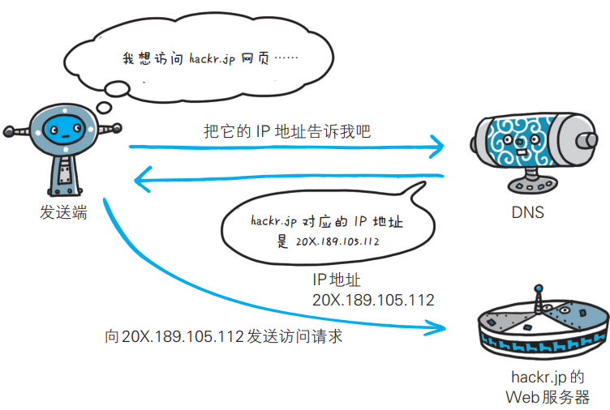
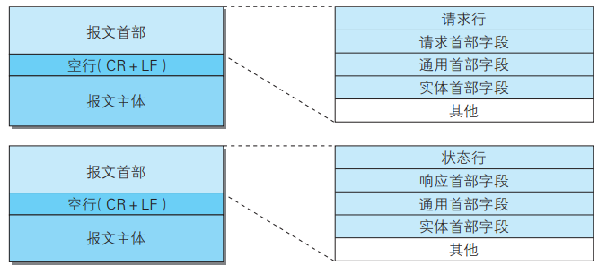

# 1. 网络基础

## 1.1 TCP/IP 协议族

TCP/IP 协议族是与互联网相关的**协议**的集合。按照层次可以分为以下4层：应用层、传输层、网络层和数据链路层。


### 1.1.1 应用层

eg：FTP / DNS / HTTP

### 1.1.2 传输层

传输层对上层应用层，提供处于网络连接中的两台计算机之间的数据传输。

eg：TCP / UDP

### 1.1.3 网络层

网络层用来处理在网络上流动的数据包。该层规定了通过怎样的路径（所谓的传输路线）到达对方计算机，并把数据包传送给对方。

eg：IP

### 1.1.4 数据链路层

用来处理网络连接的硬件部分。

eg：操作系统、驱动、网卡和光纤等。

## 1.2 IP 协议

IP 协议（Internet Protocol，网际协议）位于网络层，作用是把各种数据包传送给对方。要保证确实传送到目标地址，两个重要的条件是 IP 地址和 MAC 地址。IP 地址表明了网络节点被分配到的地址，MAC 地址指的是网卡所属的固定地址。IP 地址可以改变，MAC 地址基本不会改变。

### 1.2.1 ARP 协议

IP 之间的通信依赖 MAC 地址。网络上，通信的双方通常需要经过多台网络设备的中转才能联系到对方。进行中转时，会用到利用下一站网络设备的 MAC 地址来搜索下一个中转目标。此时采用的是 ARP 协议（Address Resolution Protocol，地址解析协议），根据通信方的 IP 地址来反查对应的 MAC 地址。

## 1.3 TCP 协议

TCP 协议（Transmission Control Protocol，传输控制协议）位于传输层。为了方便数据传输，网络会将大块的数据分割成以报文段为单位的数据包进行管理。TCP 可以可靠地将数据传送给目标。

### 1.3.1 三次握手策略

为了可靠地传输数据，TCP 采用了三次握手的策略。握手过程中会使用 SYN（synchronize）和 ACK（acknowledgement）这两个标志。

首先，发送端会发送一个带有 SYN 标志的数据包。然后，接收端收到后会回传一个 带有 SYN/ACK 标志的数据包，以表示确认收到信息。最后，发送端会再传一个带有 ACK 标志的数据包代表“握手”结束。

如果在握手的某个过程中断，会再次以相同的顺序发送相同的数据包。


## 1.4 DNS

DNS 协议（Domain Name System，域名系统）位于应用层，提供域名到 IP 地址之间的解析服务。DNS 协议提供通过域 名查找 IP 地址，或逆向从 IP 地址反查域名的服务。



## 1.5 HTTP


## 1.6 URL 和 URI

### 1.6.1 URL 统一资源定位符

URL（Uniform Resource Locator，统一资源定位符），用来表示资源在互联网上所处的位置。

### 1.6.2 URI 统一资源标识符

URI（Uniform Resource Identifier，统一资源标识符），用字符串来标识某个互联网资源。

# 2. HTTP 协议

## 2.1 请求报文和响应报文

HTTP 协议规定，请求从客户端发出，服务端响应该请求并返回。

请求报文由请求方法，请求 URI，协议版本、可选的请求首部字 段和内容实体构成。


> 如果不是访问特定资源而是对服务器本身发起请求，可以用一个 * 来代替请求 URI。
>
> eg：`OPTIONS * HTTP/1.1`

响应报文由协议版本、状态码、状态码的原因短语、可选的响应首部字段以及实体主体构成。


## 2.2 无状态

HTTP 是一种不保存状态，即无状态（stateless）协议。HTTP 协议自身不对请求和响应之间的通信状态进行保存。HTTP/1.1 虽然是无状态协议，但为了实现期望的保持状态功能， 于是引入了 Cookie 技术。有了 Cookie 再用 HTTP 协议通信，就可以管理状态了。

## 2.3 HTTP 方法


## 2.4 持久连接和管线化

使用浏览器浏览一个包含多张图片的 HTML 页面时，在发送请求访问 HTML 页面资源的同时，也会请求该 HTML 页面里包含的其他资源。因此，每次的请求都会造成无谓的 TCP 连接建立和断开， 增加通信量的开销。

为解决上述 TCP 连接的问题，HTTP/1.1 使用了持久连接的方法。持久连接的特点是，只要任意一端没有明确提出断开连接，则保持 TCP 连接状态。

持久连接使得多数请求以管线化（pipelining）方式发送成为可能。 从前发送请求后需等待并收到响应，才能发送下一个请求。管线化技术出现后，不用等待响应亦可直接发送下一个请求。 这样就能够做到同时并行发送多个请求，而不需要一个接一个地等待响应了。

## 2.5 Cookie

Cookie 技术通过在请求和响应报文中写入 Cookie 信息来控制客户端的状态。 Cookie 会根据从服务器端发送的响应报文内的一个叫做 Set-Cookie 的首部字段信息，通知客户端保存 Cookie。当下次客户端再往该服务器发送请求时，客户端会**自动**在请求报文中加入 Cookie 值后发送出去。

# 3. HTTP 报文

## 3.1 请求报文和响应报文

HTTP 报文可以分为报文首部和报文主体两块，并不一定需要报文主体。

请求报文和响应报文的结构：



请求报文和响应报文的实例：


其中，请求报文中的请求行包括请求的方法、请求 URI 和 HTTP 版本。响应报文中的状态行包括响应结果的状态码，原因短语和 HTTP 版本。首部字段中包含请求和响应的各种条件和属性的各类首部，包括通用首部、请求首部、响应首部和实体首部，也可能包括不在 RFC 中定义的首部。

## 3.2 编码提升传输效率

### 3.2.1 报文主体和实体主体

报文（message）指的是 HTTP 通信中的基本单位，由 8 位字节流组成。实体（entity）指的是请求和相应的有效载荷数据，由实体首部和实体主体组成。

HTTP 报文的主体用于传输请求或者响应的实体主体。通常，报文主体等于实体主体。只有当传输中进行编码操作时，实体主体的内容发生变化，才导致它和报文主体产生差异。

### 3.2.2 压缩传输的内容编码

HTTP 协议中的内容编码功能可以将实体进行压缩后传输。常用的内容编码有：gzip、compress 等

### 3.2.3 分割发送的分块传输编码

分块传输编码（Chunked Transfer Coding）会将实体主体分成多个块（chunk）。每一块都会用十六进制来标记块的大小，而实体主体的最后一块会使用“0(CR+LF)” 来标记。 使用分块传输编码的实体主体会由接收的客户端负责解码，恢复到编码前的实体主体。

## 3.3 发送多种数据的多部分对象集合

HTTP 协议可以发送一份报文主体中含有多种类型的实体（文本、图片、视频等）这是因为采用了多部份对象集合（Multipart）的方法，来容纳不同类型的数据。

例如，`multipart/form-data`在 web 表单文件上传时使用。


在 HTTP 报文中使用多部分对象集合时，需要在首部字段里加上 Content-type。使用 boundary 字符串来划分多部分对象集合指明的各类实体。在 boundary 字符串指定的各个实体的起始行之前插入“--”标记（例如： --AaB03x），而在多部分对象集合对应的字符串的最后插入“--”标记（例如：--AaB03x--）作为结束。

## 3.4 获取部分内容的范围请求

在以前，如果在下载过程中遇到网络中断的情况，那么必须从头开始。HTTP 实现了恢复机制，可以从之前下载中断处恢复下载。

要实现该功能需要指定下载的实体范围。像这样，指定范围发送的请求叫做范围请求（Range Request）。 对一份 10 000 字节大小的资源，如果使用范围请求，可以只请求 5001~10 000 字节内的资源。


执行范围请求时，会用到首部字段 Range 来指定资源的 byte 范围。 byte 范围的指定形式如下：

1. 5001 - 10 000 字节：

   ```
   Range: bytes=5001-10000
   ```

2. 5001 字节之后的：

   ```
   Range: bytes=5001-
   ```

3. 从开始到 3000 字节和 5000 - 7000 字节：

   ```
   Range: bytes=-3000, 5000-7000
   ```

针对范围请求，响应会返回状态码为 206 Partial Content 的响应报文。另外，对于多重范围的范围请求，响应会在首部字段 Content-Type 标明 multipart/byteranges 后返回响应报文。 如果服务器端无法响应范围请求，则会返回状态码 200 OK 和完整的实体内容。

## 3.5 内容协商返回最合适的内容

内容协商机制是指客户端和服务器端就响应的资源内容进行交涉， 然后提供给客户端最为适合的资源。内容协商会以响应资源的语言、字符集、编码方式等作为判断的基准。

* Accept
* Accept-Charset
* Accept-Encoding
* Accept-Language
* Content-Language

# 4. HTTP 状态码

## 4.1 状态码

状态码的职责是当客户端向服务器端发送请求时，描述返回的请求结果。状态码如 200 OK，以 3 位数字和原因短语组成。


常用的状态码有14种

## 4.2 2XX 成功

1. 200 OK，表示从客户端发来的请求在服务器端被正常处理了。
2. 204 No Content，

